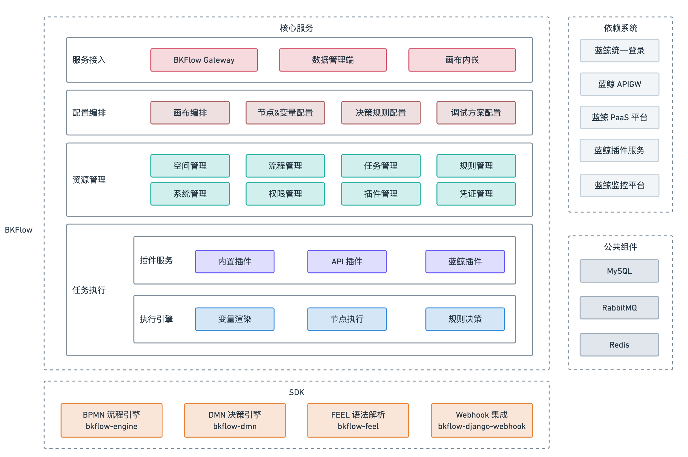

# Product Architecture

BKFlow service is a SaaS platform product written in Python, relying on related BlueKing basic services and public components. For related core service modules, BKFlow abstracts and encapsulates them into a series of SDKs.

The following is an introduction to each module:

**Core Services**

- Service access
  - BKFlow Gateway: API interface exposed by BKFlow service, used for access system calls and interactions.
  - Data management end: Meet the data management needs of access system developers. Access system developers can see all resource data under the space and configure and manage resources.
  - Canvas embedding: Meet the canvas display and orchestration needs of access system users.
- Configuration orchestration
  - Canvas orchestration: define the process structure, that is, the node sequence template for task execution.
  - Node & variable configuration: define the business execution logic and related parameters of the process.
  - Decision rule management: define the decision table and bind the corresponding process for execution, which can simplify the process branch structure.
  - Debugging scheme configuration: define the configuration node output, support node MOCK execution, and is suitable for debugging scenarios where the node cannot actually execute.
- Resource management
  - Space management
  - Process management
  - Task management
  - Rule management
  - System management
  - Permission management
  - Plugin management
  - Credential management
- Task execution
  - Plugin service
    - Built-in plugin: Public business logic encapsulation provided by BKFlow by default, including a series of plugins such as message display, timing, pause, and decision-making.
    - API plugin: Business logic plugin customized and extended by access system developers. Access system developers can implement customized business logic by exposing interfaces of specific protocols, and batch generate corresponding plugins in BKFlow for access system users.
    - BlueKing plugin: Connect to the BlueKing plugin service. Access system developers or users can customize plugins based on the BlueKing Developer Center and use them in BKFlow.
  - Task execution
    - Variable rendering: During task execution, the value of the global variable is rendered as the input parameter of the node.
    - Node execution: During task execution, the business logic of the corresponding plug-in is executed according to the input parameters of the node to obtain the corresponding node output.
    - Rule decision: During task execution, the corresponding rule is matched according to the input of the decision table to obtain the corresponding decision output.
**SDK**
- [bkflow-engine](https://github.com/TencentBlueKing/bamboo-engine): An event-driven general process engine for asynchronous execution of tasks.
- [bkflow-dmn](https://github.com/TencentBlueKing/bkflow-dmn): A Python-based DMN (Decision Model Notation) library that uses FEEL (Friendly Enough Expression Language) as a description language. It can be used as a decision engine to solve decision problems in actual business scenarios.
- [bkflow-feel](https://github.com/TencentBlueKing/bkflow-feel): A Python-based FEEL (Friendly Enough Expression Language) syntax parser that parses and calculates FEEL syntax expressions and obtains the corresponding Python objects as calculation results.
- bkflow-django-webhook: A Django app that supports rapid system integration of webhook functions.

**Dependency system**
- Necessary dependencies
  - BlueKing unified login
  - BlueKing APIGW
  - BlueKing PaaS platform
- Extended dependencies
  - BlueKing plug-in service
  - BlueKing monitoring platform

**Public components**
- MySQL: BKFlow's database storage service, recording relevant resource data.
- RabbitMQ: BKFlow's message queue service, mainly used for asynchronous message processing and task execution scheduling driver.
- Redis: BKFlow's distributed cache service.
