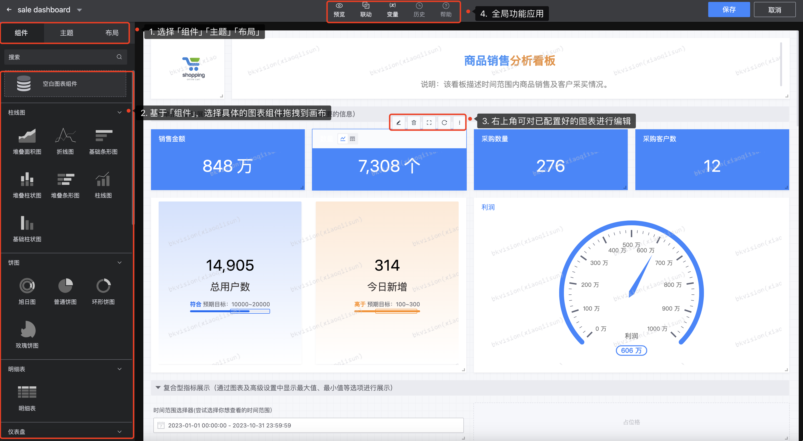
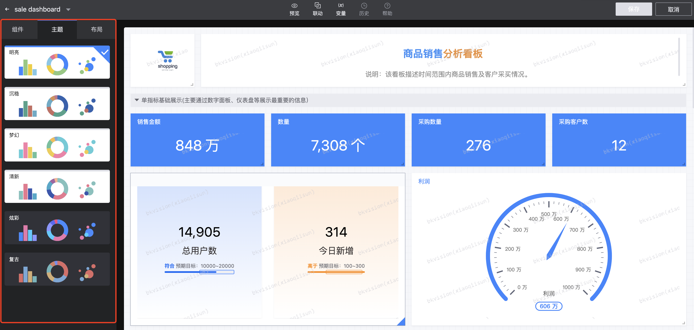
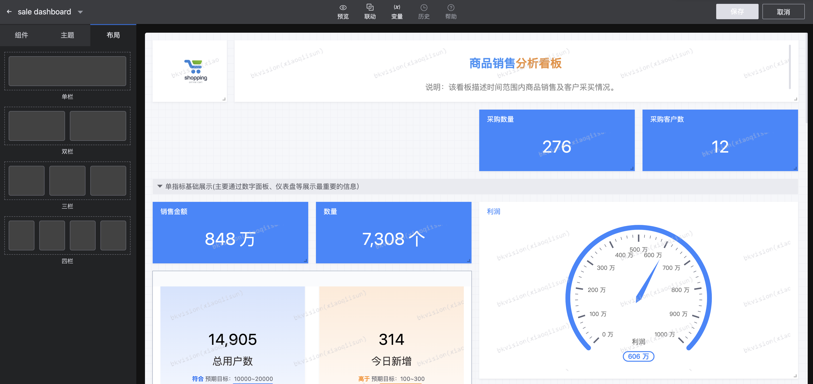
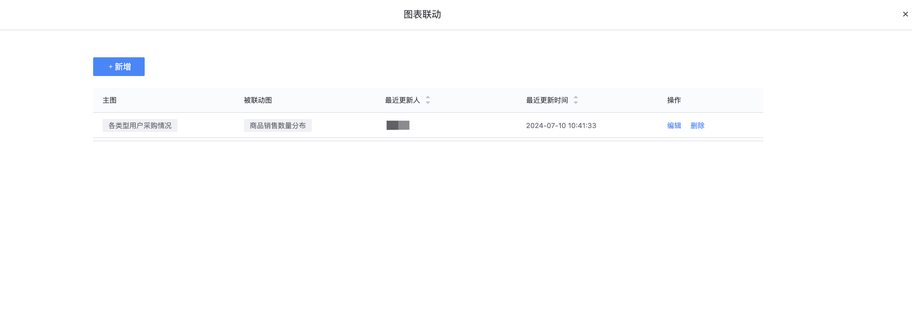

## Edit Mode

After entering the edit mode, users can freely select "components", "themes", "layouts", "linkages", etc. to configure the dashboard globally.

- **Component/Theme/Layout Settings**

1. **Component**

​ **Content**: Currently supports 27 components. For component types and function descriptions, please refer to [Component Classification and Function Description](#7.Chart-Classification-and-Function-Description);

​ **Blank Chart Component**: The chart platform supports **`Blank Chart Component`**, which is suitable for scenarios where data objects and query logic have been clarified but the graphics are not yet determined;

​ **Position**: Supports component dragging function. Click any component and drag it to the canvas, or a gray box will appear on the top of the component when the mouse hovers. Click the gray box to drag the component to move the position;

​ **Size**: Supports dragging the lower right corner of the blue border of the chart to adjust the size of the component;

​**Single chart editing**: hover the top of the chart, **`Edit chart`**, **`Delete chart`**, **`Full screen display`**, **`Refresh`**, **`Copy to clipboard`**, **`Export Excel`**, **`View SQL`** and other functions can be displayed in the upper right corner to edit a single chart;

2. **Theme**

Change the overall dashboard color and style to meet various scene applications. Currently supports 6 themes: bright, calm, dreamy, fresh, colorful and retro;

3. **Layout**

Provide 4 optional layout modes, namely **`Single column`**, **`Double column`**, **`Three columns`** and **`Four columns`**, simplify page layout and typesetting, no need to manually adjust the chart border size;

- **Global function settings**

​ **Preview**: Supports full-screen display of dashboards. You can click refresh in the upper right corner and set the refresh time;

​ **Linkage**: An interactive function for data visualization, which allows users to view a data view, and the selection or operation they make can affect other related data views in real time; for specific settings of linkage, please refer to [Drill-down, Linkage Application](Create-Drill-Link.md)

​ **Variable**: Constants, which will not be displayed in the dashboard, but are only used as parameter configurations for data query logic. They only work when the dashboard is rendered and cannot be interactive or dynamically changed; "Constants" are generally applicable to global parameter setting scenarios of charts, such as project ID, business ID, etc.;

​ **`Variable name`**: Name the variable to facilitate direct query in SQL statements

​ **`Variable value`**: Select the value corresponding to the variable name

​**`Description`**: Note the purpose and precautions of the variable

​ **History, Help** Not yet available