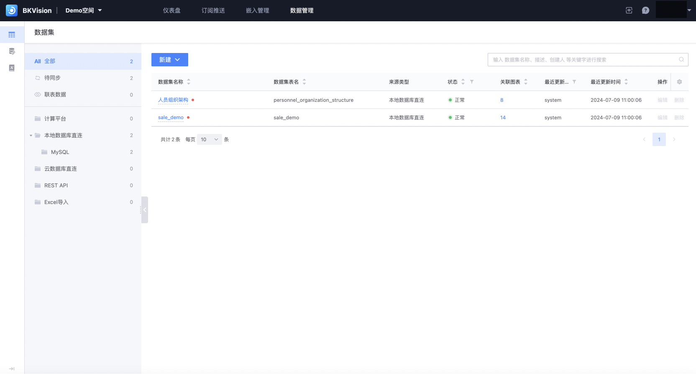
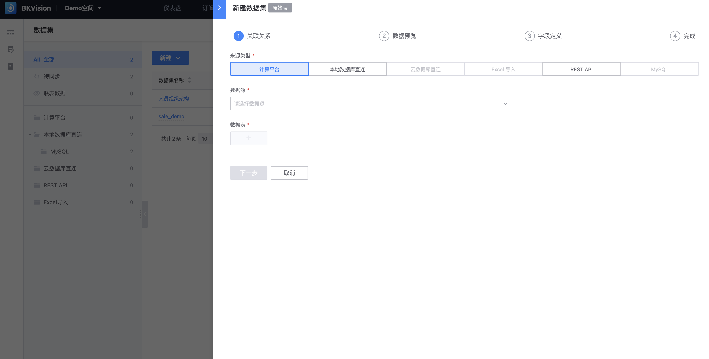
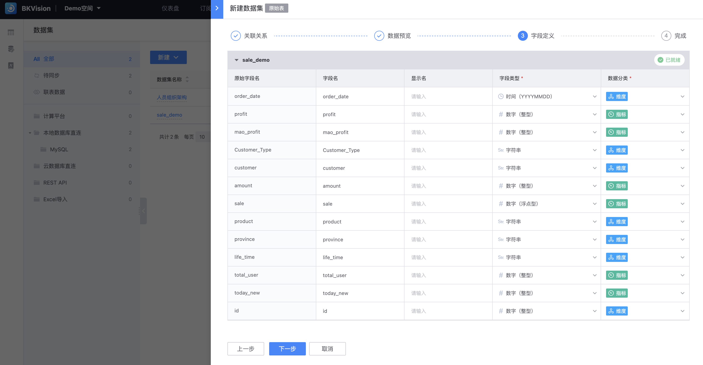
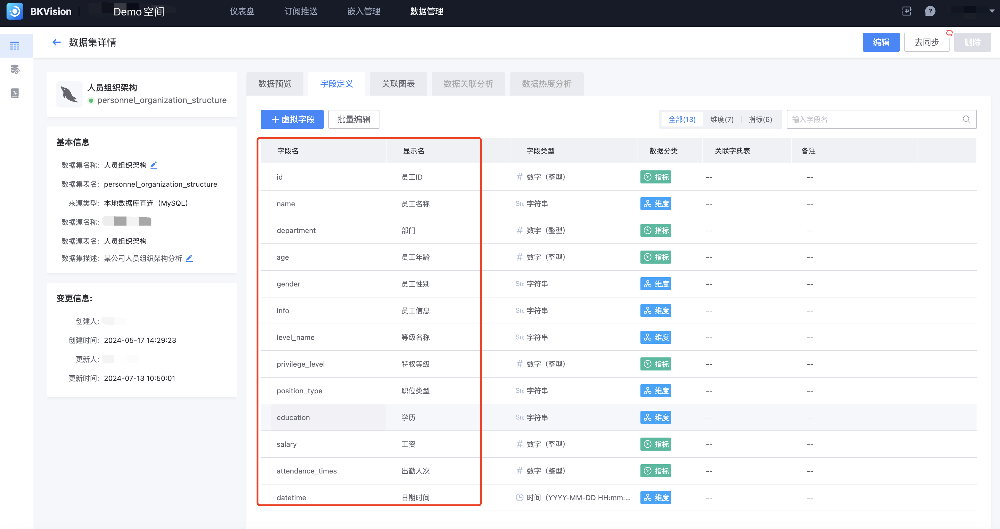
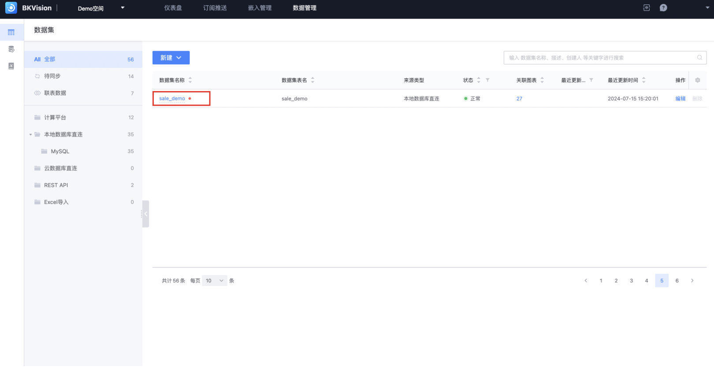

## Dataset

In the chart platform, the essence of a data set is a data table; when a user successfully connects to a data source (database), it does not mean that all data tables in the data source are connected to the chart platform. The user needs to connect the data tables required when configuring the dashboard on the "Dataset" page;

Users can retrieve the data set information that has been connected to the space through the left navigation bar, list, and search box;

### Create a new data set

Click **`New`**, the options are **`Original table`** and **`Joined table`**

- **Original table**: that is, the data table directly connected from the data source

Click **`Original table`** to enter the "New Dataset" page

1. **Fill in the association relationship**

​ **`Source type`**: divided into **`Computing platform`**, **`Direct connection to local database`**, **`REST API`**, **`Direct connection to cloud database`**, **`Excel import`**, **`MySQL`** (the latter three have not been developed yet), you can quickly lock the data table by selecting the information of the data source;

​ **`Data source`**: Select the connected data source;

​ **`Data table`**: Select the data table of the data source, and multiple data tables can be connected at one time;

2. **Data preview**: When the table in the database is successfully connected, the connected data table structure and the first 100 data are displayed;

3. **Fill in field definition**: Except **`Original field name`**, all others can be customized;

​ **`Original field name`**: The actual field name in the data source, that is, the field name of the data table created in the database;

​**`Field name`**: The name after renaming or translating the original field name to adapt to different scenarios. The default is the original field name;

​ **`Display name`**: The field name that is finally displayed to the user;

​ **`Field type`**: Identifies the type of field data, such as string, number (integer), number (floating point), time, etc.;

​ **`Data classification`**: Divided into "dimension" and "indicator", which is convenient for direct selection when configuring the chart;

After reading this, you may still be a little confused about the original field name, field name and display name. For example: This is a dataset that has been created in the Demo space. We can see from the dataset details that the field name and display name are displayed under the "Field Definition" page, and the column name when you create the data table in the database, that is, the original field name, will not be displayed;

Then users may wonder what the purpose of setting the field name and display name is? The answer is that in the "Chart Configuration" page, there will be a display of data fields. You can see that the left side is the display name and the right side is the field name. The purpose is to help users intuitively and quickly select the indicators and dimensions of the chart;

I hope the above examples can help you better understand the difference between the original field name, field name and display name!

4. **Complete**

​ **`Dataset name`**: the page display name of the dataset;

​ **`Dataset table name`**: the actual table name of the dataset in the database;

​ **`Dataset description`**: used to describe the purpose, usage scenario, instructions and other notes of the dataset;

- **Join table**: retrieve data from multiple tables based on the relationship between fields and combine them into a result set; similar to the usage of **`join`** in SQL statements, it is used to associate data from multiple tables;

1. **Fill in the association relationship**

​ **`Data source`**: select the connected data source;

​ **`Association relationship`**: match the rows of two or more tables based on the common columns between them, and return the results that meet the specific conditions; a total of four connection methods are supported, similar to join:

​ **`Internal`**: inner connection (INNER JOIN)

​ **`Left side`**: LEFT JOIN

​ **`Right side`**: RIGHT JOIN

​ **`Full outer`**: FULL JOIN

2. **Data preview**

3. **Fill in field definition** (same as original table)

4. **Complete**

​ **`Dataset name`**: the page display name of the dataset;

​ **`Dataset table name`**: the actual table name of the dataset in the database;

​ **`Dataset description`**: used to describe the purpose, usage scenario, instructions and other notes of the dataset;

### View existing datasets

The above is a description from the perspective of creating a new dataset. Next, it is described from the perspective of viewing existing datasets:

When clicking any dataset in the dataset list;

Enter the "Dataset Details" page, the basic information and change information when creating the dataset are displayed on the left, and the internal data information of the dataset is displayed on the right module;

**Data Preview**: Can display **`Original Data`** and **`Dictionary Translation`**, intuitively displaying the original data information and the dictionary associated with the dataset;

**Field Definition**: Displays the field name, display name, field type and data classification and can be manually edited and modified; supports **`Virtual Field`** and **`Batch Edit`** function;

**Virtual Field**: Fields that do not actually store data in the database, but are indirectly generated through calculations, expressions, etc.;

​ **`Field ID`**: Unique identifier for virtual fields;

​ **`Field Display Name`**: Name displayed to users in the user interface;

​ **`Remarks`**: Explain the meaning of the field for easy understanding;

​ **`Field Definition`**: Fill in the SQL statement to define the expression of the virtual field;

​ **`Field Type`**: Select the type of data to be stored;

​ **`Data Classification`**: Select indicators or dimensions;

​ **`Syntax Check`**: Verify whether the entered SQL statement complies with the correct syntax rules;

**Batch edit**: Batch modify field name, display name, field type, data classification and other information;

**Associated chart**: Displays all chart names and chart types and dashboards to which the data set is applied;

​