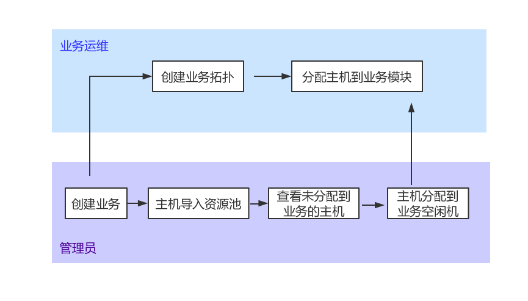
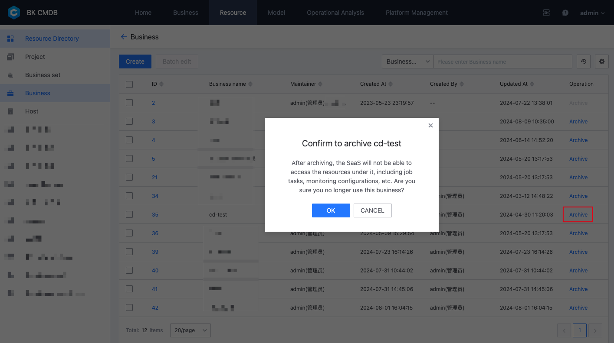
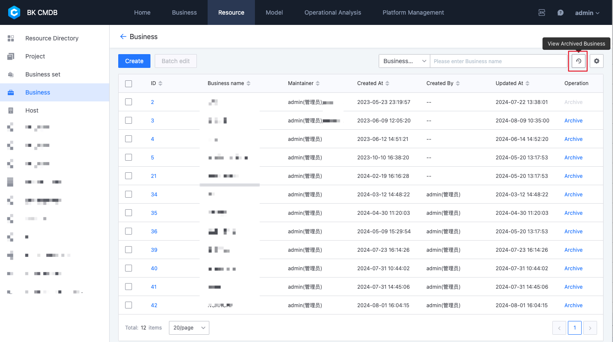
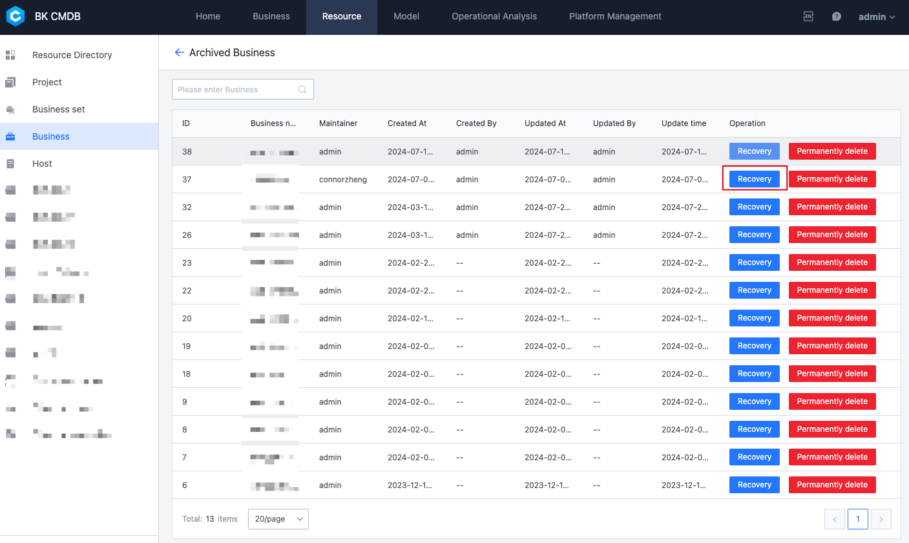
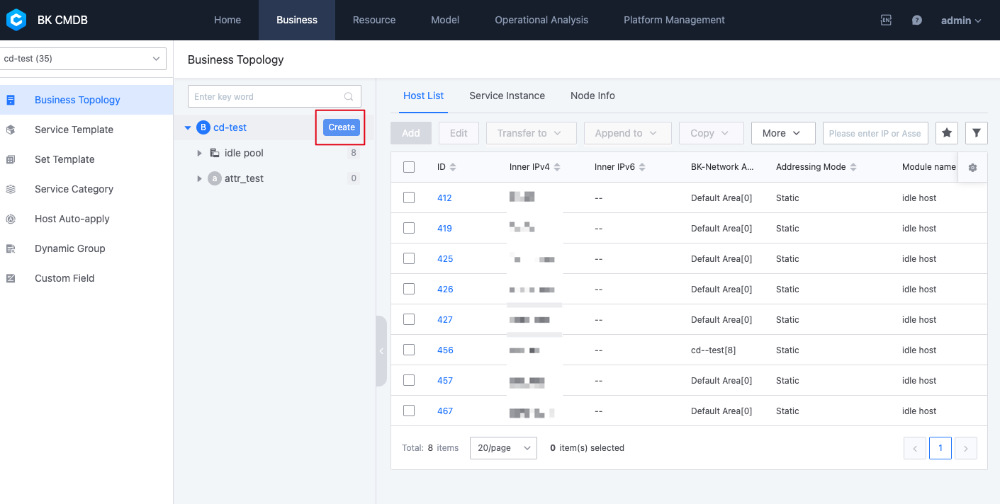
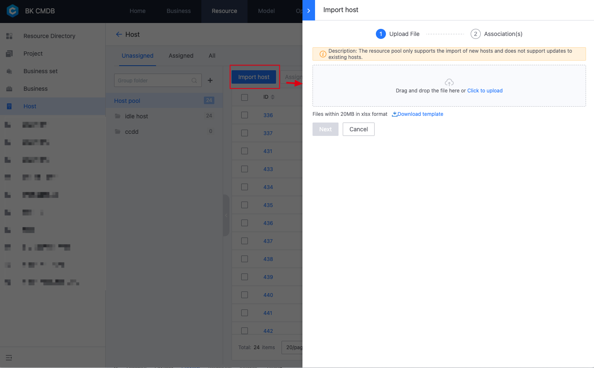
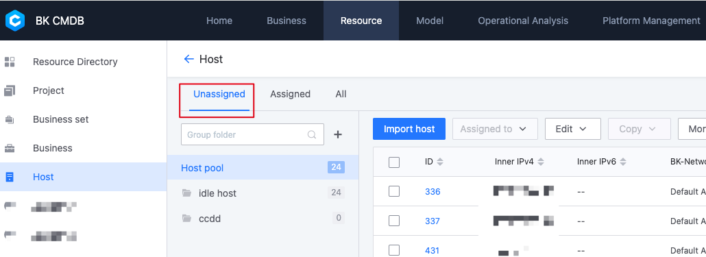
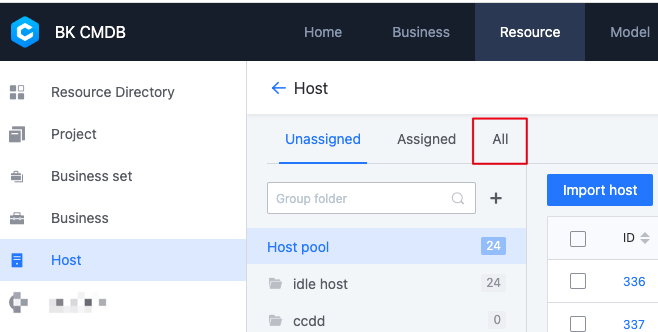
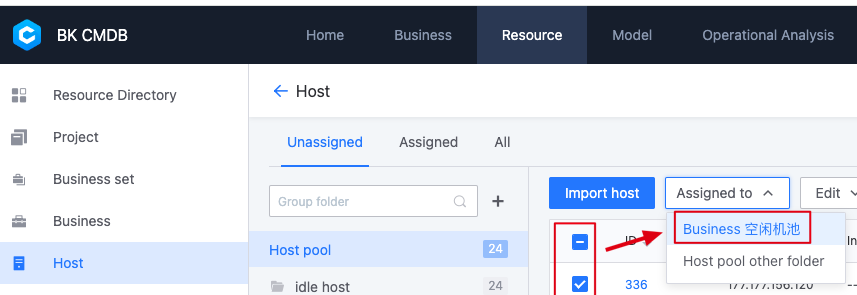
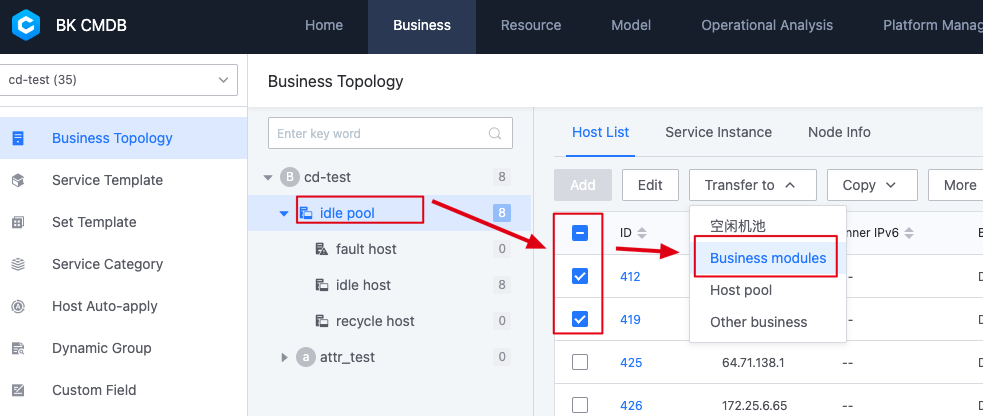

# How to create a Business Name and import Host into it

 Specific step:

 **create Business Name--Create Service Topology--import Host to resources Pool--view CVMs Not Assigned to Service--Assign CVMs to Service Idle Pool--Assign CVMs to Service module**

 

## create Business Name

 Business Name is an important concept in the continuous Deploy of BlueKing. It is mainly used for resources and setting isolation. The business create on the CMDB is Apply to the Job System, Standard OPS, Monitor, Fault Auto-recovery and other Scene by default.

 click Base resources-Business Name approve the Navigation bar to Enter the business Manage function page, and then click add.

 

> **Note:** In the initial status, only the CMDB Administrator can new and manage businesses.  Administrator can assign Business Name management permissions to specified userGroup approve auth group according to actual enterprise needs.

- Business Name is a key resources in the BlueKing system, so the delete function is not provided for business. When the business is no longer needed, you can use the ** Business Archive ** function to remove the business from the list.
- When Archive a Business Name, user need to Confirm that Other SaaS services are no longer using the service, including but not limited to Cron and Monitor Configuration under the service. Otherwise, too many abnormal will be generated.

 

 After the Business Name is Archive, all SaaS can see the business.

- When the Archive Business Name needs to be Reduction, you can use the ** Restore of Business Archive ** feature to restore it to normal Using a Status:

 After the Business Name Archive Reduction, you can view the archived services in the service archive list.

 

 click restore Business Name to restore the service to normal Using a state. For the convenience of user identification, the (-archived) flag will be added to the Business Name of the service restored from the Archive by default, and the user can Revise the service name as needed.

 

## create a Business Name Topology

 After the Business Name is create, in Business resources-Business Topology, you can see that the newly new business is added in the drop-down menu.  complete the Business Name create created, Three Modules, i.e."Idle Machine","Failed Machine" and "To Be Reclaimed", will be auto created.

 

 At this point we can definition a business topology for the Business Name.  click the Business Name in the topology tree, and the add button appears to create the direct child of the business, i.e.,"Set" and its direct child "module".

## Import Host into resources Pools

 In order to standard Manage and improve the utilization of Host resources, a resource pool mode is designed. all hosts need to be uniformly entered into the host resource pool and then allocated to the Business Name.

 Navigation Enter the "Base resources-Host" page, and click "import CVM" to import the CVM.

 Currently, there are two ways to import Host in the CMDB: `Excel Batch Import` and `NodeMan` for auto import.

 First click import Host on the Base resources-Host page to open the import dialog box.

### Batch Import approve Excel

 This method can be used when the Host is in the direct connection gateway (the area where the BlueKing central control environment can directly access).  click the [download Template] button to download an Excel The document Meets The a good format.

 After opening the Excel The document, you can see that the private IP is a isRequired attribute. If you do No Need to import Other attributes, you can delete the relevant columns.  The Two Sheet in Excel has detailed Fill In Description. It is recommended that the first-time user view this instruction first.

> **Note:** Entering the same private IP is an Operation of attribute Overwrite. You can use this feature to update Host attributes in batches.

## View Unassigned Host

 approve Navigation Base resources-Host, the default function page Display the CVMs that have not been assigned to Business Name in the current enterprise.

 

- view all Host in the enterprise:

 On the Host resources pool Manage page, check the allocated CVMs in the Query Scope for homogeneous configuration. You can query all the CVM resources in the current enterprise.

 

## Allocating Host to Business Name IDL Pool

 After selecting the target Host, select the above CVM to be allocated to the specified Business Name. By default, the CVM is allocated to the idle CVM pool of the service.

 

## Assigning Host to Business Name module

 Navigation Enter the Business Name resources-Business Topology page.

 You can see that the Host has been assigned to the idle module of the Business Name. Select the CVM to be transferred, click Transfer at the top, Select Target module in the dialog box, and click save to complete the transfer.

 

> Note :
> It should be noted that considering the Apply Scene of actual Business Name, Host transfer has the following characteristics:

1. One Host can belong to more than Modules
2. When a Host belongs to an idle machine or a failed machine, it cannot belong to Other Business Name module at the same time (when an idle machine or a failed machine is selected, the system will prompt whether to remove other selected modules)
3. When the Host needs to return the resources pool of the enterprise, it Must be transferred to the idle machine module first
