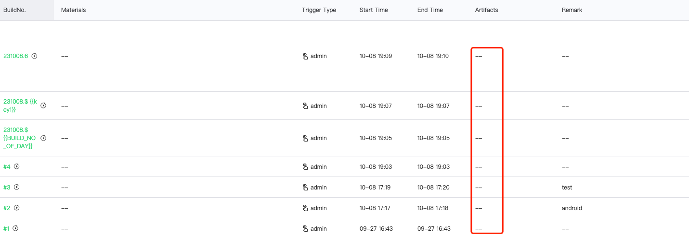

 # Service corresponding function 

 Each service of BK-CI corresponds to each function. When a function is abnormal, you can give priority to troubleshooting the corresponding service log.  service Path reference [basic concepts](./user-guide.md) 

 | service          | function                             |
 | --------------- | -------------------------------- |
 | gateway         | BK-CI Gateway                         |
 | artifactory     | Artifact artifactory service, default component repository     |
 | dockerhost      | BK-CI hosted agent                       |
 | environment     | Self hosted agent service.  import, Manage agent|
 |  process         | Pipeline                           |
 | project         | projectManage                         |
 | plugin          | service Plugin extension service               |
 | repository      | Code Repository                           |
 | ticket          | credentialManage                         |
 | store           | store                         |
 | image           | BK-CI hosted agent image                   |
 | dispatch        | Self hosted agent Schedule                   |
 | dispatch-docker |BK-CI hosted agent Schedule                   |
 | agentless       | noEnv                       |
 | auth            | authentication                         |
 | log             | build log                         |
 | notify          | BK-CI built-in notification service                 |
 | openapi         | BK-CIAPI service                      | 

 For more information about Component Description and link, please see [BK-CI Components](https://docs.bkci.net/overview/components). 

 # Troubleshooting Example 

 #### Question Background 

 1. Upload product cannot be displayed during pipeline runs 

 2. And plugin sometimes reports an error 

  

  

 #### Troubleshooting 

 ①: Check the build log 

 Obtain the build log corresponding to the build you are troubleshooting. For more information on how to obtain the log, see [Basic Concepts](./user-guide.md). 

 When troubleshooting the build log, you can query the plugin name of the error to locate the error point. for example, upload package plugin reports an error, we can try to query upload field in the log to find the corresponding log of upload execute.  Then continue to query the error log as follows: 

  

 ②: Check the service log 

 According to the build log, it can be seen that the build reported an error when requesting the artifactory service, so the artifactory log was investigated. 

 1. To troubleshoot the service log, you can troubleshoot the error logs first. If there is an obvious error, you can fix it directly.  If no error is reported, continue troubleshooting the service log. 
 2. When troubleshooting a service log, the error is usually located based on the time the log was generated and the error was reported. 

 Two obvious errors have been found when reviewing the log: 

  

  

 At this point, you should continue to troubleshoot the process service. Subsequent troubleshooting revealed that the process service was abnormal due to excessive load pressure on the CI machine during this build. 

 #### Resolved 

 1. Restart the process service according to the log. 

 2. After the No Space left on device error, clear the space on the CI machine. 
