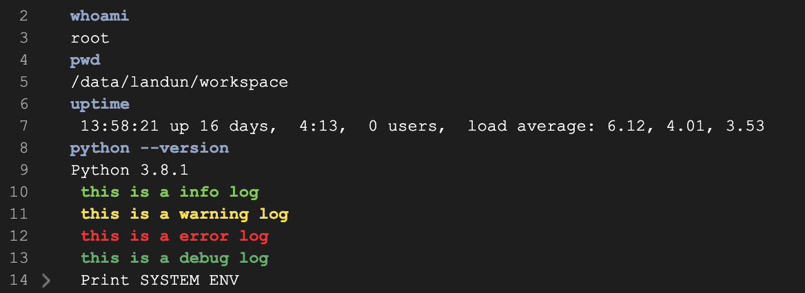

 # How to make your Pipeline log Display with different colors 

 In Pipeline log Components, we definition the following keywords for use by Develop Plugin. 

| Keyword | Function | Remarks |
| :--- | :--- | :--- |
| \#\#\[section\] | the beginning of a job or plug-in | if it is the beginning of a plug-in, it must be included in the starting of a job |
| \#\#\[endsection\] | the end of a job or plugin | if it is the end of a plugin, it must be included in the Finishing of a job |
| \#\#\[command\] | Highlight the following string with ShellScripts | \#0070BB |
| \#\#\[info\] | mark the following string as info color | \#48BB31 |
| \#\#\[warning\] | mark the following string as warning color | \#BBBB23 |
| \#\#\[error\] | mark the following string as error color | \#DE0A1A |
| \#\#\[debug\] | mark the following string as debug color | \#0D8F61 |
| \#\#\[group\] | start of a fold | |
| \#\#\[endgroup\] | end of a fold | |

**Take the Bash Plugin as an example:**

```bash
echo "##[command]whoami"
whoami
echo "##[command]pwd"
pwd
echo "##[command]uptime"
uptime
echo "##[command]python --version"
python --version

echo "##[info] this is a info log"
echo "##[warning] this is a warning log"
echo "##[error] this is a error log"
echo "##[debug] this is a debug log"

echo "##[group] Print SYSTEM ENV"
env
echo "##[endgroup]"
```

 You will see the effect shown below 



