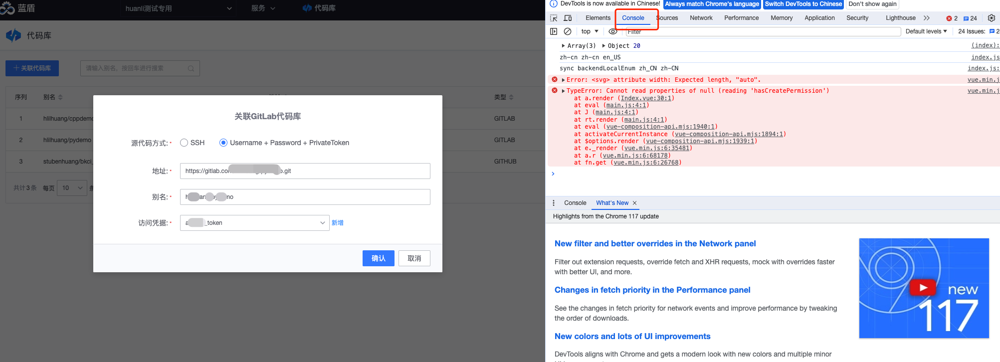

 # Central Control Unit 
 The Central Control Unit is equivalent to the console of BlueKing and BK-CI. The bkcli command can only be executed on the Central Controller. 
 Execute ```cat /data/install/.controller_ip ``` on any BlueKing/BK-CI machine to get the IP of the Central Controller. 

 --- 

 # PipelineId 

 In the pipeline URL, the parameters after pipeline are project ID and pipelineId respectively.  For example, in devops.bktencent.com/console/pipeline/iccentest/p-8f3d1b399897452e901796cf4048c9e2/history, iccenter is the project ID and p-xxx is the pipelineId. 


 # Build Log 

 The build log is stored in the agent. The path for storing the build log is located at 

 **Self-hosted agent**:{agent install directory}/logs/{buildNo} 

 **BK-CI hosted agent**:/data/bkce/logs/ci/docker/{buildNo} 


 **What is the Agent Install directory for a self-hosted agent?**: 

 BK-CI---Pools---node---{applicable agent}---installPath 

  

 **How to view the build number**: 

 In the pipeline URL, a last string starting with b- is the buildNo 

  

 # Service Log 

 BK-CI logs are stored by service. 

 Log storage path: /data/bkce/logs/ci/ 


 --- 

 ### Get All Service Log: 

 Enter BK-CI backend service 

 ```find /data/bkce/logs/ci/ -name \*-devops.log -o -name \*-devops-error.log |xargs tar zcvf /root/bkci-log.tar.gz```. 

 Then send the packed **/root/bkci-log.tar.gz** log 


 #Page error message 

 If you encounter a page error, the browser F12 opens the console and repeats a request operation again, and 

 Open the network label, click on the error request and take a screenshot. 

  


 Open the Console label and take a screenshot. 

  