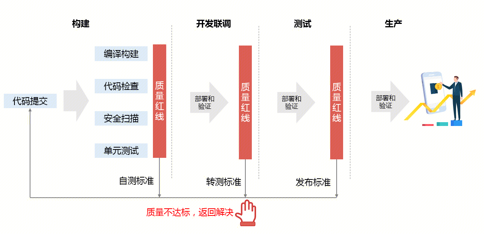

# Quality red line

The idea of quality redline originated from Toyota's stop-the-line Andon system of lean production, also known as the Andon system. When employees on the workshop production line encounter trouble, they pull the signal light immediately, and the team leader will immediately run over to help solve the problem, and the production line will stop until the problem is solved. This can expose problems and solve them as early as possible, rather than letting the problems flow to subsequent steps of producing cars.

Similarly, during the research and development process, we often have similar confusions:
- The team's coding standards have been established, but code that does not meet the standards is still incorporated;
- It has its own transfer testing standards, but it can only be followed manually and cannot be implemented into the automated process;
- In the later stages of the version, the number of bugs remains high. But many problems can be discovered through code inspection and unit testing in the early stage.
- In order to solve the above problems and learn from Toyota's lean production ideas, BK-CI has created a quality redline gate service for everyone.

The BK-CI pipeline has powerful orchestration capabilities to support the entire product life cycle from development, testing, security scanning, deployment, and operation.
The quality red line refers to a service that controls the behavior of the assembly line by setting quality standards so that the entrance/exit quality of each stage must meet the quality standards.