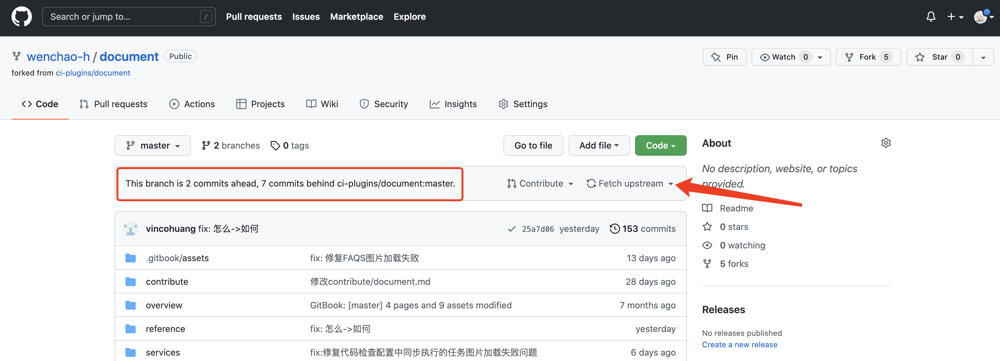
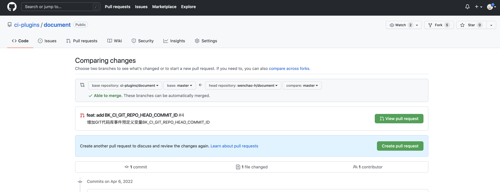

 # Contributing to BK-CI document 

 In the process of writing, it is inevitable that there will be imperfections. I hope you can help us continuously improve the quality of The document and help more people. 

 ## Method 

 Submit an Issue or Pull Request on GitHub address:https://github.com/ci-plugins/document 

 ## The document Specification 

 1. The document is written using markdown syntax 

 2. Images should be placed under `.gitbook/assets`, and the image name cannot be the same as that of an existing image. 

 3. Picture name only Allow upper and lower case letters, numbers,`-`,`_` 

 4. The co-creator can initiate a PR for the master Branch, and the Administrator will toCheck the PR 

 ## The document Co-construction Flow 

 ### 1. Fork repository 

 First you need to have a github Account, signIn, visit https://github.com/ci-plugins/document, and fork to your own github account 

  

  

 ### 2. Clone  

 Before Clone a repository, make sure that the forked repository is consistent with the source repository. If it lags behind the source repository, consider `Fetch Upstream` first. Refer to step 4. 

 `git clone https://github.com/xxxx/document` 

 ### 3. Change & Commit 

 ``` 
 cd /path/to/document 
 git config user.name "${your github username}" 
 git config user.mail "${your email}" 
 echo "add xxx" > xxx.md #Simulate user edit The document Operation 
 git commit -m "add xxx" 
 ``` 

 ### 4. Fetch upstream 

 Before submit to your own repository, view whether the Code you fork lags behind the source repository code. If it lags behind, you can first Operation `Fetch upstream` to synchronize the updated source repository code to your own repository.`  compare`view Code differences,`Fetch and merge`Merge source repository code into your own repository 

  

  

  


 ### 5. Git pull 

 In addition to syncing the latest Code on the page, sync the latest code in your local repository 
 Update the local Code (it is recommended to execute One git pull every time before Revise The document): 

 ``` 
 git pull #If there is a conflict cannot be merged, please resolve the conflict and merge it yourself, and submit 
 ``` 

 ### 6. Git push 

 ``` 
 git push -u origin master 
 ``` 

 ### 7. Pull request 

 Initiate PR, Request to merge to dev Branch of source repository, and wait REVIEW_PROCESSED by Administrator 

  

  

  