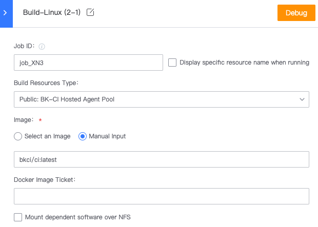

 # BK-CI Cloud-Hosted buildResource 

 In order to make your CI more user-friendly, we provided the following type of public buildResource, you can use them with confidence. 

 ## Linux Docker Host 

 After BK-CI is Deploy, the default built-in public buildResource (if you cannot select, please contact your CI platform Administrator), we will Run Docker service on your physical machine/virtual machine to run your CI compilation image, you only need to specify One image address in the Pipeline to start compilation. 

  

 ## customize CI Images 

 We have two Base CI docker images built into dockerhub: 

 image | dockerfile 
 --- | --- 
 bkci/ci:latest | [https://github.com/ci-plugins/base-images/blob/master/ci-build/Dockerfile](https://github.com/ci-plugins/base-images/blob/master/ci-build/Dockerfile) 
 bkci/ci:alpine | [https://github.com/ci-plugins/base-images/blob/master/ci-build-less/Dockerfile](https://github.com/ci-plugins/base-images/blob/master/ci-build-less/Dockerfile) 

 You can also use these two images as Base images to create your own CI image. Of course, you need a little knowledge about [Docker build](https://docs.docker.com/engine/reference/commandline/build/). 

 To create a customize CI image, please refer to: [build and host One CI image](../../Services/Store/ci-images/docker-build.md) 