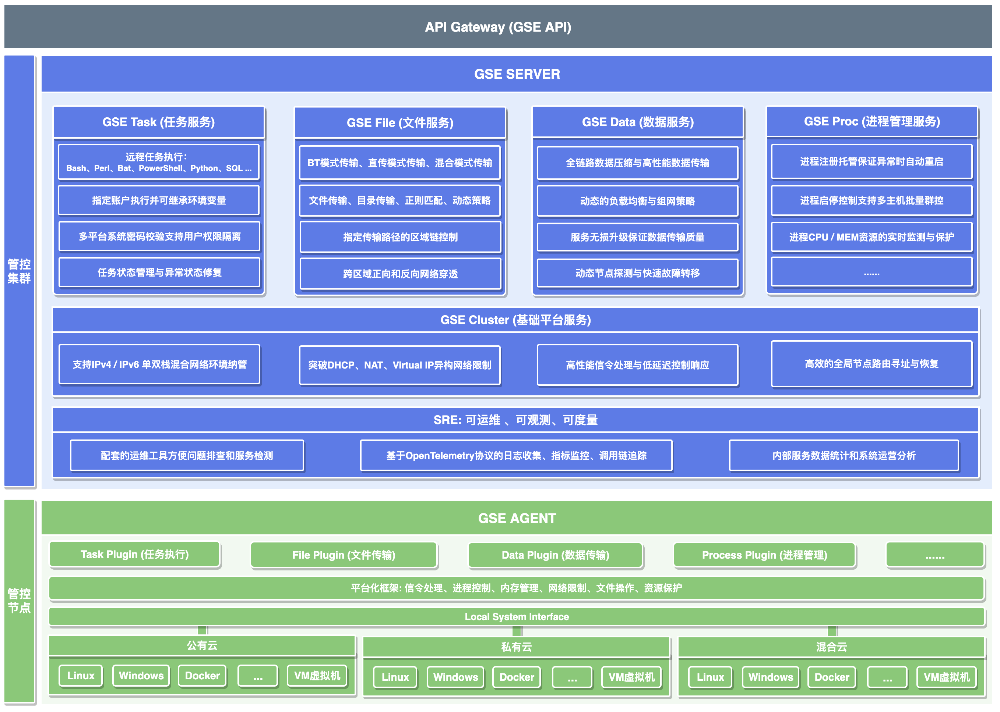

# Product Architecture

As shown in the figure, this is a simplified diagram of the overall internal architecture of the BlueKing General Service Engine. At the API level, it provides interface services based on the BlueKing Gateway Service, and supports multiple protocol family communications such as HTTP, TCP private protocol, and GRPC. The backend module is mainly composed of task services (GSE Task), process management services (GSE Proc), file services (GSE File), data services (GSE Data), and basic platform services (GSE Cluster). The basic platform service (GSE Cluster) cooperates with the Agent of the control node to complete the uplink and downlink of internal signaling messages. At the control node level, the Agent is responsible for completing task execution, file transfer, data transfer, process operation, etc. It is compatible with the release version of the mainstream operating system and can achieve control in a mixed environment.

## Module Introduction

**Task Service (GSE Task)**

Task service module, based on the basic platform service (GSE Cluster), provides remote job task execution capabilities on the target control node, such as Bash, Perl, Bat, PowerShell, Python, SQL, etc.

**Process Management Service (GSE Proc)**

Process Management Service module, based on the task service (GSE Task), implements management functions for processes on the control node, such as process registration and hosting, process start and stop control, process CPU/MEM resource protection, etc.

**File Service (GSE File)**

File service module, which provides fast file transmission capabilities, combines BT network protocol and internal private protocol to dynamically adjust networking strategies under different file sizes and node scales to achieve the best file transmission efficiency, and provides efficient and stable underlying file transmission services for the business;

**Data Service (GSE Data)**

Data service module, provides massive data transmission and routing management capabilities, and combines the BlueKing collector plug-in to provide business custom data collection and reporting capabilities. This service provides lossless upgrade and agent-side failover capabilities, provides data transmission guarantee for daily changes and failures, and also provides full-link data compression function to reduce transmission link bandwidth consumption.

**Basic platform service (GSE Cluster)**

The basic platform service module undertakes the agent session link and routing management of massive control nodes. Combined with the internal message slot mechanism and the agent platform framework, it provides downward distribution and upward delivery functions for target control node signaling messages, and provides basic signaling services for internal task, data, file and other channel modules.

**BlueKing Intelligent Agent (GSE Agent)**

The BlueKing Intelligent Agent agent program can be installed in the physical machine, virtual machine or container that the business needs to control. It is the actual executor of task execution, file transfer, data transfer and process management provided by the BlueKing control platform. The communication strategy and network status of the machine where the Agent is located need to be adjusted before installation to exert its full capabilities.

## Operating system support
> Some lower version systems such as Windows 2003, Windows 2008 and some Linux/Windows 32-bit models remain compatible in version 1.0, and higher versions 2.0 will no longer support

### Officially supported operating systems

- **Linux system:**

| OS and version | OS kernel version | CPU architecture | glibc version |
| ---- | ---- | ---- | ---- |
| TencentOS Server 2.6 for ARM64(TK4) | 5.4.119-19-0008 | aarch64 | glibc 2.17 |
| TencentOS Server 3.1 (TK4) | 5.4.119-19-0008 | x86_64 | glibc 2.28 |
| TencentOS Server 2.2 (Final) | 3.10.107-1-tlinux2_kvm_guest-0049 | x86_64 | glibc 2.17 |
| TencentOS Server 1.2 (tkernel2) | 3.10.106-1-tlinux2_kvm_guest-0024 | x86_64 | glibc 2.12 |

- **Windows system:**

| OS and version |
| ---- |
| Windows Server 2019 For Tencent |
| Windows Server 2016 For Tencent |
| Windows Server 2012 R2 For Tencent |

### Operating systems supported after community adaptation

- **Linux system:**

| OS and version | OS kernel version | CPU architecture | glibc version |
| ---- | ---- | ---- | ---- |
| CentOS 8.2 ARM64 | 4.18.0-240.10.1.el8_3.aarch64 | aarch64 | glibc 2.28 | | CentOS 7.9 ARM64 | 4.18.0-193.28.1.el7.aarch64 | aarch64 | glibc 2.17 | _4.x86_64 | x86_64 | glibc 2.28 | | x86_64 | glibc 2.12 | | Ubuntu Server 20.04 LTS ARM64 | 5.4.0-80-generic | aarch64 | glibc 2.31 | .1 LTS 64-bit | 4.15.0-142-generic | x86_64 | glibc 2.23 | | Ubuntu Server 16.04.1 LTS 64-bit | 4.15.0-142-generic | -generic | x86_64 | glibc 2.19 | | Debian 10.2 64-bit | 4.19.0-18-amd64 | x86_64 | glibc 2.28 | | Debian 9.13 64-bit | 4.9.0-13-amd64 | 0-6-amd64 | x86_64 | glibc 2.19 | | Debian 7.4 64-bit | 3.2.0-4-amd64 | glibc 2.17 |

- **Windows system:**

| OS and version |
| ----
| Windows Server 2019 Datacenter Edition 64-bit Chinese version |
| Windows Server 2016 Datacenter Edition 64-bit Chinese version |
| Windows Server 2012 R2 Datacenter Edition 64-bit Chinese version |

- **Other systems:**

AIX