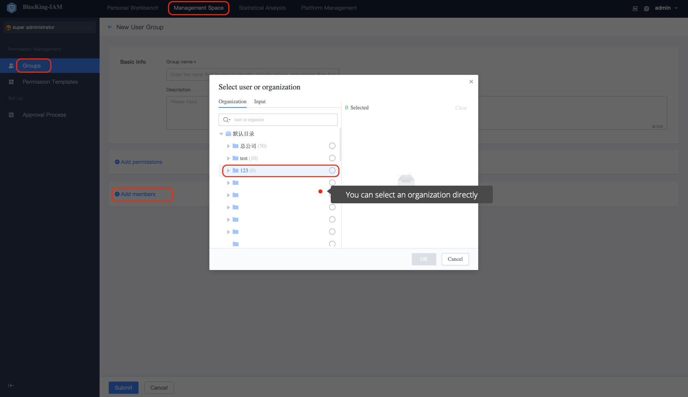

 # Does it support cross-department or business management permissions?

 Yes, the permission control is very flexible. You can authorize by organization structure, individual, business, etc.

 The V3 IAM does not deal with the concept of business and project. Instead, it uses business and project as node resources at a level selectable by resource instances. It is convenient to adapt to authorization according to scene such as business and project resource isolation area. When you select a business node, you have the permission of any instance under the corresponding business to meet the needs of dynamic authorization.

  

 IAM supports organizational architecture permissions. The administrator only needs to add an organization to a UserGroup, and users in the entire organization and sub-organizations have the permissions of the corresponding UserGroup. In addition, personnel who change in the organization in the later period will automatically lose or have the permission of the UserGroup, which meets the dynamic personnel authorization requirements.

  