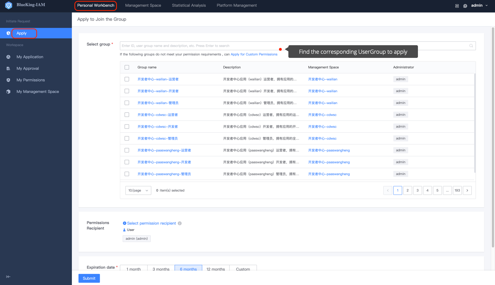
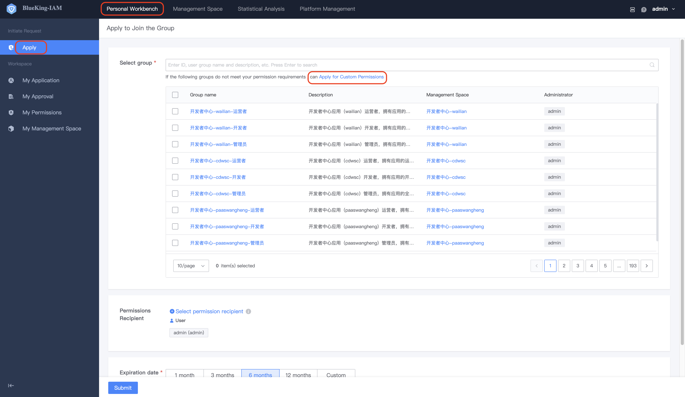

# Permission Application 

Users can rapply for required permissions in three ways: **Apply to join a UserGroup**, **Apply for customized permission**, **ump from the access system side without permission**. 

## Apply to join a UserGroup

The permission management method **recommended** by BKIAM allows users to enter the permission application page and click **Apply to join a user group** to apply. On the list page of UserGroups, users only need to search for the required user group by keywords and apply to join. 

 

## Apply for Customized Permission

It is recommended to apply for customized permissions when the UserGroup permissions cannot be satisfied. Although customized permissions are flexible, scattered permissions make it inconvenient to unify the management of subsequent permissions.

In the **Permission Application** interface, click **Apply for customized Permission** to apply. 

 

BKIAM supports **Topology Instance Selection** and **Attribute Condition**. Most access systems only use the topology instance selection method. 

- Topology instance selection: If the access system provides multiple view selections, users can select the desired instance in various ways. Except for the leaf nodes, other nodes of the topology instance are dynamic nodes. That is, if the current node is selected, all child nodes, including the child nodes added in the future, will be included by default. Topology instance selection can meet the selection needs of most users.

- Attribute condition: Attribute condition is an advanced instance filtering method. It is a dynamic select method. For users who often have instance changes or need range permissions, attribute condition is a better method.

A group of instance selections. You can select **Topology Instance** or **Attribute Condition**, or use them in combination. When used in combination, topology instance and attribute condition are **And**. The relationship between multiple groups of instances is `or`. 

