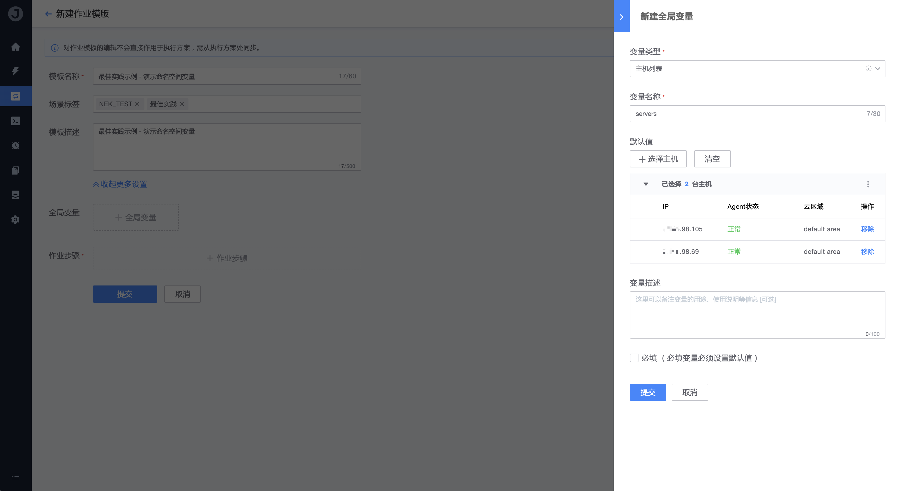
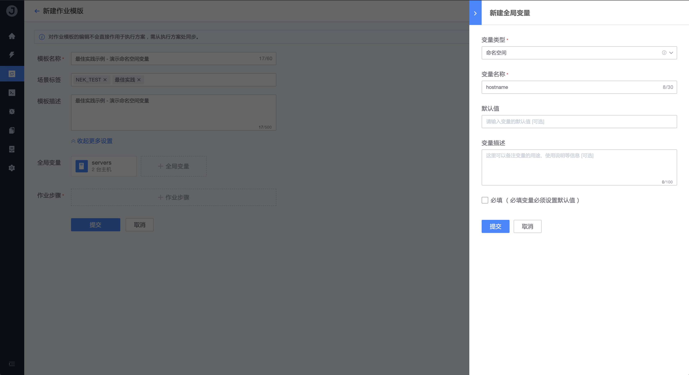
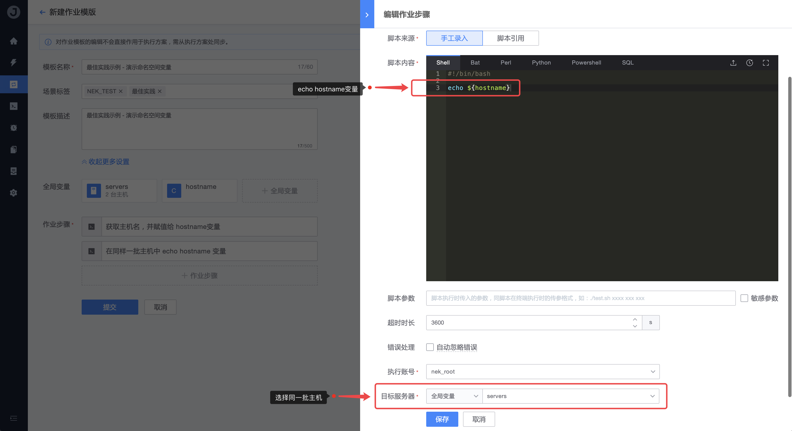
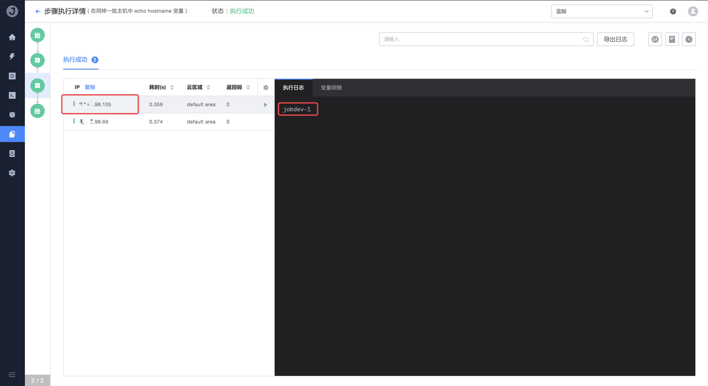

# How to make variables exclusive to the same host

When the same batch of hosts needs to pass independent variable values between multiple steps, we need to use the `namespace` variable; the difference between it and the `string` variable is that `namespace` is a unique identifier uniquely identified by the host There are variables, which are suitable for scenarios where the host is in multiple steps and needs to transparently transmit its own variable values;

Below we list a simple example to demonstrate the use of `namespace` type variables.

## Steps

1. Create a host variable for `servers` and a namespace variable for `hostname`

    

    

2. Obtain the host name in the first step, and assign it to `hostname`, execute target selection `servers`

    

3. In the second step echo `hostname`, the execution target also selects `servers`

    

4. Execute the job and observe whether the echo result of each host is the respective host name

    

    \*\*\*.\*\*\*.98.105 The variable value for this machine is `jobdev-1`

    

    And *\*\*.\*\*\*.98.69 the variable value of this machine is `jobdev-2`

## in conclusion

It can be seen that the same code logic uses `namespace` variables, so the echo results of different machines are the unique variable values of the host itself.

The introduction of this chapter is over, I hope this example can help you, thank you for your support to the BlueKing operating platform.