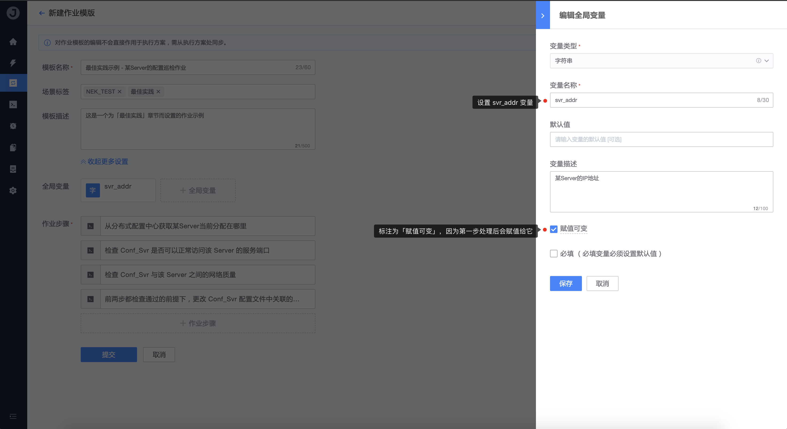
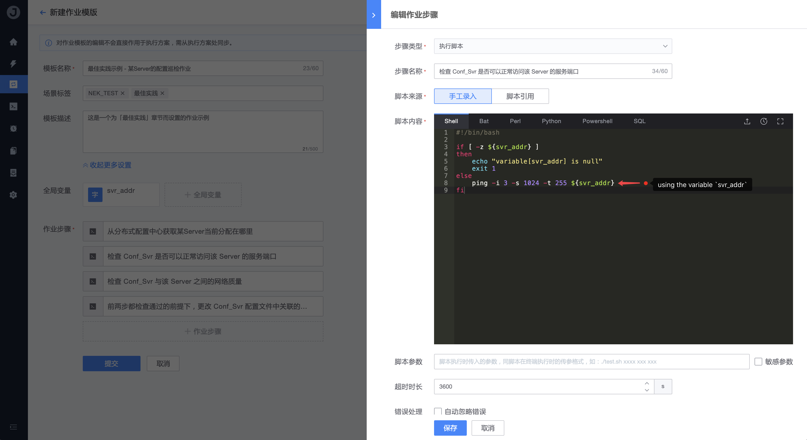
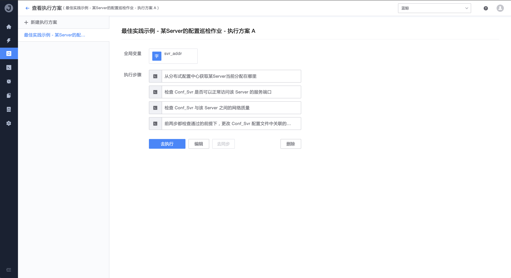
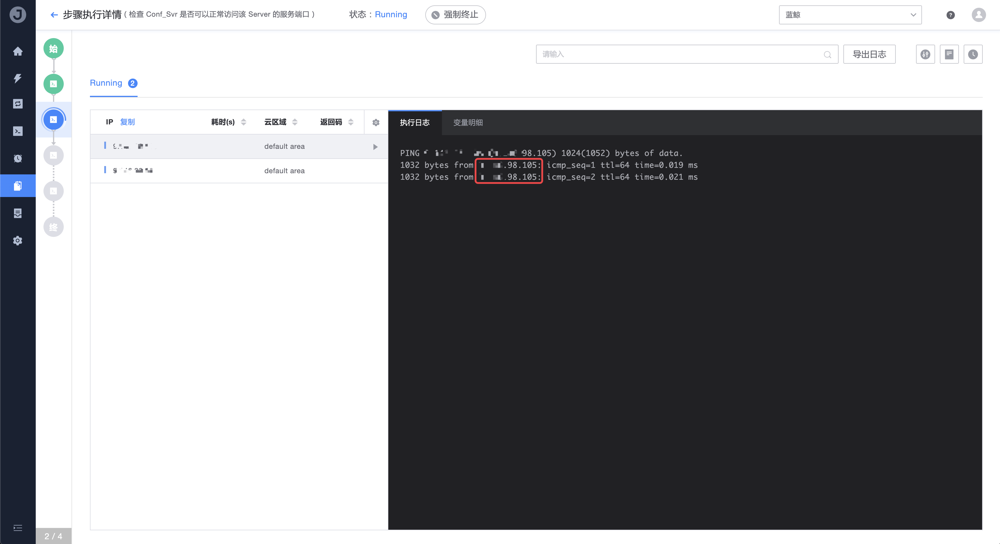

# How to pass parameters between different steps

When our job process has multiple steps, it is often necessary to pass the result value of a certain step to the next or subsequent step;

For example, the process of a "configuration inspection job" is as follows:

> 1. Obtain where a server is currently assigned from the distributed configuration center (obtain the IP address of the server)
> 2. Check whether Conf_Svr can access the service port of the Server normally
> 3. Check the network quality between Conf_Svr and this Server
> 4. On the premise that the previous two steps are checked, change the associated field in the Conf_Svr configuration file to point to this IP
> 5. Omit later...

In the above case example, the core requirement is that the IP address of the server needs to be obtained normally in the first step, so that the subsequent steps can run normally;

Next, we use "global variables" to demonstrate how the operating platform meets this demand scenario.

## Steps

1. Create `svr_addr` string variable and set `assign variable`

    

2. Obtain the corresponding value in the script processing of the first step and assign it to the `svr_addr` variable

    

3. Get `svr_addr` variable value for processing in subsequent steps

    

4. Save the job template and create an execution plan

    

5. Run the execution plan to check the results

    

## in conclusion

As shown in step 5 in the above figure, we use the ping command to monitor the network of ${svr_addr} in the script logic of the second step, and we can also see that the variable value is passed normally in the actual operation result log.

There are many other scenarios like this. I hope the examples in this chapter can help you. Thank you for your support to the BlueKing operating platform.