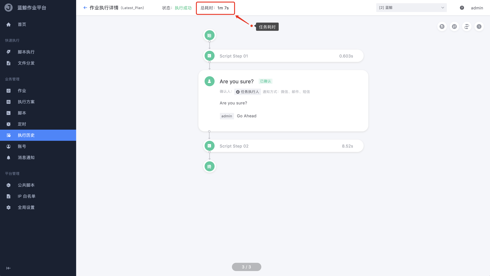
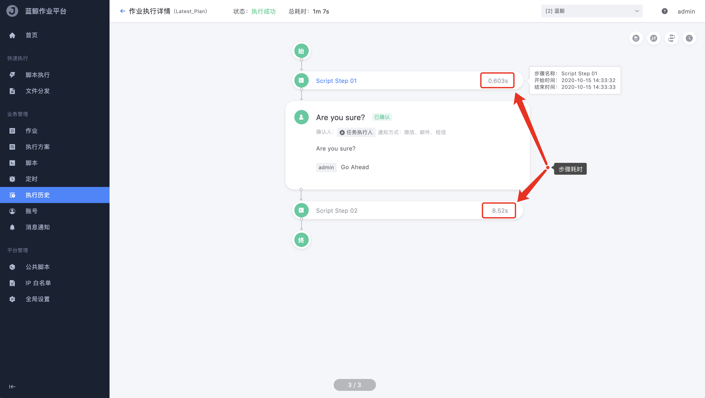
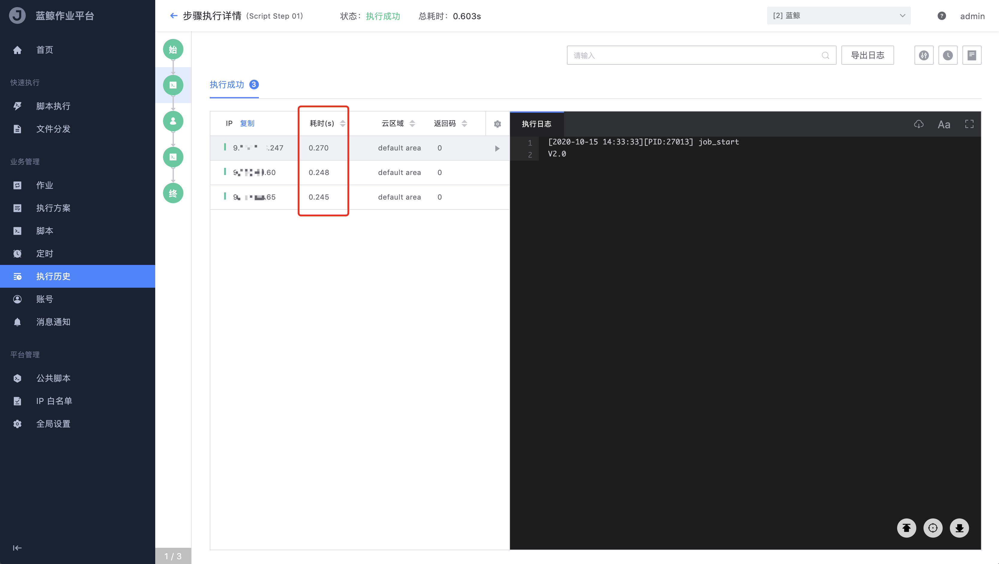

# What does task time-consuming, step time-consuming and execution time-consuming mean?

A task on the job platform contains three different meanings of time-consuming time, which are `task time-consuming`, `step time-consuming` and `execution time-consuming`. The relationship between the three is that "task time-consuming includes step time-consuming Contains execution time".

This chapter will explain to you the specific meanings of these three types of time-consuming time:

### 1. Task time-consuming

"Task time-consuming" refers to the total time-consuming time of a complete fast execution or job task, which is calculated by the task execution engine of the job platform. The calculation method is: `The sum of the processing time of all related steps in the task + The running logic of the engine itself is time-consuming`.

```text
Special Note: The stagnation time in the "Manual Confirmation" step will also be counted in the task time
```



### 2. Time-consuming steps

"Step time consumption" refers to the execution time of a single step in a job task, which is calculated by the task execution engine of the job platform; because there may be multiple execution hosts in a single step, the calculation method of step time consumption It is: `The running logic time of the engine itself + (the earliest start time of all hosts in the step - the latest end time)`.



### 3. Execution time-consuming

"Execution time" refers to the actual execution time of a specific target server in a single step. Since command execution or file distribution is finally implemented by GSE, this time-consuming value comes from the GSE Server after the task is completed. Returns the difference between startTime and endTime.

