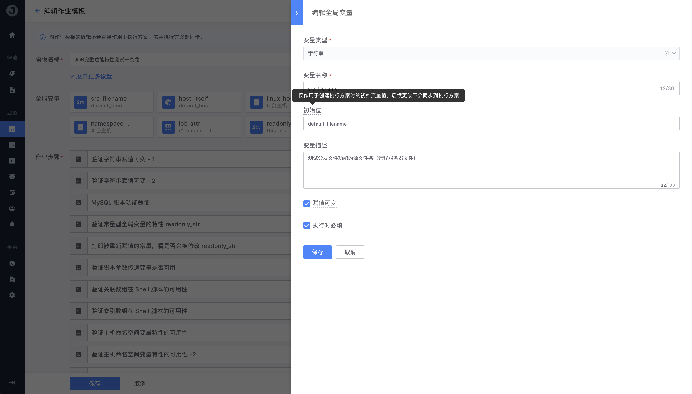

# What is the synchronization logic of the job template and the execution plan?

If you understand the BlueKing operating platform, you know that a job execution plan is an executable instance derived from a job template;

So what content in the modified job template will cause the execution plan to be out of sync with it? And which places to modify the template will not affect the execution plan?

This chapter will explain in detail the three main points of the template and execution plan synchronization logic in the job platform:

### 1. Modifying the basic information of the template will not cause the execution plan to be out of sync

### 2. Modifying the initial value and description of global variables in the template will not cause the execution plan to be out of sync

### 3. In addition, modifying any other content will cause the execution plan to be out of sync

The core includes the following key elements:

- Adjust the order of steps
- Add/subtract job steps
- Modify any field value within the step
- Increment/decrement global variables
- Modify variable related field values other than default value and description