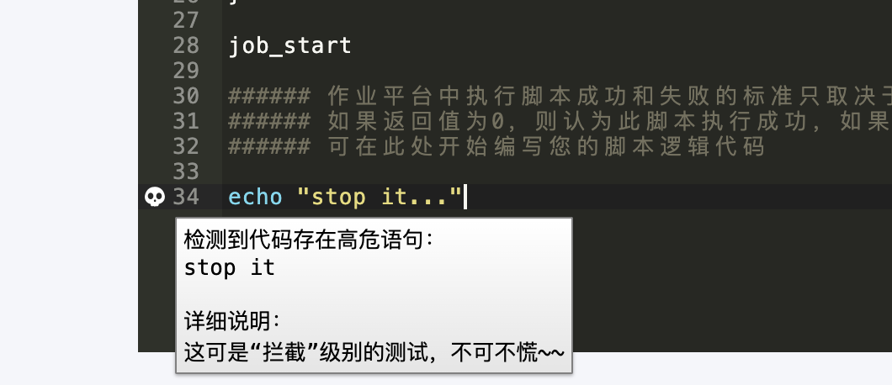

# High-risk sentence detection

### High-risk statement rule configuration

In order to avoid operation and maintenance operators mistakenly write some high-risk commands in the script, such as `rm -rf /`, which is a serious mistake to delete the root directory of the server! We provide a custom configuration function for high-risk statements. Enterprises can configure according to different script types in a regular way according to their own scenario needs;

Also, it is supported to configure detection actions (`intercept` or `scan`):

   - scan
  
     After the platform detects that a request hits a high-risk statement rule, it only records the log and does not intercept it
  
   - Intercept
  
     Literally, after the requested script content hits the rule, it will be directly intercepted and recorded in the log

### High-risk statement detection record

Provides to view the log records of all high-risk statement scanning and interception in history

### High-risk sentence detection effect
- "Scan" level
  
   - Editor hints
  
     
  
   - Execution prompt
  
     
  
- "Intercept" level

   - Editor hints

     

   - Execution prompt

     