# Job management

"Operation" is one of the core capabilities of the BlueKing operation platform! Its concept is: through the process orchestration capability, multiple script execution or file distribution steps involved in the operation and maintenance operation scenario are combined into a job template. This job template includes as much as possible the common logic related to the scenario, and then The corresponding execution plan is derived according to the actual usage scenario, so the relationship between the job template and the execution plan is "one-to-many".

## Job list

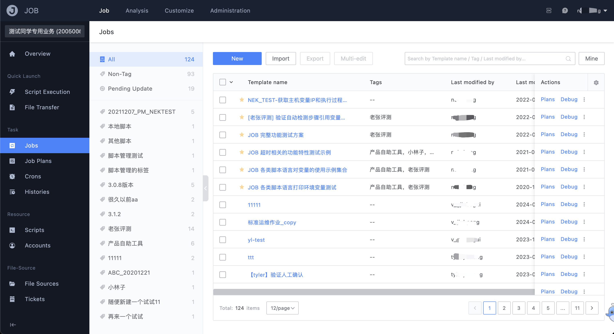

The job list page supports classification management by `tag`, so that the job templates of different scenarios can be well stored and easy to find; the management of tags supports adding/editing directly in the form, which is very convenient! In addition, you can also add personal favorites to the job templates you care about, and you can quickly and easily access them from the home page.

## Create job template

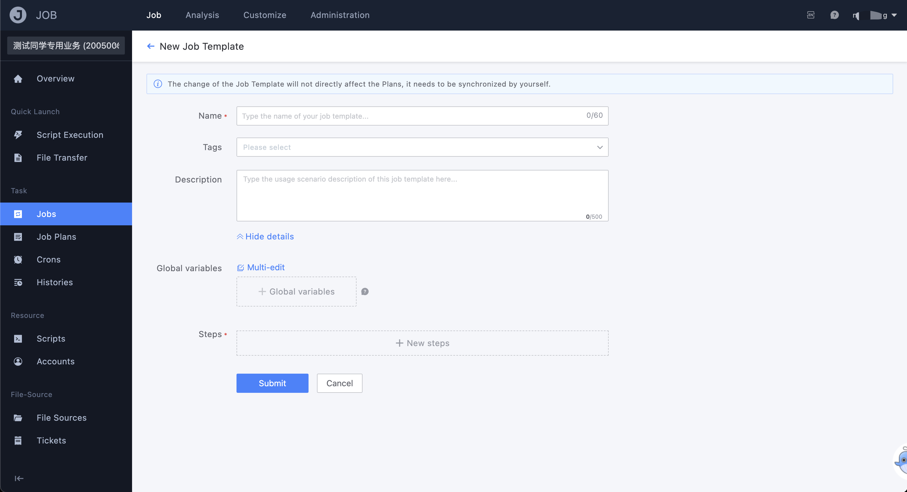

The job template consists of 3 parts: "basic information/global variables/job steps":

1. Basic Information

    - template name

      Set the name of the job template

    - scene label

      Set the classification label of the job template usage scenario

    - template description

      Remarks A detailed description related to the use of job templates

2. Global variables

    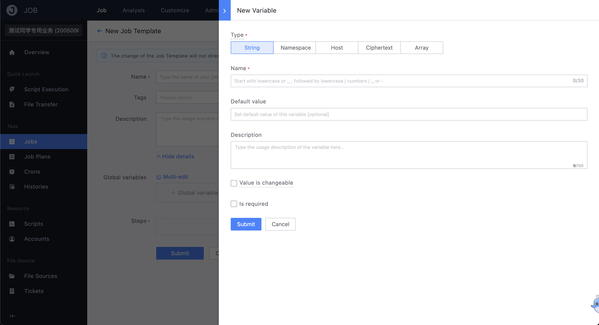

    - variable type

      - string

        Ordinary string type variables, no usage restrictions, can be shared across hosts or steps

      - Namespaces

        It works as its name suggests. Variables have their own namespaces on different hosts, and the hosts will not affect each other.

      - host list

        The host list is mainly used when multiple steps are set for the same batch of execution objects, which is convenient for batch synchronization and management

      - ciphertext

        The product layer of the operation platform encrypts ciphertext variables to protect their privacy and will not be displayed in plaintext
      
      - array

        Array structures dedicated to shell scripts, including `associative arrays` and `indexed arrays`

    - variable name

      That is, the name of the variable, which follows the naming convention of the Linux operating system for variables

    - initial value

      After setting the initial value of the variable, the execution plan derived from the template will be initialized and filled when it is created; of course, it can also be modified and adjusted separately in different execution plans later

    - variable description

      It is used to mark the detailed description information such as the purpose and function of the variable

    - other

      - variable assignment

        Indicates that the value of the variable can be changed in any step

      - required

        Indicates that the variable must be filled in before the job is executed and cannot be empty

3. Job steps

    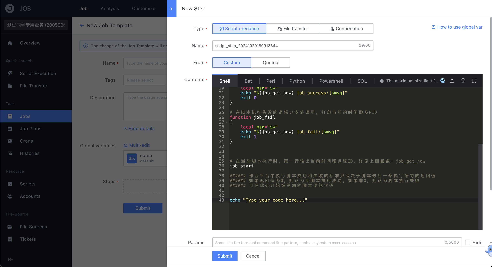

    - step type

      There are currently 3 types of steps, namely: `execute script`, `distribute file` and `manual confirmation`

    - step name

      Used to indicate the specific role of the step

    - Step content

      The steps of `executing scripts` and `distribution files` are the same as the quick execution method, and will not be repeated here;

      The step type of `manual confirmation` is unique to the job, so let’s explain it in detail:

      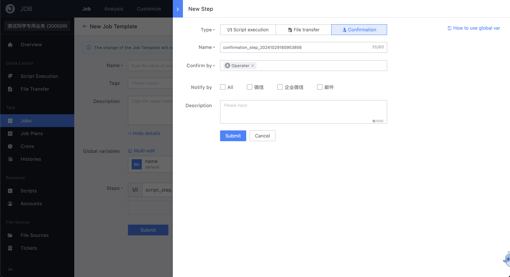

      - Confirmor

        The actual stakeholders who fill in the confirmation step, other people who are not in the confirmation list cannot perform the confirmation operation!

      - method to informe

        Select how to send a message to notify "Confirmer" when running to this step

      - confirm description

        Remark some items that need to be checked by the confirmer in the current execution scenario, and clearly describe the points that need to be confirmed.

    - error handling
     
      When the step execution fails, if `Auto Ignore Error` is checked, the process will ignore the failure and continue to execute

## Template debugging

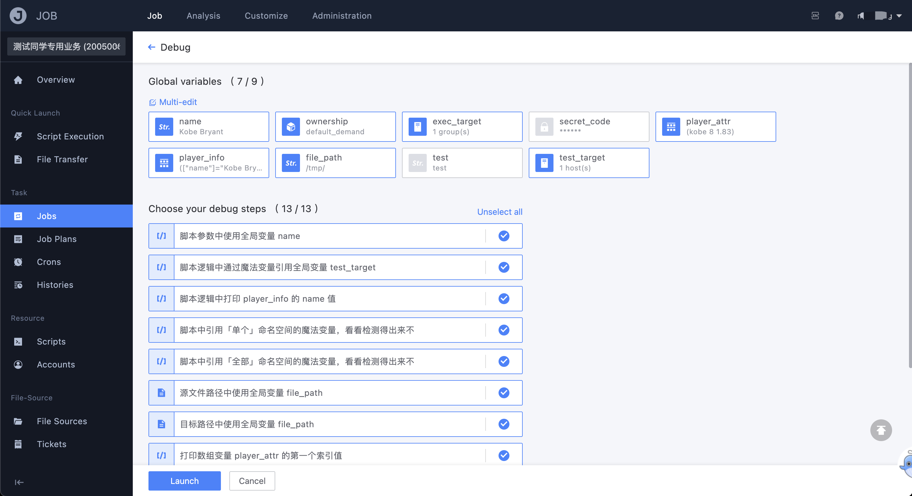

The "**debug**" function of the job template is specially designed for the template owner who needs to debug after changing the template logic. The job content in the debugging mode will be completely consistent with the job template, without the need to Synchronize to get the latest status.

## Generate execution plan

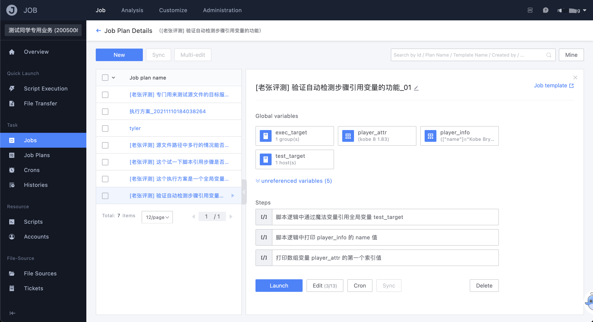

After the job template is created, one or more "**Execution Plans**" customized according to the scenario requirements can be created from the template; each execution plan can check the steps it needs from the template and modify the global variables variable value.

Important! In addition to checking steps and modifying global variable values in the execution plan, the order of steps, the content of steps cannot be modified, and global variables cannot be deleted. 

## Run the execution plan

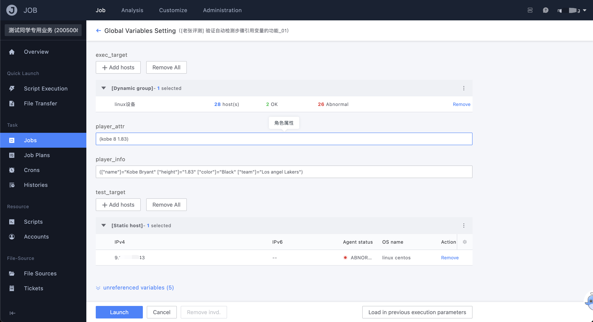

Select the execution plan you need, click "**Execute**" to go to the execution page; for the execution plan with global variables set, you will first enter the global variable confirmation page, in this page, users can follow their own needs Modify the scene and fill in the corresponding variable value, confirm and then click Execute.

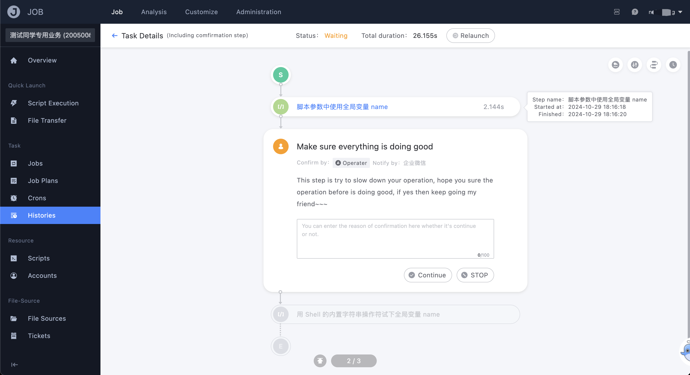

After the execution starts, you can see the overall execution status of the task, including the current progress, time-consuming, status and other information of the task; click on a step to enter and view the execution details of the step:

On the step execution details page, you can view information such as the execution time, return code, and result log of each target server; in addition, some auxiliary functions are provided to help users view configurations related to this step, Step information, including operation records.

## Import and Export

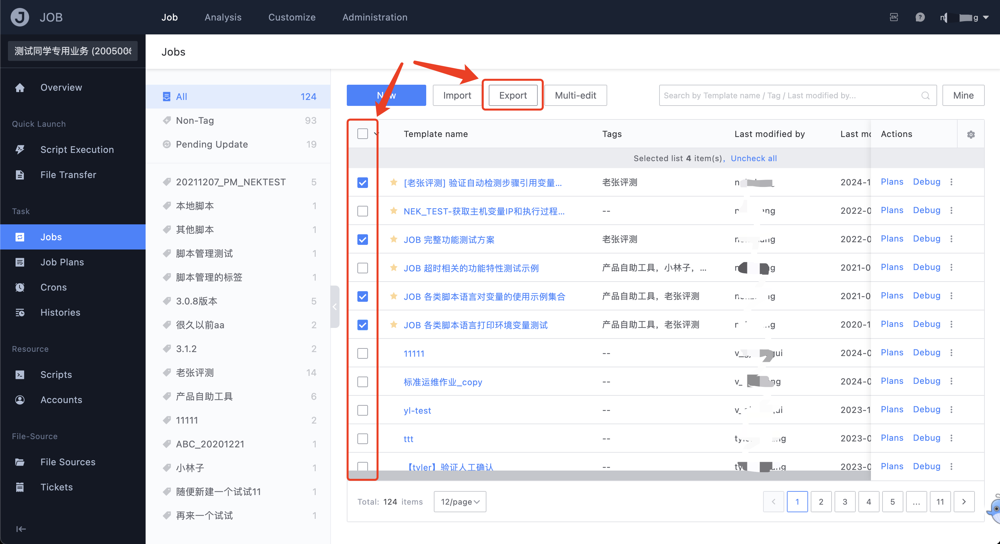

Check the job templates that need to be exported from the list, and click the `Export` button to export them.

### Export process

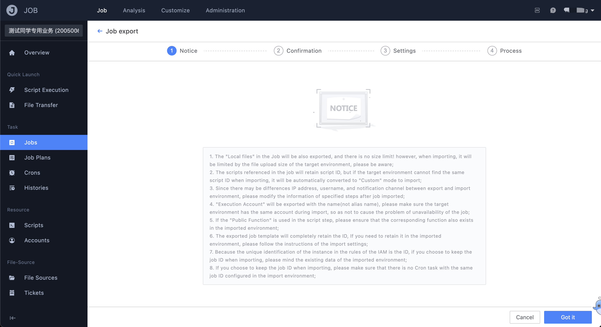

The process is as follows: `User Notice` -> `Export Content Confirmation` -> `Export Settings` -> `Start Export`

1. Notice to users

    Job export/import will have some established rules, which are described in detail in the first step of import/export `User Notice`, please read it carefully for the first time use.

2. Export content confirmation

    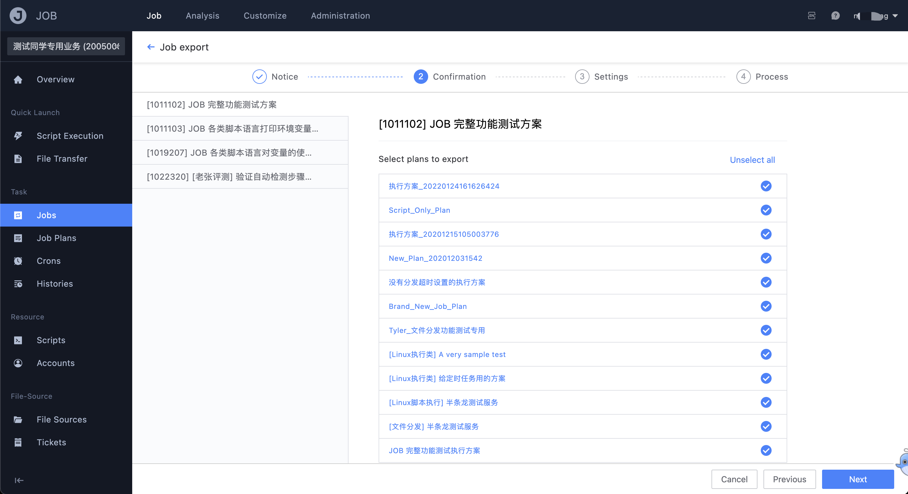

    In this step, users can customize and select the job execution schemes that need to be exported, without exporting all of them.

3. Export settings

    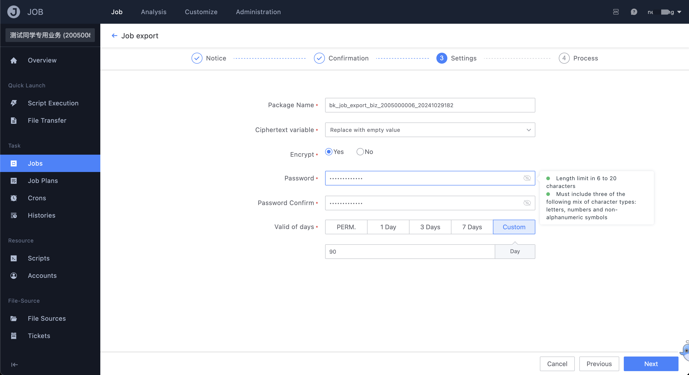

    Mainly some general basics and security settings for the exported compressed package;

    - Compression package name

      Support for customizing the name of the exported file compression package

    - Processing of ciphertext variable values

      When the exported job contains variables of `ciphertext` type, here you can set whether to export the original value of the ciphertext, or choose not to export

    - encrypt documents

      After setting the password, you need to enter the correct password when importing

    - Document validity period

      Select the import validity period of the file compression package. After the validity period, it will no longer be imported

4. Start the export

    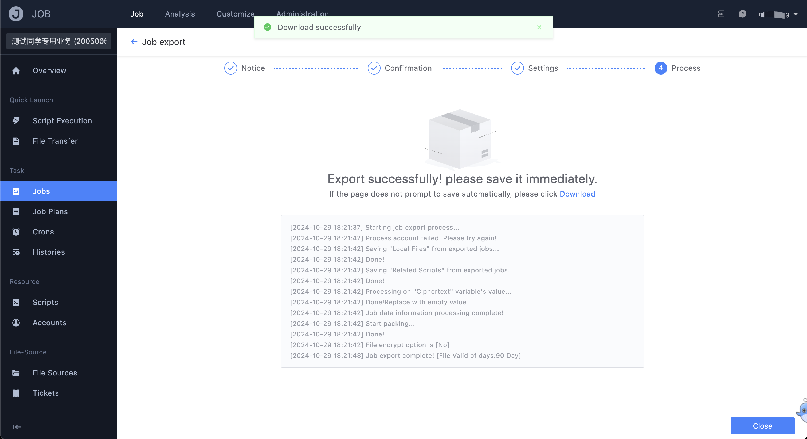

    This step will officially start the job export action. After the export task is completed, a pop-up window will automatically pop up to save the file locally. If you lose it, you can click `Re-download file` to download it again.

### Import process

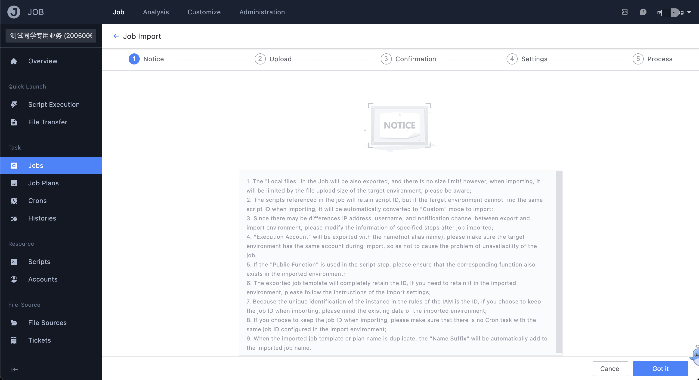

The process is as follows: `User Notice` -> `File Package Upload` -> `Import Content Confirmation` -> `Import Settings` -> `Start Import`

1. Notice to users

    Job export/import will have some established rules, which are described in detail in the first step of import/export `User Notice`, please read it carefully for the first time use.

2. File package upload

    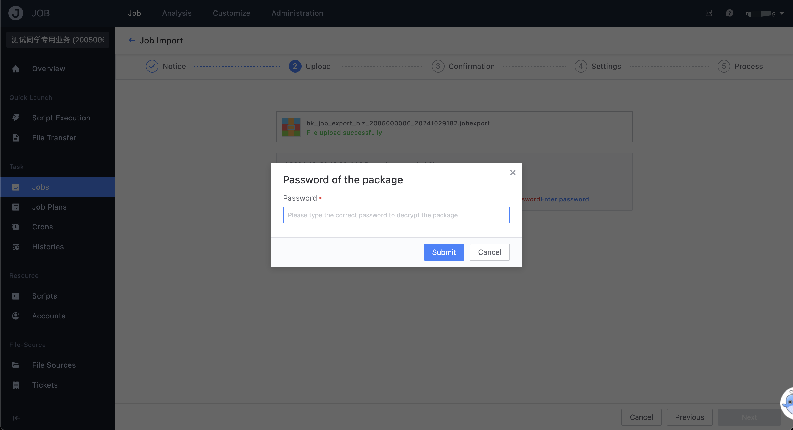

    After clicking Upload file compression package, if the background detects that the file is encrypted, a password input box will pop up automatically, and the correct password must be filled in to continue importing

3. Import content confirmation

    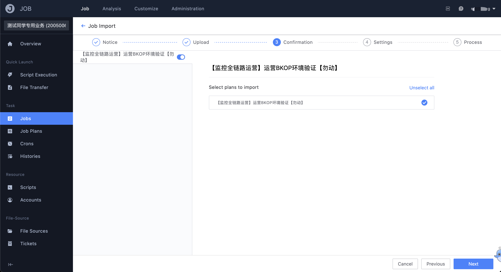

    In this step, users can select the job templates or execution plans to be imported as needed, without importing all of them.

4. Import settings

    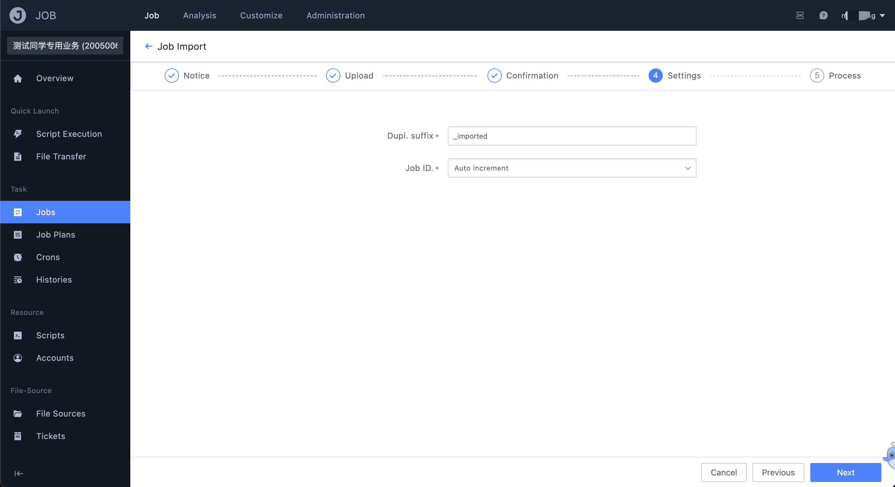

    - duplicate name suffix

      When the imported job template name already exists, the suffix name will be automatically appended according to this setting

    - Job ID handling

      Select what to do with job template IDs after import

5. Start the import

    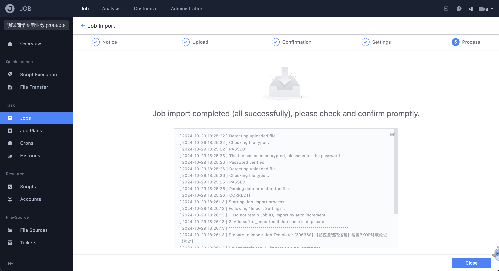

    This step will officially start the job import task. During the import process, you can click the link in the log to view the job information that has been successfully imported in time.

## Video guide

▶️[How to implement job scheduling in different scenarios](https://www.bilibili.com/video/BV1CY411H7JC/)