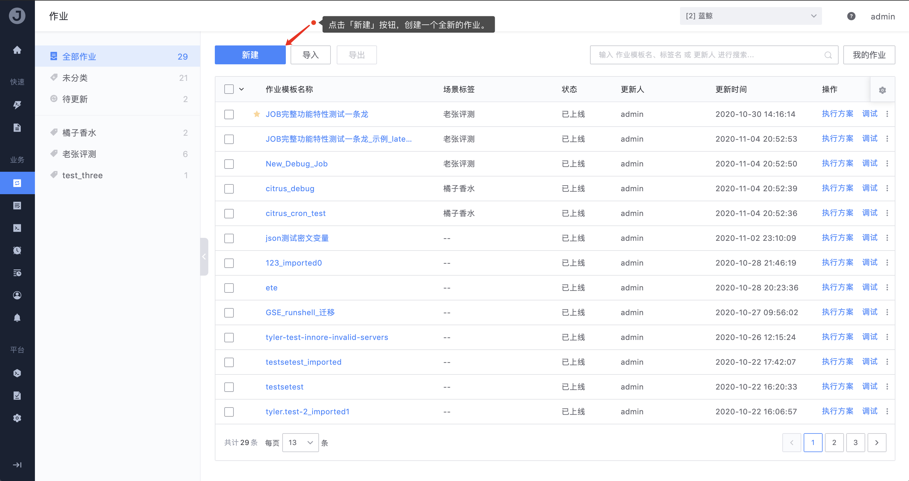
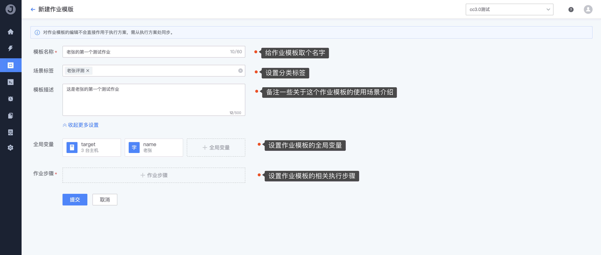
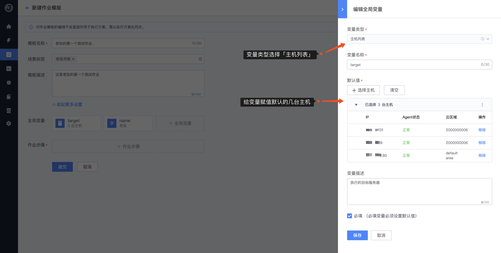
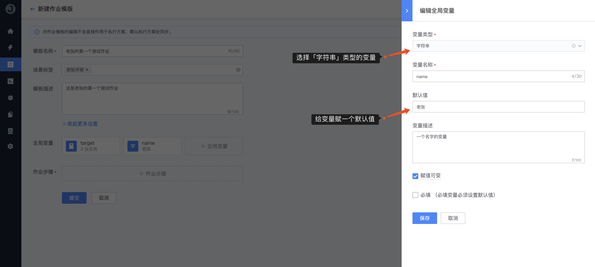
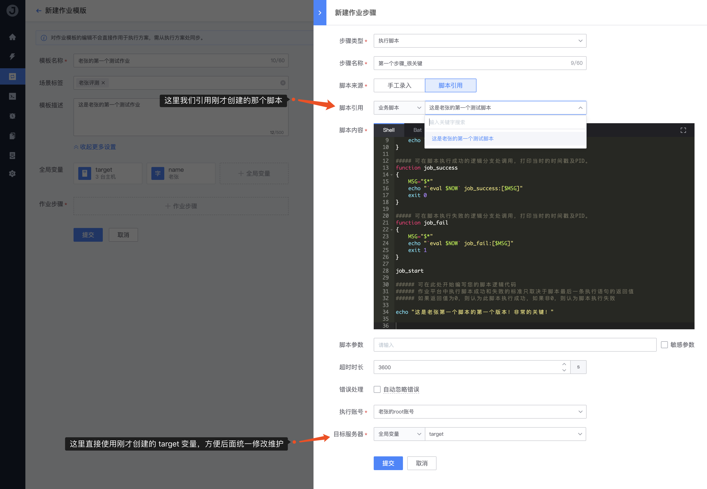
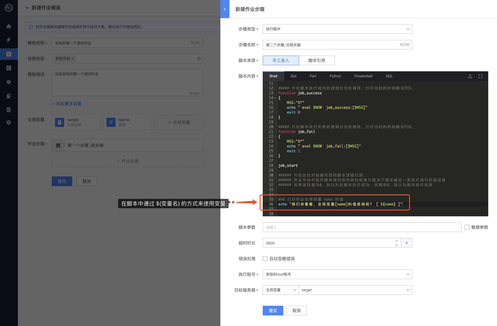
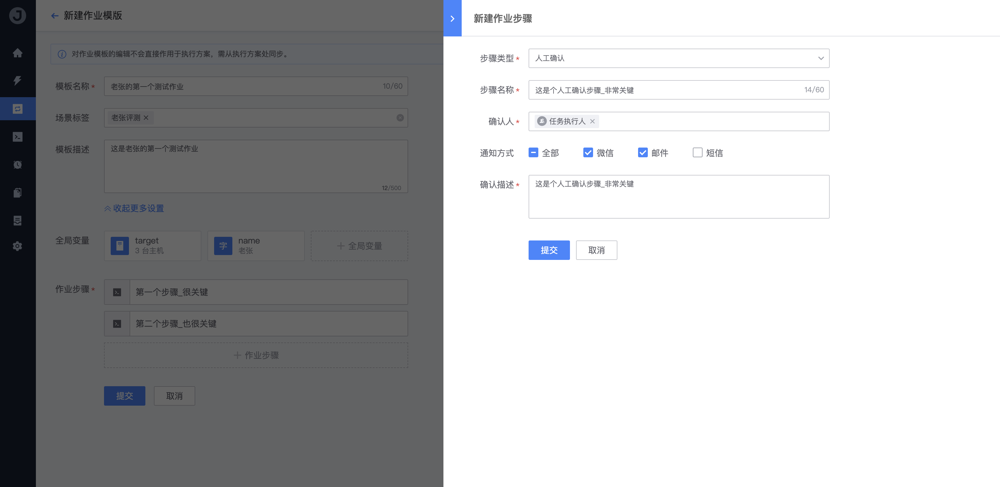

# 4. Create a job template

"Job" is a general term for the process used to assemble one or more operation nodes, just like the assembly line operation of the factory, assemble several required operations into one process, so that it can be connected in series to realize one-click automatic execution.

In the operation platform, an executable and complete "job" is composed of `template + execution plan`; the template provides a complete template that is general, standard, and uniformly modeled, and the execution plan is based on the scenario requirements from the template And the corresponding entities derived from it.

## Preconditions

```text
1. There is an executable server under the business (Agent status is normal)
2. Prepare the system execution account (required)
3. Prepare a "live" script (optional)
```

## Steps

1. On the `Jobs` page, click **New** to enter

    

2. Enter the basic information of the job and the content of the steps according to the requirements in the form

    

3. Set `name` string, and `target` host list variables, which are used in job steps

    Create a `hostlist` variable:

    

    Create a `string` variable:

    

4. Add execution steps, refer to the scripts and variables we just created as examples

    Step 1. Reference the script you just created

    

    Step 2. Directly write a temporary script and use the global variable `name`

    

    Step 3: Add a manual confirmation step and demonstrate

    

5. Finally, click the `Submit` button to save the job template; at this point, the job template is created

    

For more detailed job-related function introduction, please go to [Job Management Function Description](../Features/Jobs.md) .