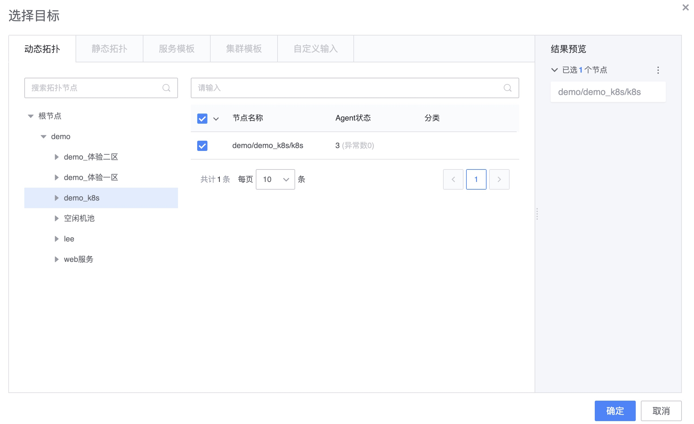
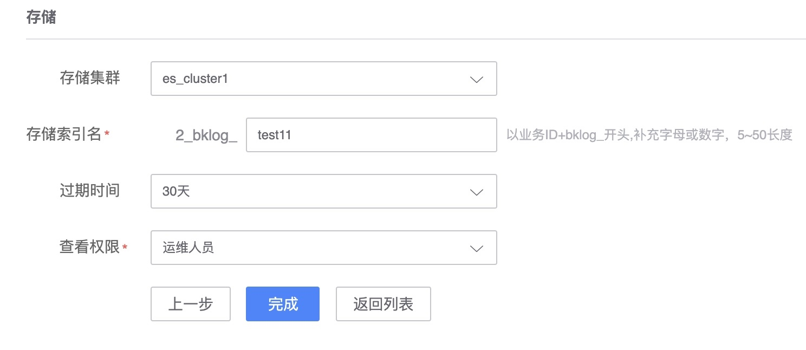

# Collect access

Log collection is to collect logs to the server through real-time streaming through the log service's own link, and the agent-side filtering and server-side field extraction functions can also be run during the collection process, which can quickly format the logs. need.

## Collection workflow

## Create new collection

**Function location**: Navigation → Management → Data Access → Collection Access → New

**Steps**:

* (1) Collection configuration
* (2) Collection and distribution
* (3) Field extraction & storage
* (4) Complete

### Collection configuration

Log type description

*Physical environment
     *Linux
         * Line log: suitable for collecting single line logs
         * Segment log: suitable for collecting multi-line logs, such as stack error reports, etc.
     * Windows
         * win event log: collect Windows system logs
         * Line log: suitable for collecting single line logs
         * Segment log: suitable for collecting multi-line logs, such as stack error reports, etc.
* Container environment
     * Based on Pod collection
     * Based on standard output collection
     * Based on Container collection

    
Select goal description

* Dynamic topology: IP changes under the topology, automatically updating the collection target
* Static topology: Only the first collection target is maintained. If the IP changes under the topology, the collection target will not be updated.
* Service template: Collect from the service template of CMDB
* Cluster template: Collect from the cluster template of CMDB
* Custom input: IP can be entered
     
> Note: Only one type can be used at the same time and cannot be mixed.
     

Log path:

* The log is an absolute path and log rotation
* Can support wildcard mode, see [Common Wildcard Characters](./wildcard.md) for details
* Can support multiple log files

Log content filtering:

* Support include method
* Supports filtering by strings and delimiters

Log link:

* Transfer logs and storage nearby, please see [Link Management](../resource-management/data_link_management.md) for details

### Collection and delivery

> Note: The asynchronous execution is still continuing after leaving the current collection, but the storage setting has not been completed, so the storage of the third step has not been completed after 24 hours, and the collection task will be forcibly deactivated.

### Field extraction

Optional item, applicable to scenarios where logs need to be formatted and logs need to be aggregated and dimensionally monitored.

For specific usage, see [Field Extraction](./log_simple_format.md)

### Storage

The index name where the collected data is stored will be used in the index set.

