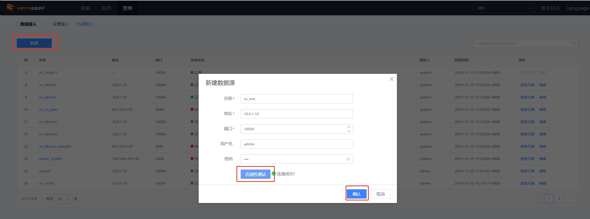

# Third-party ES access

The scenario of third-party ES access is mainly to solve the problem of using existing ES cluster access log service, or to collect data into a third-party cluster.

## Preliminary steps

### Features

* Connect to the ES cluster first

Navigation path: Management → Data Access → ES Source Access → New

After entering the complete ES cluster address, perform a connectivity test and save it only after the test passes.

> Third-party ES cluster version supports >=5.4, and has been tested and verified for versions 5.4 to 7.

* Create index set

After connecting to the third-party ES cluster, in order to actually use it, you need to create an index set before it can be used.

Navigation path: Management → Index Set Management → New

"*" is supported to match multiple indexes, and the fields of all matched indexes must be consistent, and the index must contain a time field, otherwise the access cannot be completed.

* Collection access

If you want to connect the collected data to a third-party ES cluster, just select the third-party ES cluster when collecting. For details, please view [Collection Access](collect_log.md)