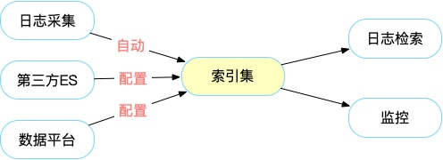
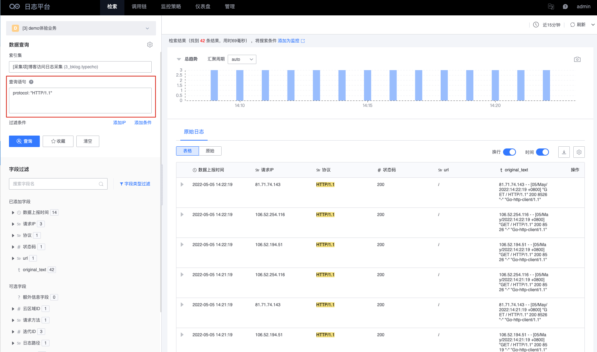
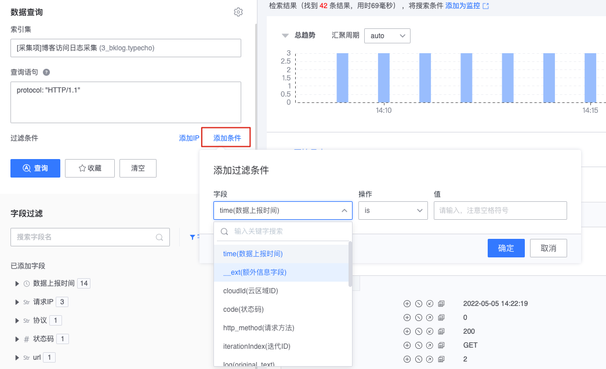
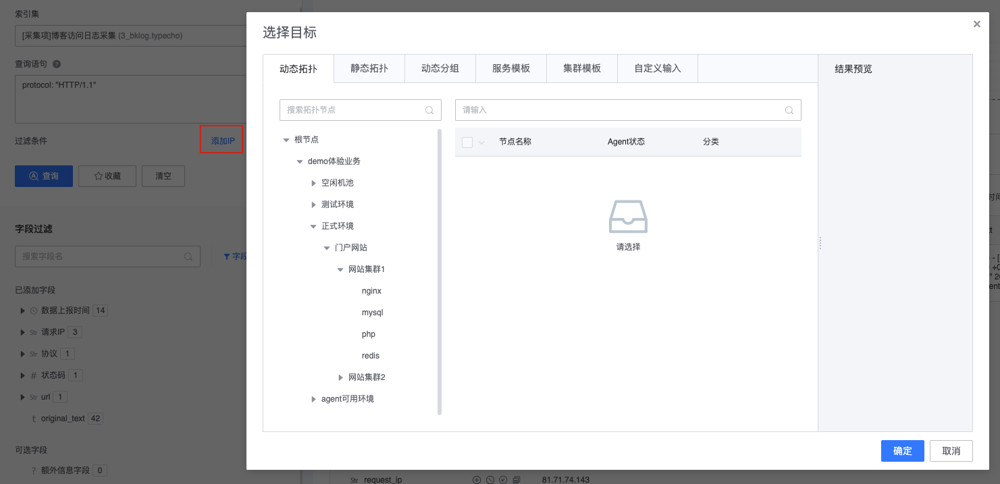
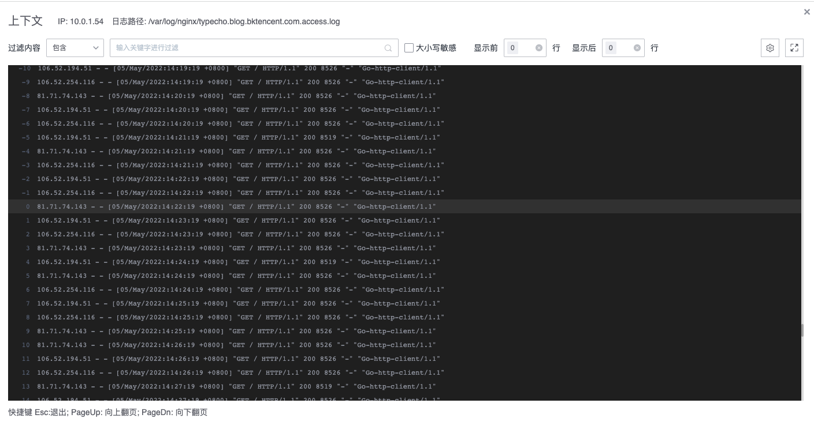
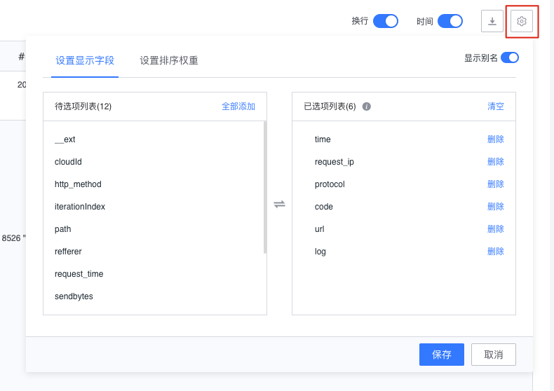

# Log retrieval

Log retrieval is mainly used to quickly locate problems and avoid querying logs on the server side. The advantages are efficient performance and convenient tools.

## Preliminary steps

To be able to retrieve logs, you need to have access to the data source and form an **index set** before it can be used for retrieval and monitoring.

## function list

* Log retrieval and display
* Filter conditions and IP quick selection
* Real-time log scrolling
* context
* Field display and sorting
* Search collection

## Features

### Search statement

Supports QueryString syntax and regular matching. For specific query syntax, please see [query string detailed explanation](addenda/query_string.md).

### Filter conditions

**Add filter conditions** to locate the log content more accurately. ****

### IP Quick Selection

**IP Quick Selection** controls the scope of log retrieval by correlating the business topology of CMDB.

### Real-time log

**Real-time log scrolling. **

**View in context. **

### Field display and sorting

**Field display and order, as well as multi-column sorting function. **

### Query Collection

