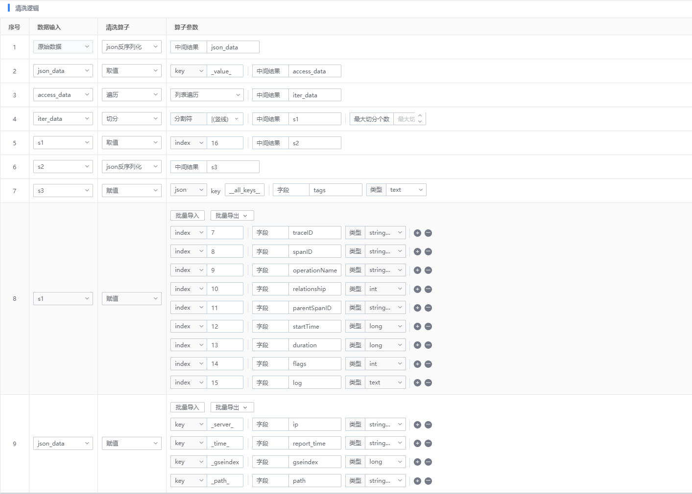
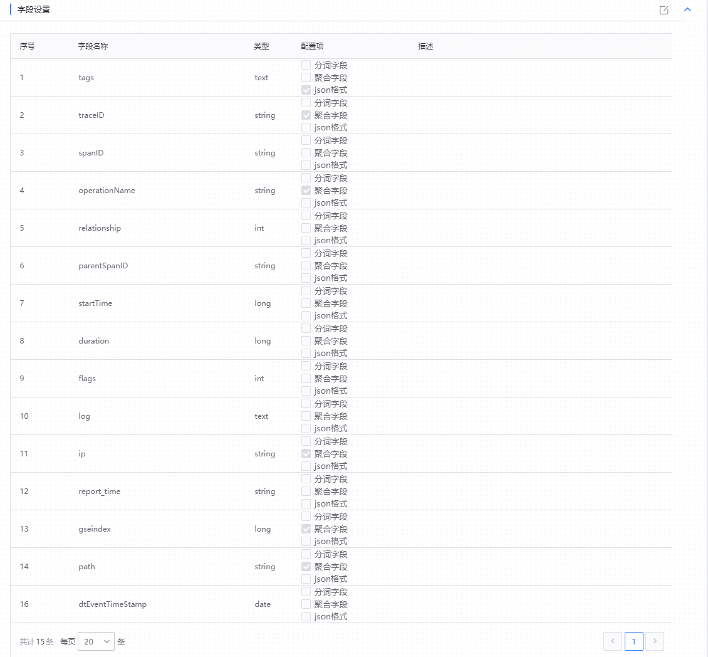
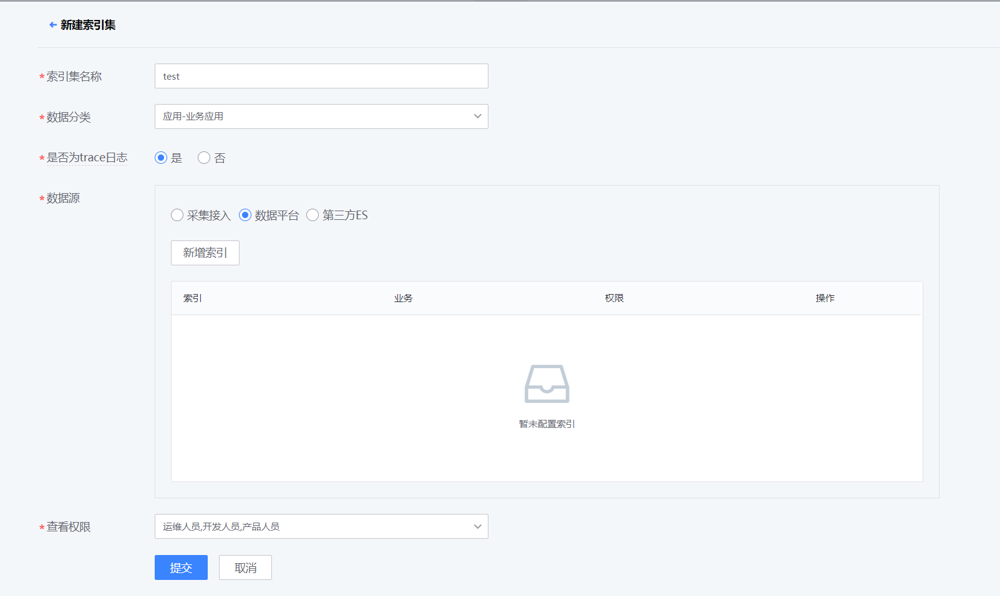

In actual business, a request needs to be associated with multiple task modules. Therefore, some tools are needed that can help understand system behavior and analyze performance problems, so that when a failure occurs, the problem can be quickly located and solved. If you want to understand the behavior of a distributed system in the context of a request, you need to monitor the related actions across different modules and different servers, and ultimately complete the tracking actions of the entire link.
   

    Legend: Example of calling a retrieval operation (experience through demo business-full link tracking)
There are generally three core steps in full-link tracking: code burying, data storage, and query display.

Full-link monitoring supports the OpenTracing (OpenTelemetry) open source protocol, and logs that meet the protocol standards can be collected and accessed.

## data structure

Legend: opentracing data structure example

## Data reporting

Integrated SDK: OpenTelemetry also provides various SDKs including Java | C# | Go | JavaScript | Python | Rust | C++ | Erlang/Elixir, as well as various common frameworks and libraries available for packaging, such as MySQL | Redis | Django | Kafka | Jetty | Akka | RabbitMQ | Spring | Flask | net/http | gorilla/mux | WSGI | JDBC | PostgreSQL, etc. Users can easily obtain and use them, and the advantage is fast access and high efficiency.
OpenTelemetry official website address: https://opentelemetry.io/

github address: https://github.com/open-telemetry

Independent implementation: Code burying and log output reporting are carried out according to the OpenTracing/OpenTelemetry protocol. These are the same methods currently commonly used. The advantage is that they are flexible and controllable.

## Data collection & transfer

In addition to the initial code burying point of data reporting, it also involves the data reporting method. During the SDK access process, an exporter needs to be set. During the independent implementation process, you can also choose to log the logs to the local disk, or to log the logs to the designated collector in the form of network transmission.
It is recommended to use the tlog (tglog) method for internal game business access. Firstly, the technical solution is familiar, and secondly, the performance is stable and guaranteed. Currently, multiple businesses are accessed in the form of tlog; at the same time, users can choose kafka and other other components as collectors, and the same is true on the platform side. Support data processing and storage.
 

Legend: tlog access table field definition example (opentracing)

## Data cleaning

Through the BlueKing data platform, data can be cleaned. Example of data cleaning template:

After cleaning, the data is stored in ES and the field settings are:

## Index set access

Management->Index Set Management->New

- Whether it is a trace log: Yes
- Data source: Select the corresponding index set from the data platform

At this point, you can use the full link related functions normally.