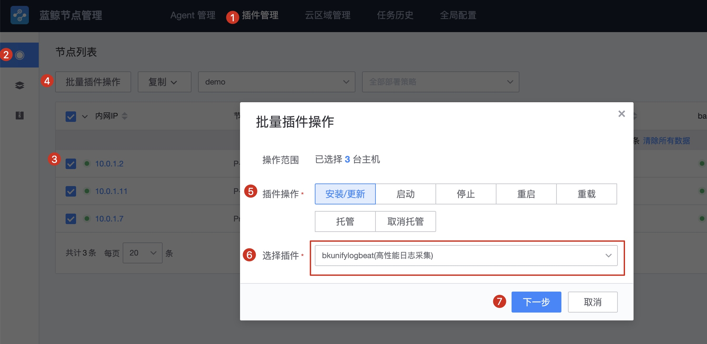
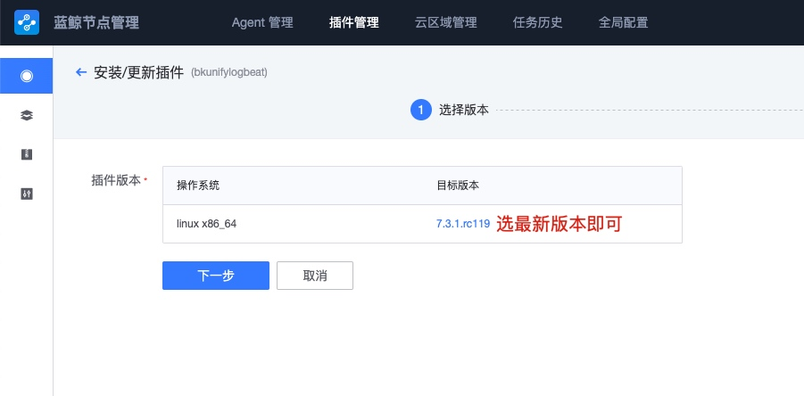

# Log collector installation


## installation method

Plug-in installation and hosting are unified operations through node management
​
The name of the log collector is bkunifylogbeat




Select the latest version and click Next to install

​



## FAQ


### 1. Troubleshooting collector problems

Log collector program related

Log collector binary file

`/usr/local/gse_bkte/plugins/bin/bkunifylogbeat`

The main configuration file of the log collector

`/usr/local/gse_bkte/plugins/etc/bkunifylogbeat.conf`

Log collector sub-configuration file

`/usr/local/gse_bkte/plugins/etc/bkunifylogbeat/ `

Check if the process is started

`ps -ef|grep bkunifylogbeat`

The main configuration file of the log collector

```
logging.level: error
max_procs: 1
output.bkpipe:
   endpoint: /usr/local/gse_bkte/agent/data/ipc.state.report
path.logs: /var/log/gse_bkte #Log path
path.data: /var/lib/gse_bkte #File for collection progress related data records
path.pid: /var/run/gse_bkte #pid path

queue:
   mem:
     events: 1024
     flush.min_events: 0
     flush.timeout: "1s"

xpack.monitoring.enabled: true
xpack.monitoring.bkpipe:
   bk_biz_id: 100147
   dataid: 1100006
   task_dataid: 1100007
   period: "30s"

processors:
   - drop_event:
       when:
         not:
           has_fields: ["dataid"]

bkunifylogbeat.eventdataid: -1
bkunifylogbeat.multi_config:
   - path: /usr/local/gse_bkte/plugins/etc/bkunifylogbeat #Sub-configuration file path
     file_pattern: "*.conf"
```

Log debug mode

If you need to debug and check whether the current log is collected normally, you can change the collector log to debug mode for viewing.

```
vim /usr/local/gse_bkte/plugins/etc/bkunifylogbeat.conf

logging.level: debug #Change the log level to debug mode
cd /usr/local/gse_bkte/plugins/bin

./restart.sh bkunifylogbeat

#View the log. The debug log will record the currently collected files and content.

tail /var/log/gse_bkte/bkunifylogbeat

#After the adjustment is completed, change the log level to error
```

### GSE resource protection

Whether the collector exceeded the resource limit and was killed: confirm whether there is a restart.

```
# Confirm whether there is a restart

grep -nr "logbeat" /tmp/bkc.log | tail
​
5375:[]20201123-120449 INFO|113|log-main start bkunifylogbeat ...[-]20201123-120459 INFO|120|log-main stop bkunifylogbeat ...
5376:[]20201123-120535 INFO|113|log-main start bkunifylogbeat ...[-]20201123-120545 INFO|120|log-main stop bkunifylogbeat ...
5377:[]20201123-120621 INFO|113|log-main start bkunifylogbeat ...[-]20201123-120632 INFO|120|log-main stop bkunifylogbeat ...
```

Confirm whether gse has a kill record

```
# Confirm gse kill
grep -nr "bkunifylogbeat" ./agent-*.log | tail
​
./agent-20201123-00507.log:5043:[2020-11-23 12:01:55.530] <40149-260040448>[ERROR][processmanage:558] : Process[bkunifylogbeat] cpu[45.360824584960938] or mem[0.1 22222900390625 ] usage is too high! Cross line 3 times, Process restarted!
./agent-20201123-00507.log:5048:[2020-11-23 12:02:41.576] <40149-260040448>[ERROR][processmanage:558] : Process[bkunifylogbeat] cpu[46.315788269042969] or mem[0.1 2119293212890625 ] usage is too high! Cross line 3 times, Process restarted!
```

Manually adjust the collector resource ratio

```
# Confirm the number of CPU cores
cat /proc/cpuinfo| grep "cpu cores"| uniq
​
#Adjust bkunifylogbeat resource proportion
vim /usr/local/gse_bkte/agent/etc/procinfo.json


"cpulmt" : 30,
"memlmt" : 20,

Adjust the cpulimit of bkunifylogbeat to a certain proportion according to needs
For example: a 4-core machine needs to be set to 30% to run full single core.
​
# reload gse agent
# - reload will wait until all tasks are completed before restarting
# -restart will restart directly, and the executing tasks will be lost.

cd /usr/local/gse_bkte/agent/bin
./gse_agent --reload
```


### The collector cannot be started

```
If the following log appears, it means there is a problem with the agent.

2021-08-05T15:36:49.117+0800 ERROR instance/beat.go:807 Exiting: error initializing publisher: get agent info timeout
The agent needs to be restarted before the collector can start normally.

cd /usr/local/gse_bkte/agent/bin
./gse_agent --reload
```


### Windows multiple IP does not report collection processing method

```
#windows multi-IP configuration adjustment to solve the problem that the collector cannot report data
IP=$(ipconfig|grep "IPv4 Address"|grep -v "169.254.68.1"|awk '{print $NF}'|grep -E "(^9.|^11.)"|sed "s/\ r//g") #If the IP does not start with 9 or 11, please adjust it yourself.
echo $IP
grep "\"agentip\":\"$IP\"," /cygdrive/c/gse/gseagentw/conf/gse.conf || sed -i "/{/a\"agentip\":\"$IP \"," /cygdrive/c/gse/gseagentw/conf/gse.conf
cat /cygdrive/c/gse/gseagentw/conf/gse.conf || exit 1
sc stop gseDaemon
sc start gseDaemon
```

cgroup adjust quota

Adjust the CPU quota first, then adjust it in node management


Add personal configuration

```
mkdir -p /etc/sysconfig/gse_plugins/
echo "CPU_CGROUP_LIMIT=400000" > /etc/sysconfig/gse_plugins/bkunifylogbeat #Use 4 cores

cd /usr/local/gse_bkte/plugins/bin || exit 1
./restart.sh bkunifylogbeat
```