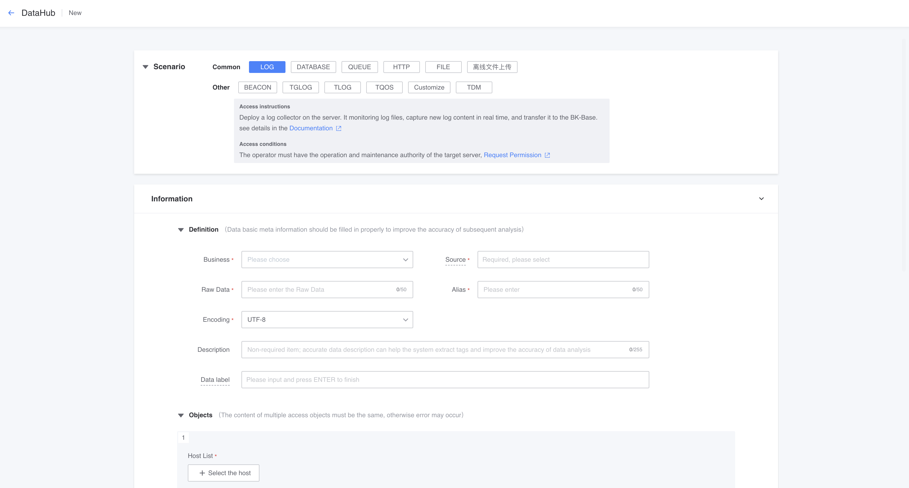
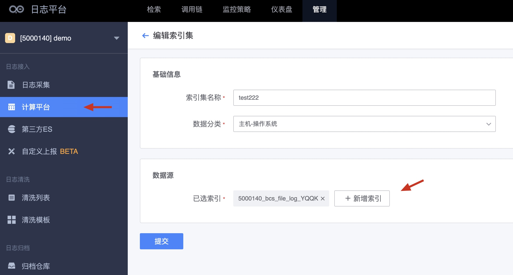

# Quick access to data platform

Quickly access BKLog by accessing the data platform. (Enterprise version only)

## Access steps

### Computing platform data collection

*Complete data collection through data platform

Navigation path: Computing Platform → Data Integration → New Access Data Source

### Computing platform data cleaning

* After the collection is completed, data cleaning is performed. The specific cleaning process is based on the characteristics of the data and refers to the data platform cleaning instructions.

### Data storage

* Create a new database after cleaning. After the data is stored in ES, it can be queried in BKLog.

Description of storage configuration items:

Word segmentation: Generally, you can select longer texts. When entering the database, the text will be segmented using the ES standard word segmenter.

Aggregation: doc_values will be set to true when es is stored in the database. After setting, it can be used for sorting in BKLog.

json: If the data is of dict type and you need to query the children, you can choose it.

### BKLog View the logs of the computing platform

By creating an index set, visualization needs such as log retrieval can be met.
