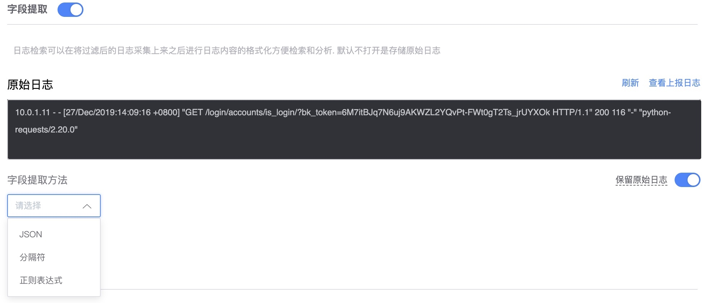
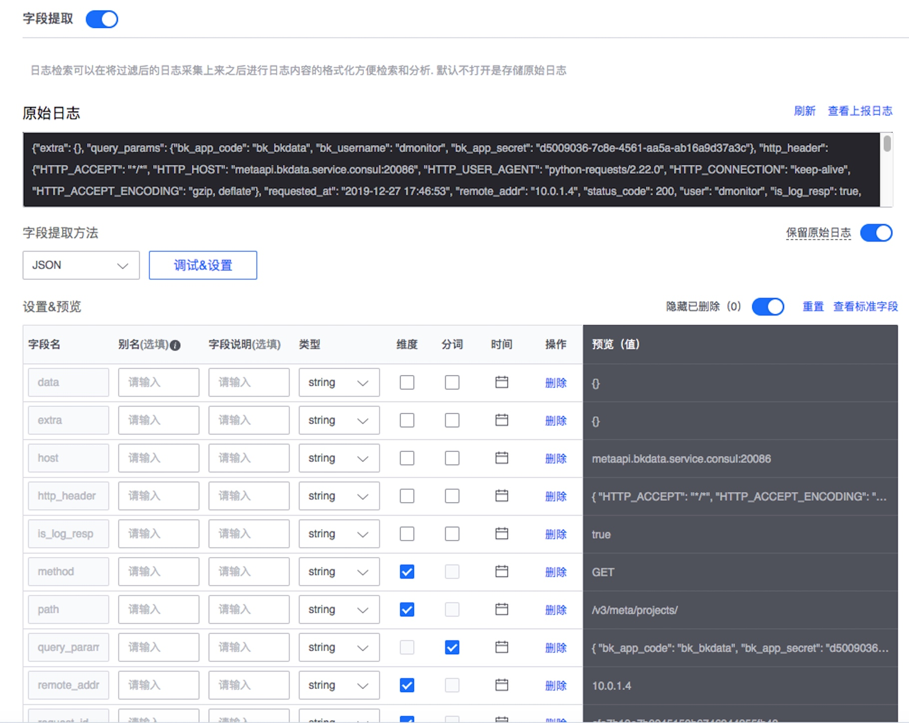
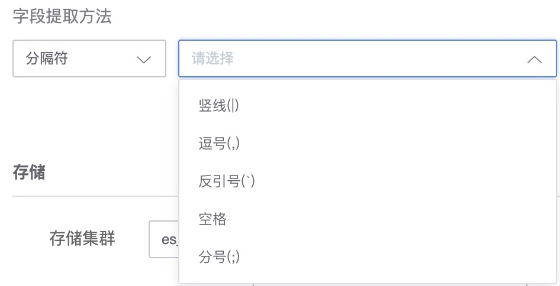

# Field extraction/log cleaning


Field extraction provides three extraction methods: JSON, delimiter, and regular expression.



#### Regular extraction

Format description:

Regular extraction uses Go's regular syntax: there are two forms, one is a normal extraction group, and the other is a named extraction group. Named extraction group syntax is used here.

* Normal: (Expression)
* Naming: (?P<name>Expression)

like:

```bash
(?P<request_ip>\d+\.\d+\.\d+\.\d+)
```

It means: name the `\d+\.\d+\.\d+\.\d+` content matched by the regular expression as `request_ip`.

[Online regular expression debugging page](https://www.debuggex.com/)

#### JSON mode

The collected and reported logs are in standard JSON format, and only the first-level keys are extracted.



#### Separator

Determine the required field content through delimiters. Currently supported: vertical bar, comma, backtick, space, and semicolon.



