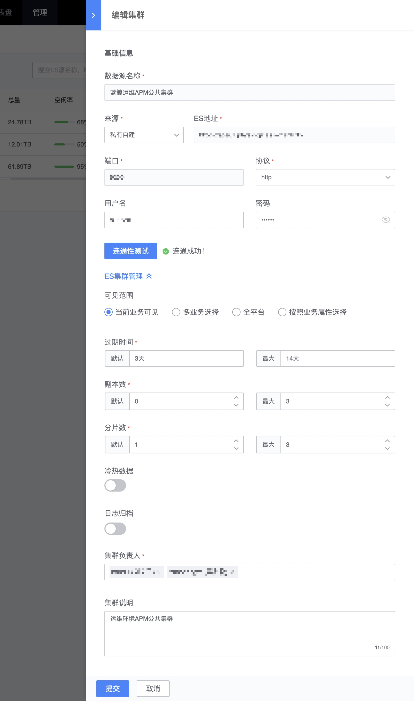
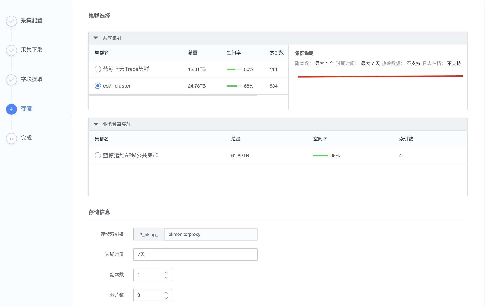

# Cluster management

Cluster refers to the management of Elasticsearch storage cluster, which can meet different collection and storage needs by docking with ES storage.

As long as it complies with the ES native protocol, it can be connected. Support V5, V6, V7

## Create and manage clusters

After the connectivity test is successful, you can set up ES cluster management.

1. Visible range, support
     * Current business is visible
     *Multiple business options
     * All platforms
     * Select according to business attributes: Filter by CMDB business attributes

2. Expiration time, number of copies, number of shards, hot and cold data, and log archiving will have corresponding effects when collected and used after being set.

* Hot and cold data: Through the setting of hot and cold data, different machine resources can be set to achieve resource cost savings.
* Log archiving: For long-term storage, irregular backtracking is required. Better to save machine resources, log archiving can be used. For specific log archiving configuration, see [Log Archiving Usage Document](../tools/log_archive.md)

