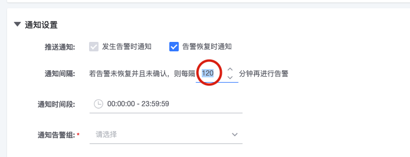

# Notify convergence and aggregation mechanism

In order to avoid alarm storms caused by a large number of alarm events in a short period of time, the monitoring platform converges and summarizes alarm notifications.

## Alarm convergence

In order to prevent the same alarm from generating notifications in each detection cycle, the notification interval can be set in the policy configuration, and the alarms between two notifications will be converged.

## Alarm suppression

High-level alarms suppress low-level alarms.

1. If a high-level alarm occurs, the low-level alarm in the same dimension will be restored immediately.
2. If there is a high-level alarm, low-level alarms will not be generated.

## Alarm summary

Multiple alarm notifications within a period of time are classified according to certain rules and then aggregated and sent.

### Notification allocation

Alarm notifications will be classified into two levels.

First, a single alarm notification will be classified according to the following information. Those with the same information will be assigned to the same category.

Alarm notifications of the same level and dimension generated by the same policy will be classified into one category, here we call it **Same Dimension Group**.

1. Business ID (bk_biz_id)
2. Notification recipients (notice_receivers)
3. Notification method (notice_way)
4. Notification type (notice_type)
5. Alarm strategy (strategy_id)
6. Alarm level (level)
7. Dimension hash (dimension_hash)

Then, the above categories are classified according to the following information, and the number of same-dimensional groups in each category is counted.

Classes with the same business, same data source, and same level will be classified into one category. Here we call it **multi-strategy group**.

1. Notification type (notice_type)
2. Notification recipients (notice_receivers)
3. Notification method (notice_way)
4. Business ID (bk_biz_id)
5. Data source type (data_source)
6. Alarm level (level)

### Trigger sending task

After the notification is classified, it will try to trigger a sending task. There are three sending tasks:

1. Send immediately

    When the notifications of the same dimension group do not enter any summary state, the sending task with a delay of one second is directly triggered. The reason why a single alarm is not sent directly is so that when a large number of alarms flood in in a short period of time, the first alarm sent can carry enough alarms.

    When the task is executed, unsent notifications in this same dimension group within 120 seconds are aggregated and sent.

2. Summarize and send the same dimensions

    When the number of notifications to be sent in the same dimension group reaches the **same dimension summary threshold**, the same dimension group enters the summary sending state and triggers a sending task with a delay of 60 seconds. When the task is not executed, the same dimension group will not Will trigger **Send Now**.

    When the task is executed, unsent notifications within the **same dimension summary time window** seconds in the same dimension group are summarized and sent, and then the sent notifications are marked as sent.

3. Multi-strategy summary sending

    When the number of same-dimensional groups in a multi-policy group reaches the threshold **Multi-policy Summary Threshold**, the multi-policy group enters the summary sending state and triggers a sending task with a delay of 60 seconds. When the task is not executed, the multi-policy group The same dimension group will not trigger any sending tasks.

    When the task is executed, unsent notifications within the **multi-policy summary time window** seconds of all the same-dimensional groups in the multi-policy group are summarized, and then the notifications are marked as sent.

> The **summarization threshold** and **summarization time window** mentioned in the above description can be adjusted by the administrator in the dynamic global configuration.

### Notification content

1. The notification templates for same-dimension summary and multi-policy summary are different.
2. The length of a single message in some notification channels (such as SMS) is limited. When the notification message reaches the single message length limit, some notification template variables will enter the omission mode to minimize the length of the notification message, but there is no guarantee that the notification message will be smaller than the single message length limit.
    * content.target
    * alarm.target
    * content.dimension
    * alarm.dimension

## Voice Alarm

Due to the particularity of language alarms, the summary logic of voice alarms is relatively special. It will ensure that no matter how many voice alarm notifications there are within 2 minutes, the same group of people will only receive one phone alarm, and the remaining language alarms will be discarded.

Therefore, it is recommended to configure telephone alarms only for important alarms.