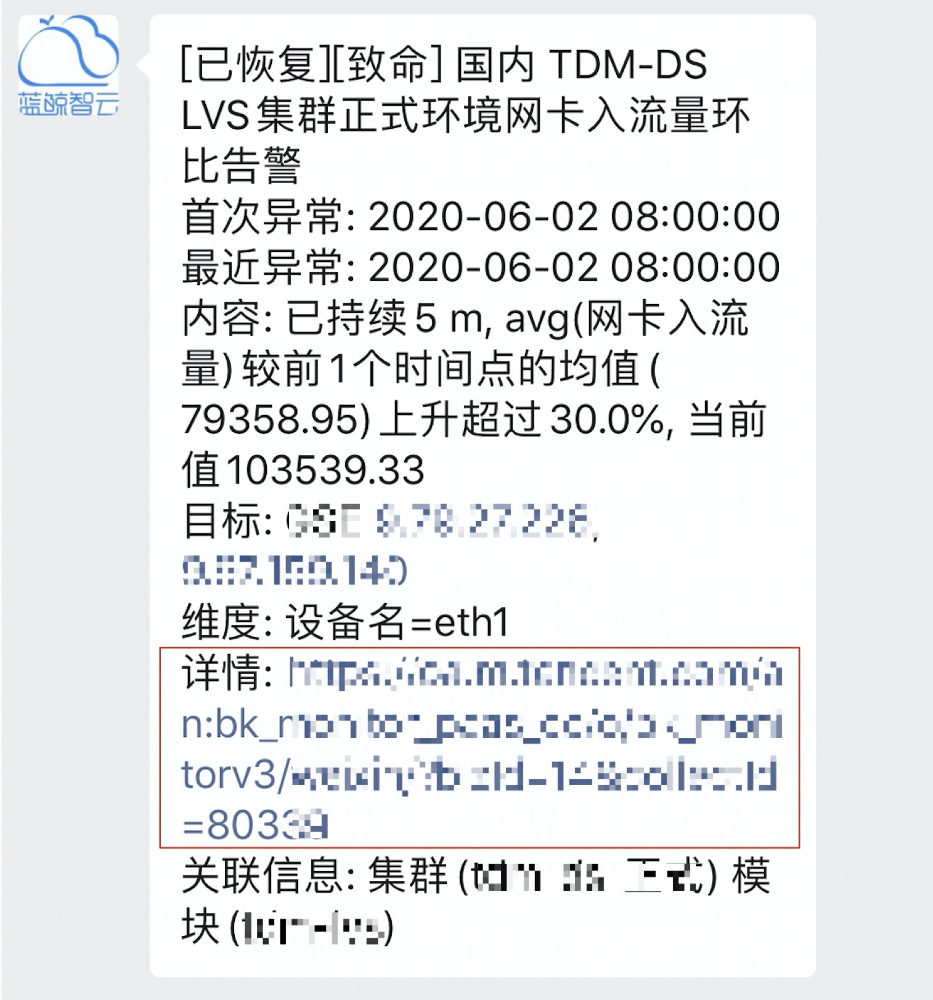
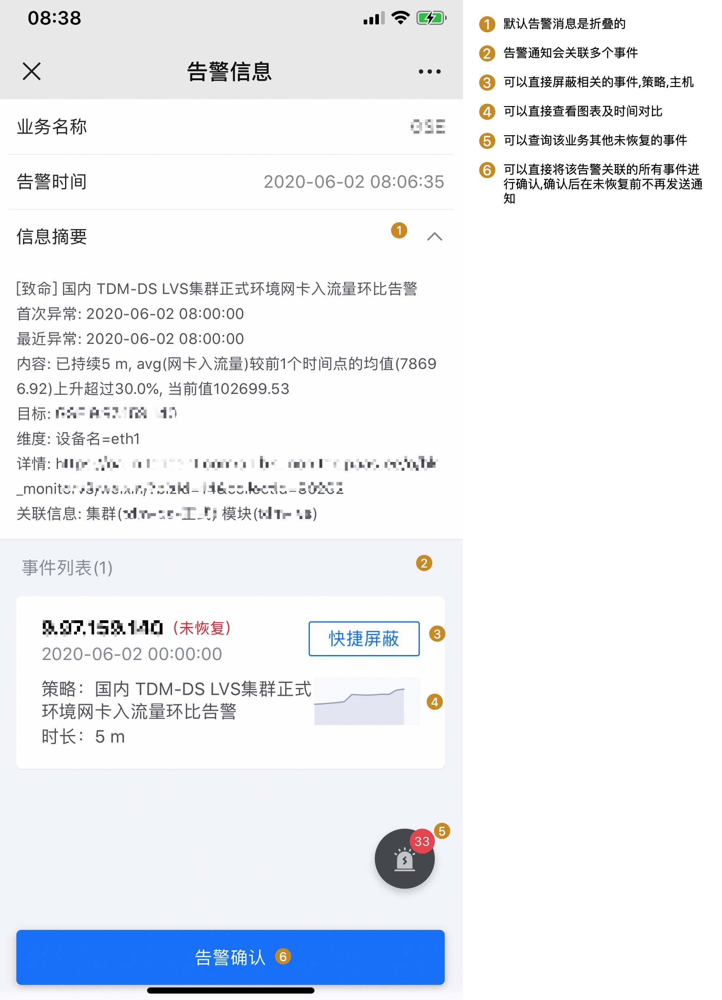
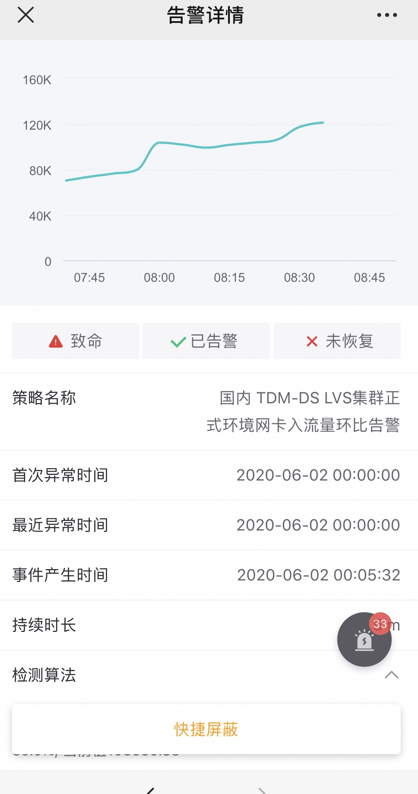
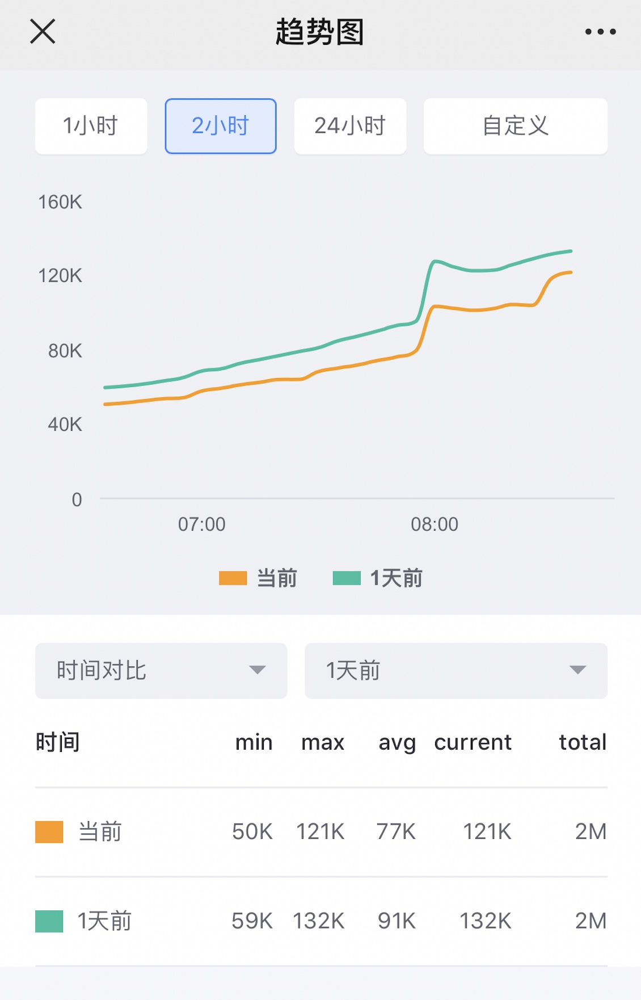
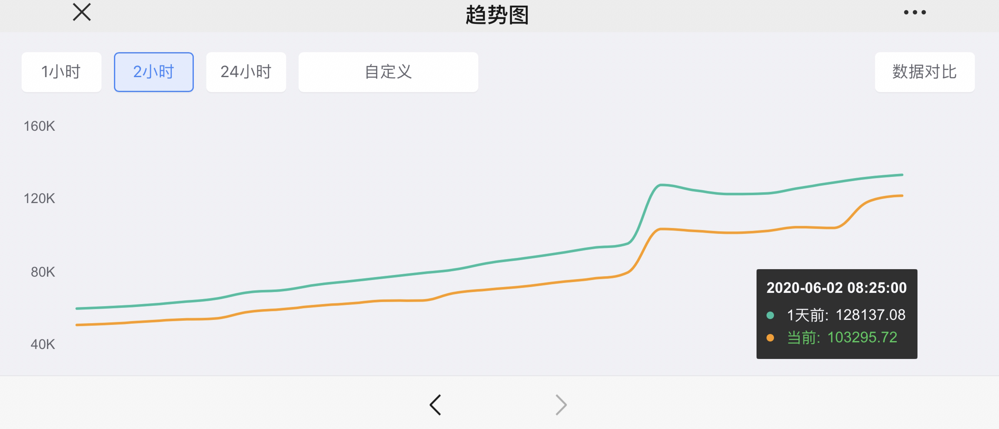
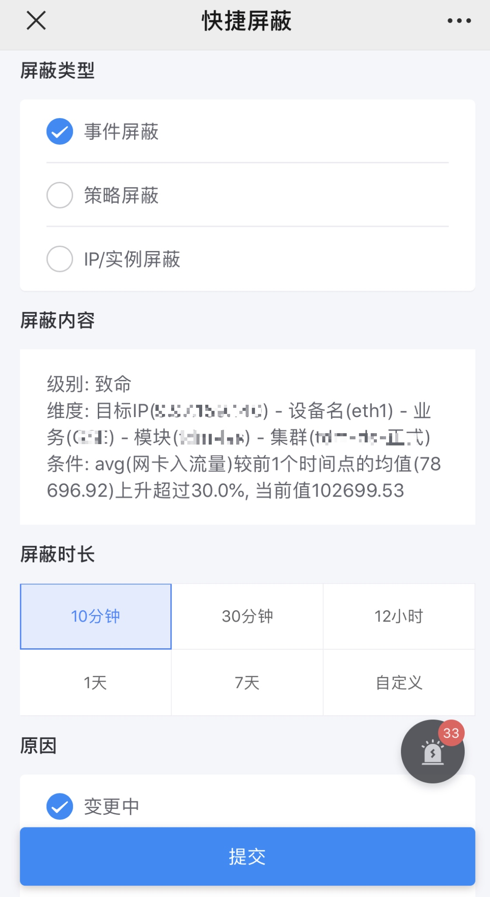
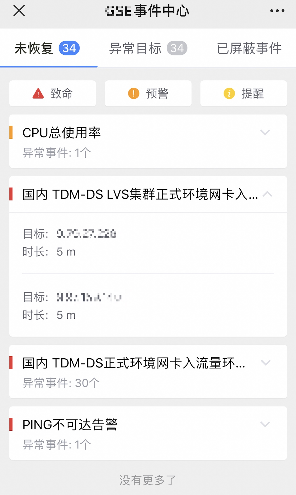
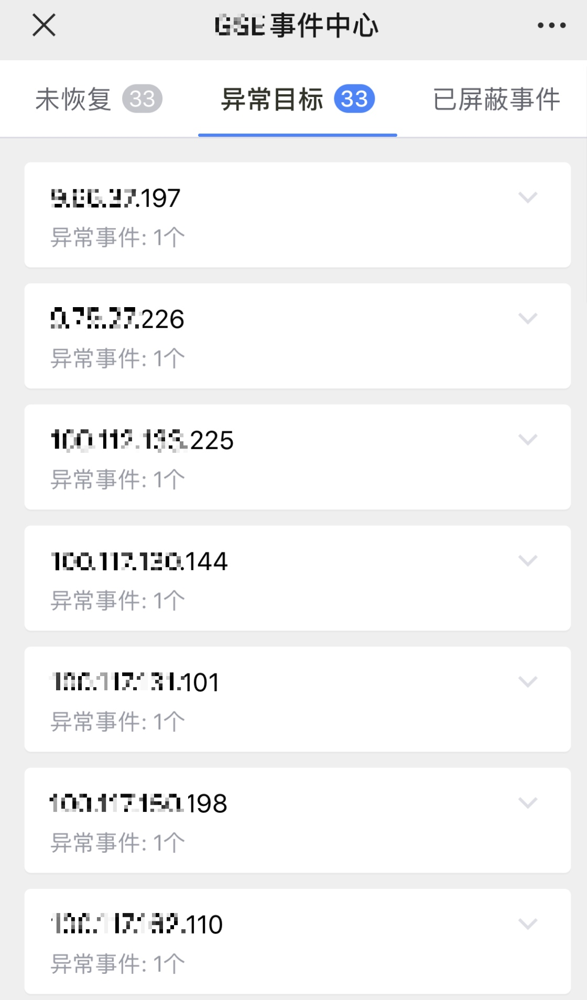
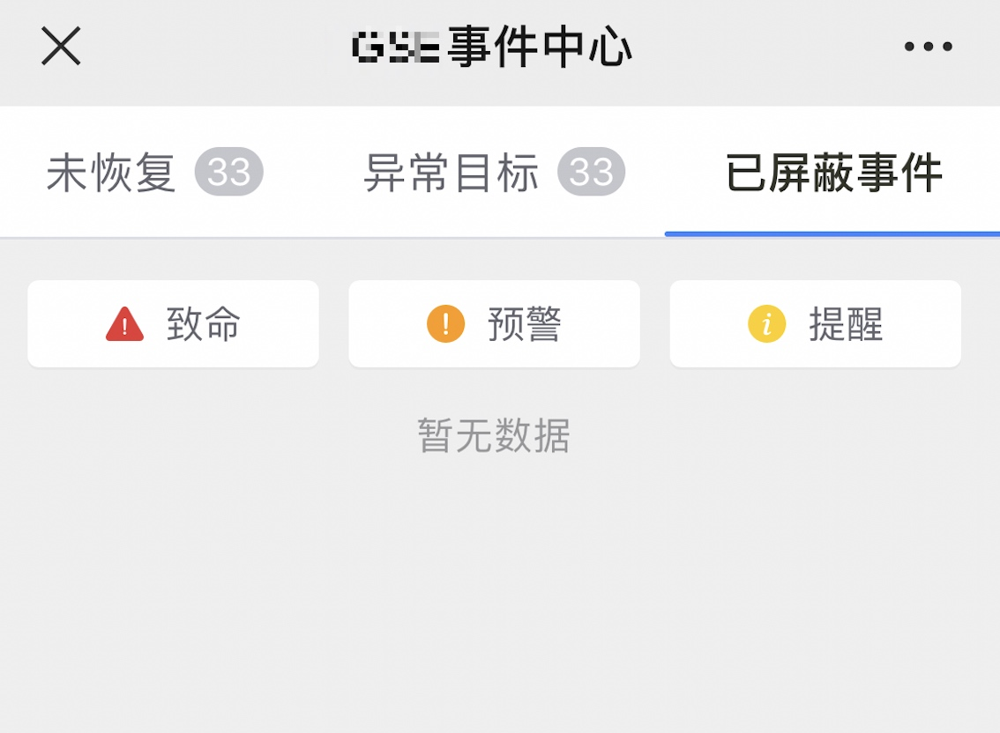

# Mobile

Currently, the mobile terminal does not have a separate App or official account, but exists in the form of H5. The main solution is to enable simple problem location and alarm event processing on the mobile terminal.

## List of main functions

1. View specific alarms, events and logs
2. View views and view comparisons
3. View the list of unrecovered events
4. Alarm confirmation and blocking

## Function Description

### Notification channel entrance

Currently, different channels are supported to configure whether to enable the entrance address of H5 on the mobile terminal. Next, WeChat information will be used as the entrance.

* The location of the red box is the link to the mobile terminal. Click it to directly enter the alarm page.

### Alarm details

After clicking the link, you will see information related to the alarm by default.

### Event details

When you want to see the specific event content, click the event content area to enter the event details to view more information.

### View

You can perform simple data comparison operations and view them horizontally.

You can view the large image in landscape orientation

### Blocking operation

* Event shielding: shield the event
* Policy shielding: the policy corresponding to the shielding event
* IP/instance shielding: shield the IP/service instance corresponding to the event

### The business event center

Unrecovered events: summarized by policy

Exception target: summarized by IP/service instance

Blocked events: events that are being blocked

