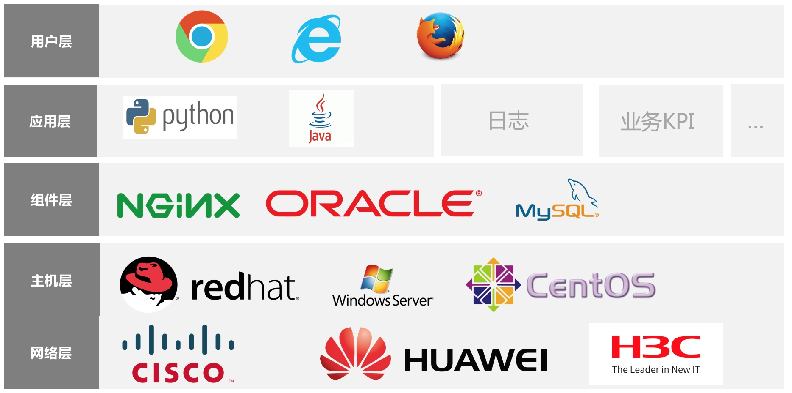
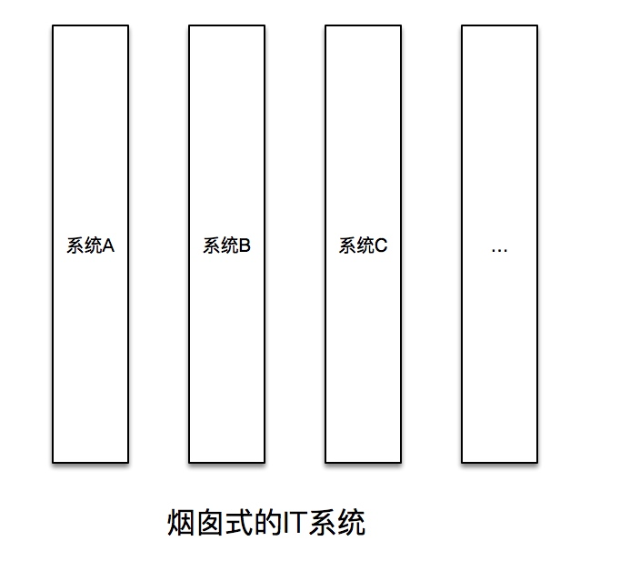
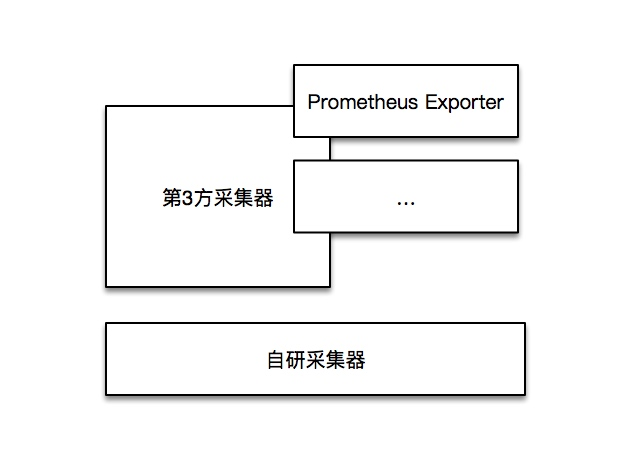
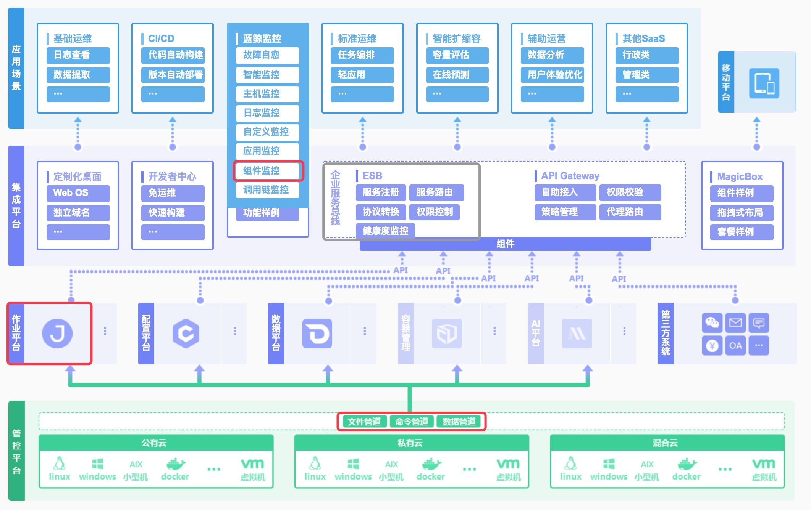

# Scenario case

## Multi-dimensional monitoring: the data basis for intelligent monitoring
> Take component monitoring as an example to introduce the roadmap of monitoring products

The role of the operation and maintenance monitoring system is self-evident. It runs through the five functions of operation and maintenance: release, change, fault handling, experience optimization, and daily needs, ensuring the service availability of the above functions.

Judging from the characteristics of big data (large amount of data, **multi-dimensional**, completeness) [1], the construction of the operation and maintenance monitoring system can be divided into 2 stages: `multi-dimensional monitoring` (accumulation of data) and ` Intelligent monitoring (using data) can see and investigate faults through multi-dimensional monitoring. Intelligent monitoring can detect risks in advance and find out the root cause of faults.

Component monitoring is the third layer of the multi-dimensional monitoring system. It mainly monitors the performance indicators of common open source components and middleware. For example, the performance indicators of Nginx include Active Connections (current number of client connections), Waiting (waiting) number of connections), etc. Oracle's performance indicators include SQL hard parsing rate, table space usage, etc.

By collecting key performance indicators of components, you can learn the running status of components in real time and detect problems in advance, instead of just monitoring whether the process or port is alive (**When the process or port is normal, it does not mean that services can be provided**).

This article takes construction component monitoring as an example, starting from `the composition of multi-dimensional monitoring`, `three problems to be solved by monitoring products`, `technical selection of component monitoring`, `cloud-delivered collector configuration`, `openness of the community` Capabilities `to introduce the monitoring product design roadmap.

## The composition of multi-dimensional monitoring

From the perspective of user access links, the dimensions of monitoring indicators are divided into `user layer`, `application layer`, `component layer`, `host layer`, and `network layer`.

(Composition of multi-dimensional monitoring)

The user layer simulates user access behavior through service dial testing and other methods, without waiting for user complaints to come to the door; the application layer tracks the application call status through call chains and other methods; the other three layers are easier to understand and will not be introduced.

Through these 5 layers + other key indicators (such as logs, business KPI curves, etc.), the multi-dimensional monitoring capabilities of the monitoring system are built to provide data support for the second stage of intelligent monitoring.

## 3 problems to be solved by monitoring products

In addition to obtaining key performance indicators, monitoring products also need to solve three problems. They can perform fault correlation analysis after exiting and build intelligent scenarios for operation and maintenance.

### Ability to autonomously control IT systems

Due to the lack of independent control over IT systems, some medium and large enterprises are actively embracing the Internet under the "Internet +" wave.

In view of this situation, some industries have clearly stated[2][3] that they must increase their ability to autonomously control IT systems.

Therefore, when designing products, it is necessary to consider allowing users of the monitoring system to participate in the development or partial development of the monitoring system.

### Refuse to build another chimney

The siled structure is estimated to be the current situation of most enterprises building IT systems. Each system has no connection with each other. Each system purchased is equivalent to building an additional information island, with extremely low added value.

If you want to implement fault correlation analysis and build intelligent operation and maintenance scenarios, you can build it on a PaaS-based operation and maintenance platform [4], and connect various IT operation systems within the enterprise through iPaaS.

### There are many components, and it is unrealistic to develop them completely by yourself.

There are many types of components used in the industry, including more than 100 components from databases, storage, HTTP services to message queues, etc. It is definitely unrealistic to develop them completely by yourself.

The best way is to self-research core components that are not well supported by the industry, and for the rest, rely on the capabilities accumulated by the industry over the years to build fewer wheels and save some electricity for society.

## Technology selection for component monitoring

The idea of self-research + third-party open source collector is mentioned in [There are many components, it is unrealistic to develop it completely by yourself]. Here we take the open source collector Prometheus Exporter as an example.

The Prometheus Exporter community is very active [5], supporting 100+ common open source components. Some major manufacturers even specially write corresponding Prometheus Exporters, such as Weblogic Exporter written by Oracle, IBM MQ Exporter written by IBM, k8s, etcd even have built-in Exporter specifications. metrics.

According to this solution, you only need to do a **protocol conversion** to store the indicators into the database.

(Simple timing diagram for docking with industry collectors)

## Experience optimization: Cloud-delivered collector configuration

After solving the basic needs, you need to optimize the experience immediately.

Distributing collectors or configurations to monitored hosts generally requires manual deployment or the use of third-party tools (such as Ansible).

The experience of switching multiple systems to complete one thing is very bad.

There is an optimization solution that uses the file distribution and command execution capabilities of the management and control platform layer through iPaaS [4], allowing users to complete the configuration process on one page to improve efficiency.

(BlueKing architecture diagram)

## The openness of the community

After meeting the basic functions and optimizing the product experience, consider the scalability of the product.

First solve the convenience of users importing self-developed components with one click, and then provide a communication platform so that community users can share freely.

**While gaining the open source capabilities of the community, we also need to feed back the community**.

## end

Multi-dimensional monitoring, which belongs to the scope of basic monitoring, is less glamorous than intelligent monitoring, but it is the data basis for intelligent monitoring. Without the data provided by multi-dimensional monitoring, it is impossible to implement fault prediction, fault root cause analysis and other intelligence. Monitoring scenarios.

When traditional companies or Internet companies embrace Internet changes, they need to think calmly and implement them step by step according to the road map.

## references
- [1] Wu Jun. Intelligent Era: Big Data and Intelligent Revolution Redefine the Future [M]. Beijing: CITIC Publishing Group, 2016-8.
- [2] People's Bank of China. [China's Financial Industry Information Technology "Thirteenth Five-Year Plan" Development Plan](http://images.mofcom.gov.cn/coi/201706/20170629110047159.pdf) [EB/OL]. 2017.06
- [3] China Banking Regulatory Commission. [Guiding Opinions on the Supervision of China’s Banking Industry Information Technology “Thirteenth Five-Year Plan” Development Plan (Draft for Comments)](http://www.cbrc.gov.cn/chinese/home/docView/1940BD4B2D7740CC90F4FE4C6B3CD316. html) [EB/OL]. 2016.07.15
- [4] China Communications Standards Association. [Cloud Computing Operation and Maintenance Platform Reference Framework and Technical Requirements] (http://v2.opensourcecloud.cn/article/2) [EB/OL]. 2017.11.16
- [5] Prometheus. [EXPORTERS AND INTEGRATIONS](https://prometheus.io/docs/instrumenting/exporters/) [EB/OL].