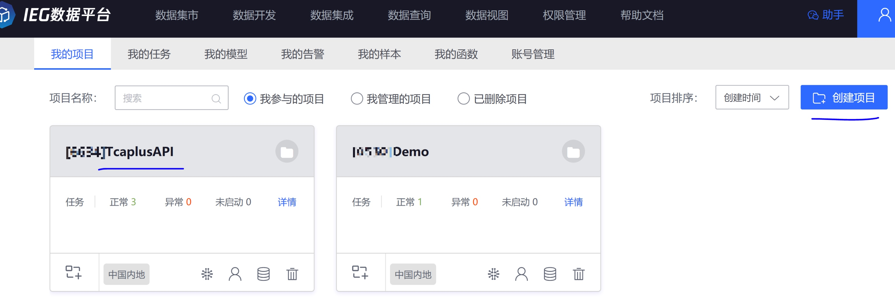
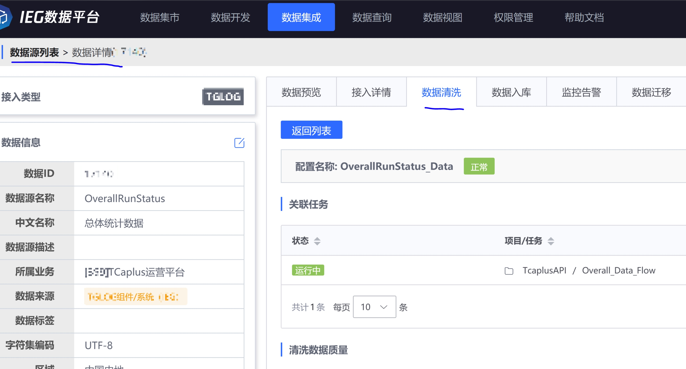
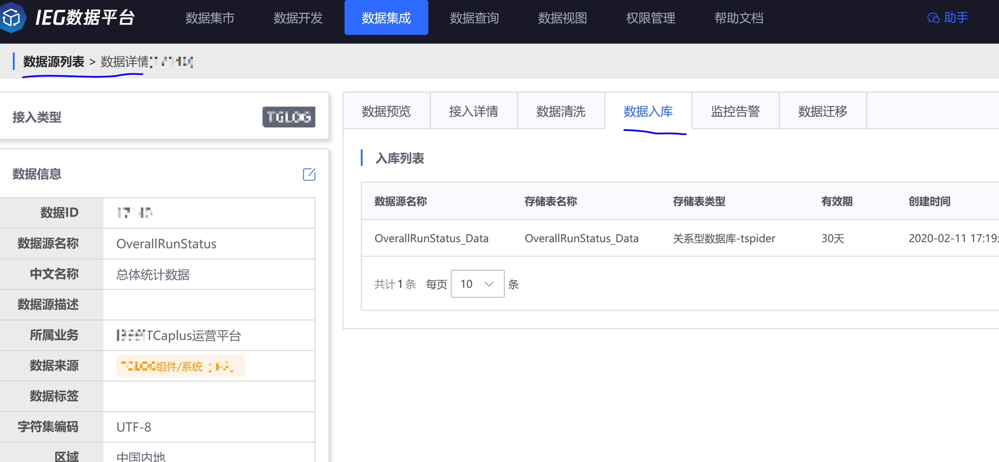
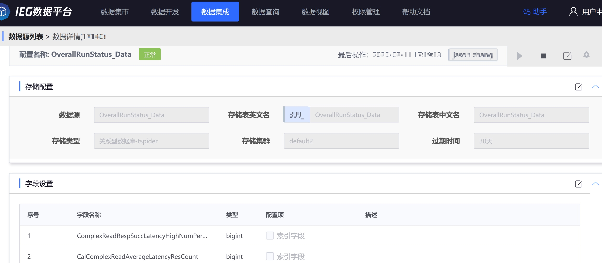
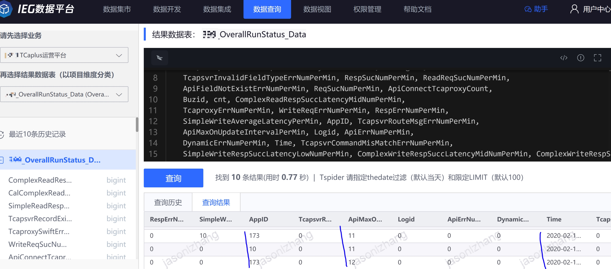
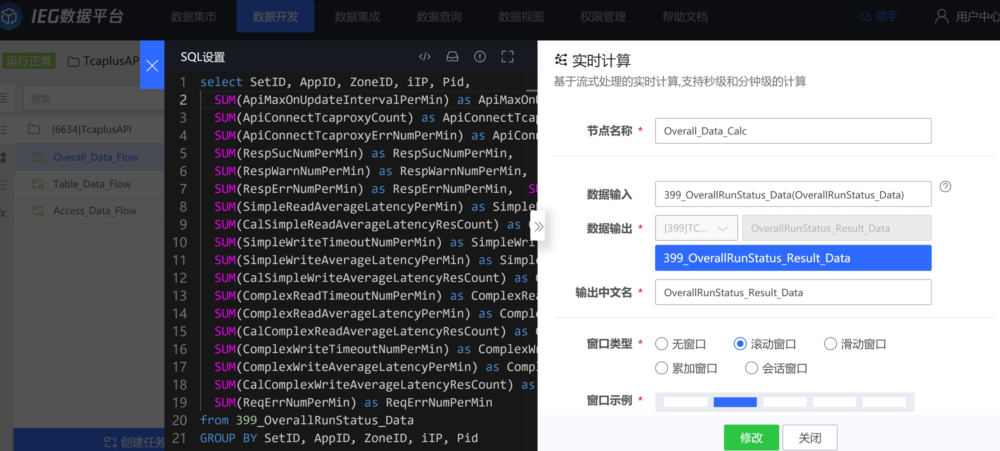

# How to monitor data from the data platform

The data entering the data platform generally has the following situations:

1. A lot of data cannot be directly collected and obtained by monitoring.
2. Original data requires a lot of data calculations
3. One piece of data can be used for multiple purposes

In this case, if you want to increase the demand for monitoring, the monitoring platform can meet the alarm demand.

## Preliminary steps

**Configuration process**:

1. Data access
2. Data cleaning
3. Data storage
4. Data calculation
5. Alarm configuration
6. Monitoring dashboard

> Note: 1-4 are all functions of the data platform, and 5-6 are functions of the monitoring platform. This document explains some data relationships between the two platforms.

## Specific configuration method

The following specific configuration method is introduced using the `TcaplusAPI` statistical indicator as an example.

### Requirement background

Tcaplus is a platform service. We hope to add operational data statistics to the code called by the API. For example: the indicators are the number of requests and latency; the dimensions are clusters, business, game areas, tables, machines, processes, etc.

* Q: Why can't it be collected actively through logs or collection plug-ins?
     * The process instance startup on a machine changes dynamically, such as: opening a game room
* Q: Why must we enter the data platform first instead of reporting directly through monitoring?
     * Because there are 150 indicators in the data collected by a business, but only 30 are used for alarms. Other indicators are required for operational analysis.
     * The data is massive data, and reporting through TCP ensures access and storage of massive data.

The following is the structured statistical indicator information defined by Tcaplus based on xml:


* There are three categories of statistical indicators:
* OverallRunStatus overall statistics
* AccessStatistic Statistics of each access point
* TableStatistic table statistics

In the api instance, the values of each indicator are counted every **cycle (1min)** and reported to iData via TCP. The following is an example of data reported by OverallRunStatus (AccessStatistic is similar to TableStatistic, here is a small part of the data as an example):

```html
dataId=17140&tm=1581397544622&dt=1581397544013&
cnt=1&NodeIP=10.0.0.1&rt=1581397544391&
m=5&messageId=10.0.0.1#1912#1581397544354&bid=b_ieg_tcaplusapi|__tablename=OverallRunStatus&
Timestamp=1581397544&Buzid=0&Logid=0&
AppID=70&ZoneID=2&iIP=10.0.0.1&
CalComplexReadAverageLatencyResCount=234&SimpleWriteRespSuccLatencyHighNumPerMin=0&SimpleWriteRespSuccLatencyCustomizedNumPerMin=0&
SimpleWriteTimeoutNumPerMin=0&ReqSucNumPerMin=247&ApiFieldNotExistErrNumPerMin=0&
ComplexReadRespSuccLatencyLowNumPerMin=234&TcapsvrSystemErrNumPerMin=0&WriteRespWarnNumPerMin=0&
ApiConnectTcaproxyCount=4&WriteReqErrNumPerMin=0&ReadRespWarnNumPerMin=0&
```

* Metrics: such as CalComplexReadAverageLatencyResCount ApiConnectTcaproxyCount
* Dimension information includes user-defined: SetID, AppID, ZoneID, ProcessInfo
* Dimension information includes default built-in: NodeIP, bid, iIP

### Data access

After reporting the original data to iData via TCP, first create the business TcaplusAPI on the data platform:



Then connect the data to the data source in the data platform (see the white paper of the data platform for specific access methods). Data source after TcaplusAPI access:


### Data cleaning

Next, we clean the data reported by the three data sources of TcaplusAPI. The purpose of data cleaning is to turn the original text content into formatted data. For example: **OverallRunStatus** Data cleaning:



Data cleaning result data:


### Data storage

Then configure the data to be stored in the database for the data cleaning results of the three data sources of TcaplusAPI, for example: the data of OverallRunStatus is stored in the database:

> Note: Current monitoring only supports the warehousing data of MySQL and Tspider. Druid is still being adapted.



You can view the data entry details:



Check the data entry result to see if it was successfully entered:



### Data calculation

How can indicators and dimensions be discovered through monitoring? There are two ways:

First: Clean the table, simple indicator and dimension identification principles: data type is the indicator, string type is the dimension

> Note: If the dimensions set in the cleaning table can meet the needs, the data calculation step can be skipped.
> Clean the table. If the data is delayed and needs to be aggregated, create a calculation using the data.
> Data index: Whether the data platform has an index affects query efficiency


Second: Convert the data into a result table through data calculation. The default group by fields are dimensions.

Data Computing For some complex computing requirements, data computing can also be used to meet some requirements for data aggregation.

TcaplusAPI configures data calculation tasks for three original data tables respectively, and the calculation results are stored in the result table for subsequent alarm calculations.




> Note: There is a **Statistical Frequency** at the bottom of the window example. The default is 60 seconds, which is the aggregation period of data calculation. This **Statistical Frequency** corresponds to the **Monitoring Period** in the monitoring.

```SQL
select SetID, AppID, ZoneID, iIP, Pid,
   SUM(ApiMaxOnUpdateIntervalPerMin) as ApiMaxOnUpdateIntervalPerMin,
   SUM(AvailableTcapdirNum) as AvailableTcapdirNum,
   SUM(ApiConnectTcaproxyCount) as ApiConnectTcaproxyCount,
   SUM(ApiConnectTcaproxyErrNumPerMin) as ApiConnectTcaproxyErrNumPerMin,
   SUM(ReqSucNumPerMin) as ReqSucNumPerMin,
   SUM(RespSucNumPerMin) as RespSucNumPerMin,
   SUM(RespWarnNumPerMin) as RespWarnNumPerMin,
   SUM(RespErrNumPerMin) as RespErrNumPerMin,
  from 399_OverallRunStatus_Data
GROUP BY SetID, AppID, ZoneID, iIP, Pid
```

After data calculation: the fields grouped by become dimensions by default. For example: `SetID, AppID, ZoneID, iIP, Pid` will become dimensions, and other `ApiMaxOnUpdateIntervalPerMin,AvailableTcapdirNum`, etc. are indicators

> Note: Pay attention to the syntax format, which is consistent with the SQL of MYSQL.

Check whether the result table of data calculation has data:


**Precautions**:

1. The data processing mode of dataflow is selected from **tail**, which can quickly get the latest data. Once there is too much historical data, it will be difficult to generate the latest data. At this time, the currently configured alarm policy may not have alarms, and the view may not have any alarms. chart.
2. Pay attention to the SQL syntax format.
3. Consider the choice of `group by` dimensions, such as Time or random hash values, meaningless auto-incrementing IDs, are not suitable for dimensions. Dimensions will be displayed in the alarm notification, so choosing meaningful dimensions will help you quickly locate and view dimensions, such as area and system dimensions.
4. There is no need to consider the time field in the original data, such as the `TimeST` field added in the report. During data calculation, `dtEventTime` is used for periodic aggregation and calculation.


### Alarm configuration

Open monitoring application

Configure alarms in the following path: Navigation → Monitoring Configuration → Policy → New. First configure the indicator items to be alarmed:

* Monitoring objects: select other
* Add monitoring indicators and select the corresponding result table data and indicator items in the data platform


> Note: There are two ways to monitor and identify indicator dimensions:
> First: Clean the table and set dimensions. The long type will appear in the indicator list, and the others will appear in the dimension list.
> Second: convert the data into a result table through data calculation. The default group by fields are dimensions.

For more operations, see [Introduction to Policy Configuration Functions](../functions/conf/rules.md)

Configure the alarm policy. After the alarm calculation complies with the policy, an alarm event will be generated. For more information, see [Event Center Function Introduction] (../functions/analyze/event.md)

Generate warning message:


### Monitoring dashboard view

The calculated result table data can also be displayed in charts on the monitoring dashboard.

View more [Introduction to Dashboard Functions](../functions/report/new_dashboard.md)