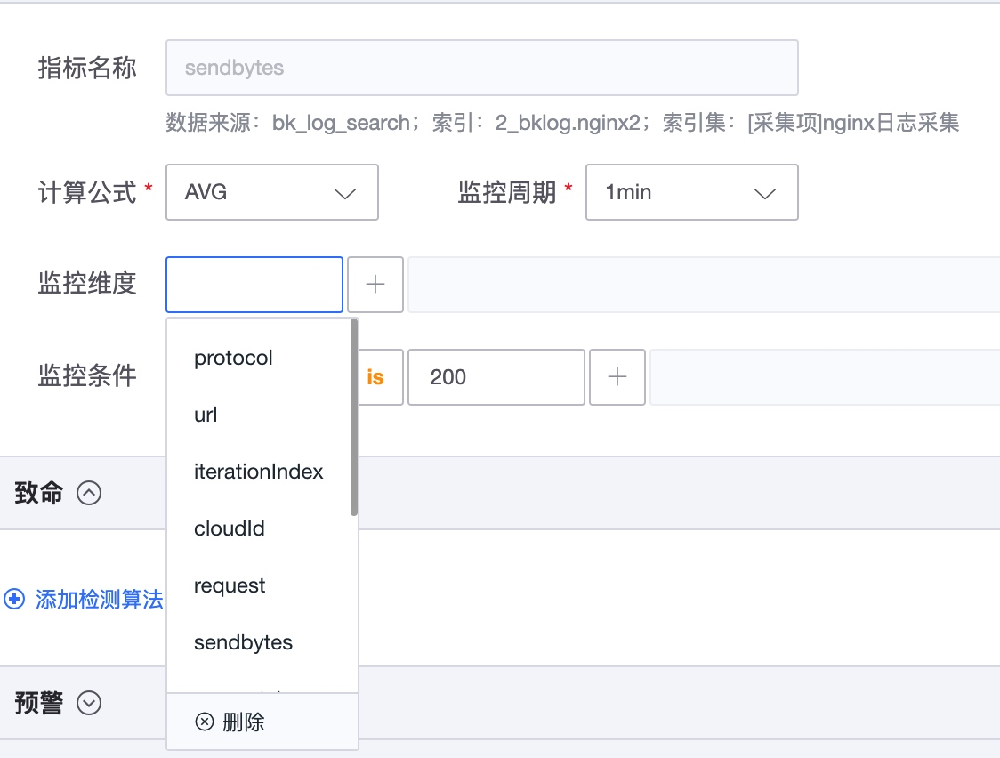

# How to monitor the data of the log platform

Logs are a very useful type of data for discovering and locating problems. Basically any monitoring object has logs. The operating system, process module, service module, etc. will have corresponding log data.

Effective use of log data can not only achieve monitoring purposes but also meet the needs of problem location.

## Preliminary steps

**working principle**:

Log collection is to monitor changes in log file content and collect real-time log streams. During the collection process, "log extraction" can be performed to format the log content.

Log collection and processing are based on log platform services. Collection and configuration can be done directly on the "log platform" or directly on the monitoring platform.

**Collection navigation path**: Navigation → Monitoring configuration → Collection → Log collection

**Policy configuration navigation path**: Navigation → Monitoring configuration → Policy → New → Log keywords/monitoring items (log collection)

**Problem location navigation path**: Navigation → Log retrieval

**View configuration navigation path**: Navigation → Dashboard → New → Indicator selection (log collection)

## Log collection & field extraction

For details, please view the log platform [Collection Access](../../../日志平台/产品白皮书/functions/addenda/query_string.md)

## Log monitoring strategy

There are two types of log monitoring:

1. Log keyword monitoring, the most common and commonly used monitoring method
2. Log time series data monitoring is to convert logs into time series data for monitoring.

### Log keyword monitoring

> Note: The current log retrieval statement is based on the ES word segmentation syntax. See [query string](../../../Log Platform/Product White Paper/functions/addenda/query_string.md) for details.

### Log time series data monitoring

The data extracted from the field will be entered into the monitored indicator selector.

* Indicator: **aggregation type** and is of numeric type, such as int/long.
* Dimension: **aggregation type** and of type string.

> Note: Word segmentation can be used when there is no need for monitoring or overall query. It can save storage space and improve efficiency.

Two indicator items, `code` and `sendbytes`, will appear in the monitored indicator selector.

Everything else will become dimensions

## Log view

In the dashboard, you can select the data collected by the log platform to create views.