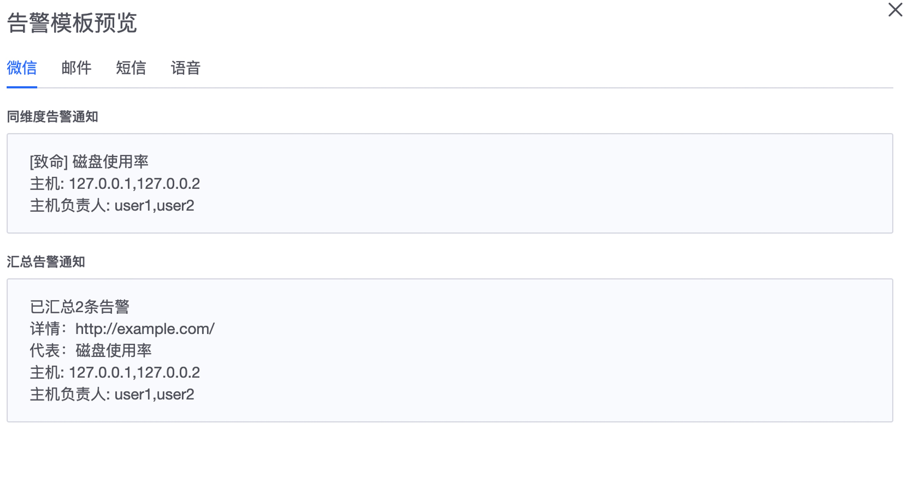
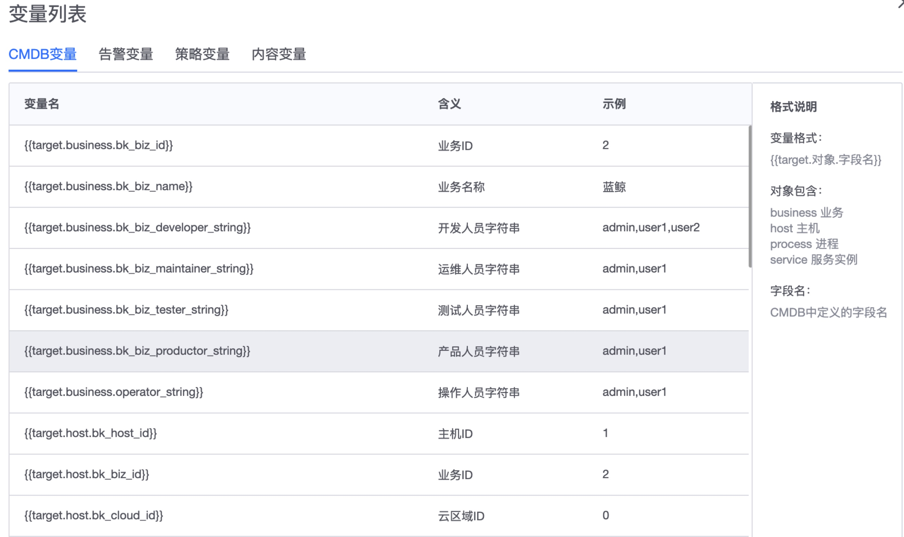

# How to customize notification templates

## Alarm notification template setting location

In the policy configuration, we can configure the **customizable** part of the notification content sent when this policy is triggered in **Advanced Options** -> **Alarm Notification Template**.


The monitoring platform provides a default alarm notification template, which can display different styles in different notifications. You can use the **template preview** function to see how they will be rendered. Of course, the template preview function only provides some **sample data**, and the real effect needs to consider the actual situation.



## Template syntax description

Since the sending types include text, email, voice, etc., in order to facilitate users to define notification templates that can be displayed normally in different notification channels, the monitoring platform provides a line template syntax.

```bash
#label #content
```

It must start with a # sign and is divided into two parts: label and content, separated by a # sign. Content that does not conform to the row template will be displayed as normal text.

In order to ensure the normal display of email content, it is recommended that user-defined notification templates use line template syntax.

### Template variables

Relevant information about this alarm notification is provided in the form of template variables, which can be directly referenced in the template variables, and the corresponding information will be rendered when notified.

You can check the available variables through **variable list**.



**CMDB variables**: Some variables can only successfully obtain values when the monitored object is a host, process, service instance, etc. If the value fails, a null value will be returned.

**Content variables**: Built-in variables used by the default template. Different values will be displayed in different notification methods. There is no need to add row templates.

**Alarm variable**: information related to the alarm content.

**Policy variable**: Information related to the policy that generated this alarm.

## Configuration example

You only need to use the row template and template variables to configure a personalized notification template.

### Example 1: Change the order to conform to reading habits

Adjust the variable order of the default notification template. It should be noted that some variables in content are only displayed in specific notification methods.

The {{content.content}} variable was moved below.

```html
{{content.level}}
{{content.time}}
{{content.duration}}
{{content.target_type}}
{{content.data_source}}
{{content.current_value}}
{{content.biz}}
{{content.target}}
{{content.dimension}}
{{content.content}}
{{content.detail}}
```

WeChat

```bash
[FATAL] Disk usage
Time: 1970-01-01 00:00:00
Target: BlueKing[2] 10.0.0.1, 10.0.0.1 (2)
Dimensions: Disk=C
Content: Has lasted 10 minutes, sum(in_user) > 10
Details: http://example.com/
```

Short message

```bash
Monitoring Notification, [FATAL] Disk Usage
Target: BlueKing[2] 10.0.0.1, 10.0.0.1 (2)
Dimensions: Disk=C
Content: Has lasted 10 minutes, sum(in_user) > 10
Alarm ID: 12345
```

### Example 2: Cut out redundant content

Delete unnecessary information and streamline notification content.

```html
{{content.time}}
{{content.content}}
{{content.detail}}
```

WeChat

```bash
[FATAL] Disk usage
Time: 1970-01-01 00:00:00
Content: Has lasted 10 minutes, sum(in_user) > 10
Details: http://example.com/
```

Short message

```bash
Monitoring Notification, [FATAL] Disk Usage
Content: Has lasted 10 minutes, sum(in_user) > 10
Alarm ID: 12345
```

### Example 3: Add related host information

Host-related information can be obtained through variables.

```html
{{content.time}}
{{content.content}}
#Operating System#{{target.host.bk_os_name}}
{{content.detail}}
```

WeChat

```bash
[FATAL] Disk usage
Time: 1970-01-01 00:00:00
Content: Has lasted 10 minutes, sum(in_user) > 10
Operating system: linux centos
Details: http://example.com/
```

Short message

```bash
Monitoring Notification, [FATAL] Disk Usage
Content: Has lasted 10 minutes, sum(in_user) > 10
Operating system: linux centos
Alarm ID: 12345
```

### Example 4: Notification content generates a specific URL link

A URL is generated in the alert content, and you can click to access the specified content.

```html
{{content.time}}
{{content.content}}
{{content.detail}}
#xxsystem#http://xxxx.demo.com?control=3&host={{target.host.bk_host_innerip}}
```

WeChat

```bash
[fatal]
Time: 1970-01-01 00:00:00
Content: Has lasted 10 minutes, sum(in_user) > 10
Details: http://example.com/
xx system: http://xxxx.demo.com?control=3&host=10.0.0.1
```

Short message

```bash
Monitoring notification, [fatal]
Content: Has lasted 10 minutes, sum(in_user) > 10
Alarm ID: 12345
xx system: http://xxxx.demo.com?control=3&host=10.0.0.1
```

### Example 5: Keyword monitoring adds original log content

To be improved