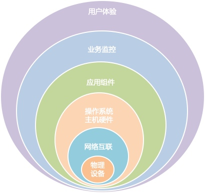
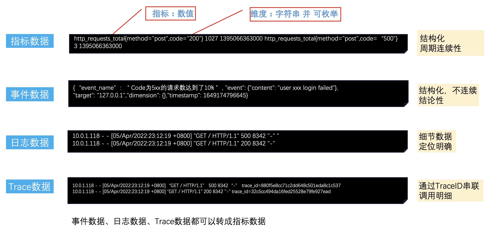

#Data model

The data model mainly introduces the relationship between monitoring data reporting format, storage format and monitoring management operations.

### Data stratification

No matter how the data is collected and reported; no matter where the data is reported from; whether it is time series data, event data or log data, it serves the data layering that users care about.

1. **User experience**: refers to the user's use of the application and the operational data of the application. Such as mobile terminal usage, number of business application logins, etc.
2. **Service**: refers to the service module running on the server operating system. Such as database, process, etc. Corresponding to CMDB-service topology
3. **Host**: refers to the host system and hardware level. Such as CPU MEM server hardware failure, etc. Corresponds to CMDB-host topology
4. **Data Center**: refers to the network and equipment related content related to the data center. Corresponds to CMDB-Device Management



### Monitoring realizes logical decoupling

Understand the data stratification that users care about, and all implementation methods are decoupled. In short, all the following methods serve data stratification.

* **Data reporting sources**: 4 types
     * **Monitoring default collection**
         * Default collection: The monitored collector is only bkmonitorbeat. By default, the host operating system, system events, process indicators, and K8s data will be collected.
     * **User collection PULL**
         * Collection configuration: Collection tasks issued through collection configuration, such as scripts, Exporter, DataDog, JMX, log collection, etc.
         * Dial-up test task: Dial-up test is a specific scene task, which actually belongs to a category of collection configuration.
     * **Custom reporting PUSH**: Collection sources that do not need to be issued and managed by the monitoring platform, as long as they comply with the data format of the monitoring platform, including custom event reporting and custom time series data
     * **Computing Platform**: It is the [result table] data that has been connected to the computing platform for monitoring.

* **Collection method**: 8 types
     * Script script plug-in collection: maintained in plug-in management, Linux supports Bash, Python; Windows supports Powershell, vbs, Python
     * Exporter plug-in collection: supports the collection protocol of [Prometheus](https://prometheus.io/docs/instrumenting/exporters/). You can easily turn Exporter into a plug-in for the monitoring platform
     * DataDog plug-in collection: supports the collection of [DataDog](https://github.com/DataDog/datadog-agent). DataDog can be easily converted into a plug-in for the monitoring platform
     * JMX plug-in collection: Collect the service status of any Java process that has the JMX service port enabled. Users can define in plug-in management
     * SNMP plug-in collection: Make an SNMP collection plug-in through the MIB library to remotely realize the collection of hardware devices.
     * BK-Pull plug-in collection: Collect by remotely obtaining the URL of metrics.
     * bkmonitorbeat basic collector: the default installed operating system indicator collector, the default process collector, and the process information is based on the process management of CMDB
     * bkunifylogbeat log collector: BlueKing’s default log collector, the log collector supports Linux and Windows
     * bkmonitorbeat collector: supports data collection related to dial testing services, such as TCP, UDP, HTTP(s), ICMP is not only responsible for dial testing but also is responsible for the management of other plug-ins

* **Data target range**:
     * Host topology based on CMDB: the minimum monitoring granularity is the host IP, configured according to the CMDB topology
     * CMDB-based service topology: The minimum monitoring granularity is service instance instance, which is configured according to the CMDB topology.
     * Service template based on CMDB
     * Cluster template based on CMDB
     * Dimensions of data: The topology of the CMDB cannot be distinguished through custom reporting or data sourced from the data platform.

* **Data type**: 4 types
     * Time series/indicator data: [time series](https://zh.wikipedia.org/wiki/%E6%99%82%E9%96%93%E5%BA%8F%E5%88%97) Monitor the most Important data types, most problems can be found through time series data. The three most important elements are indicators, dimensions, and time. and is continuous in time
     * Event data: An event is a record of something that has happened, continuous in time, and composed of multiple consecutive abnormal points.
     * Log data: Log data is text records generated by systems and applications. It is one of the important monitoring and positioning information.
         * Log generation method: file log (line log, segment log) system log (device log, Windows Event log)
         * Log content format: text, json, binary, etc.
     * Trace data: Trace data output by the program through Opentracing and Opentelemetry standards.
    


    
## data structure

### Custom event data

```json
{
     # Data channel identifier, required
     "data_id": 10.0.0.14,
     # Data channel identification verification code, required
     "access_token": "d9007a0d10.0.0.10.0.0.18693c1a",
     "data": [{
         # Event identification name, maximum length 128
                 "event_name": "input_your_event_name",
                 "event": {
                     #Event content, required
                     "content": "user xxx login failed"
                 },
         # Source identifier such as IP, required
         "target": "10.0.0.1",
         # Custom dimensions, optional
         "dimension": {
             "module": "db",
             "location": "guangdong"
         },
         # Data time, accurate to milliseconds, optional
         "timestamp": 1600308754824
     }]
}
```

### Custom time series data structure

```json
{
     # Data channel identifier, required
     "data_id": 10.0.0.14,
     # Data channel identification verification code, required
     "access_token": "d9007a0d10.0.0.10.0.0.18693c1a",
     "data": [{
         #Indicator, required
         "metrics": {
             "http_request_total": 10
         },
         # Source identifier such as IP, required
         "target": "10.0.0.1",
         # Custom dimensions, optional
         "dimension": {
             "module": "db",
             "location": "guangdong"
         },
         # Data time, accurate to milliseconds, optional
         "timestamp": 1600308839050
     }]
}
```

## Data structure of Promtheus

The monitoring platform supports [Promtheus data structure](https://github.com/prometheus/docs/blob/master/content/docs/instrumenting/exposition_formats.md)

Refer to the basic data reporting format of Promtheus.

```bash
<-----<metric name>{<label name>=<label value>, ...}-------><--value-->
http_request_total{status="200", method="GET", route="/api"} 94355
http_request_total{status="404", method="POST", route="/user"} 94334
```

* **metric**: The name of the metric (metric name) can reflect the meaning of the sample being monitored (for example, http_request_total - represents the total number of HTTP requests received by the current system). Indicator names can only consist of ASCII characters, numbers, underscores and colons and must conform to the regular expression `[a-zA-Z_:][a-zA-Z0-9_:]*`

* **label**: The label reflects the characteristic dimensions of the current sample. Through these dimensions, Prometheus can filter, aggregate, etc. the sample data. The name of the label can only consist of ASCII characters, numbers and underscores and satisfy the regular expression `[a-zA-Z_][a-zA-Z0-9_]*`. Equivalent to **dimension** in the monitoring platform platform

## Trace data structure

Supports OpenTelemetry and OpenTracing

[Introduction to OpenTelemetry](integrations-traces/opentelemetry_overview.md)