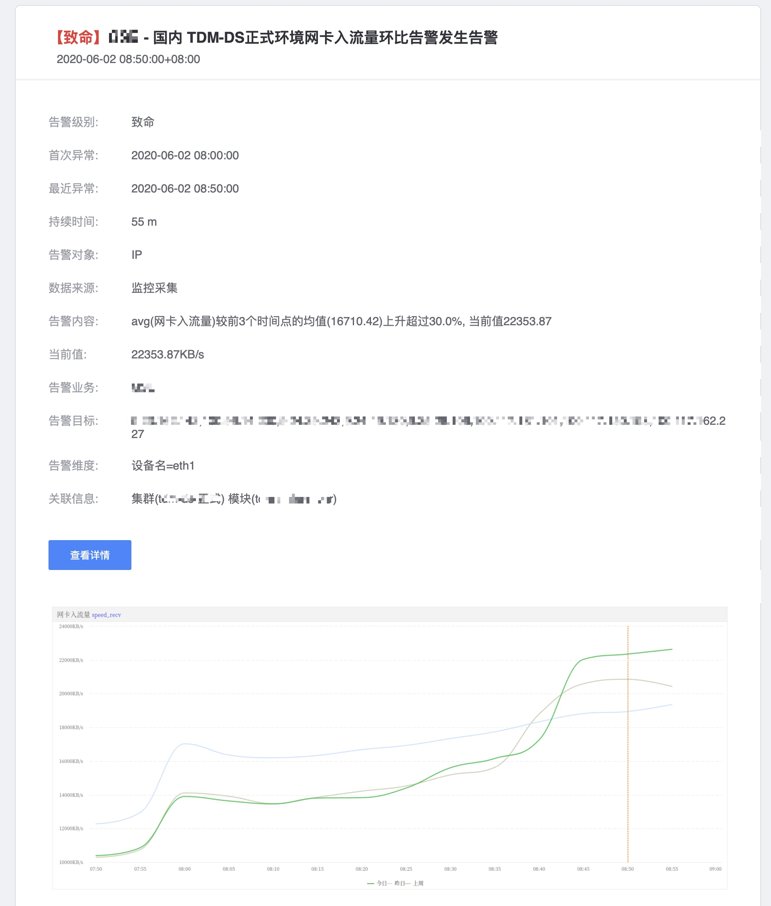
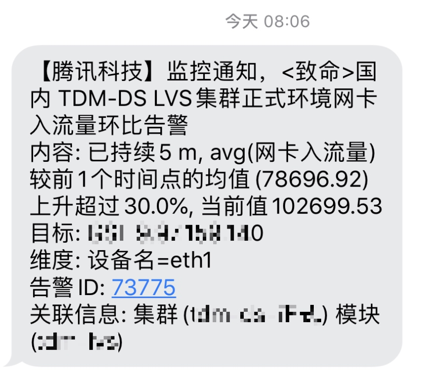
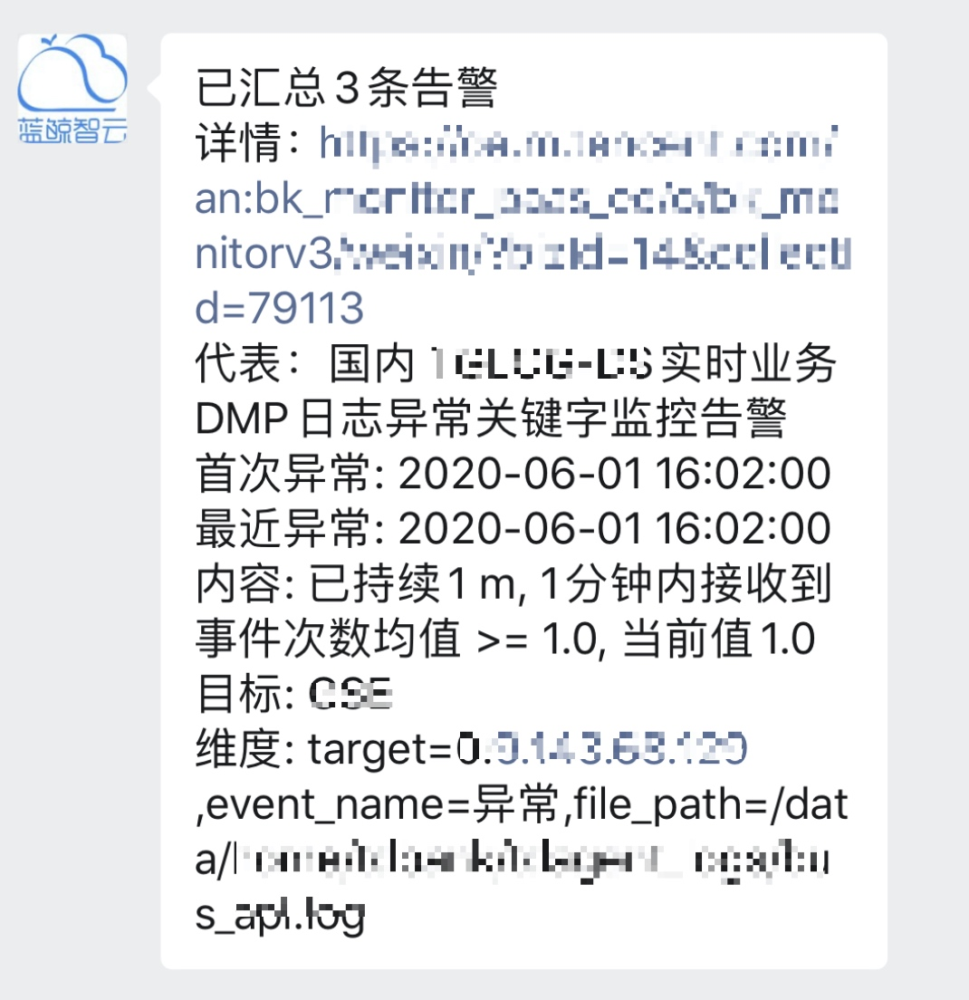
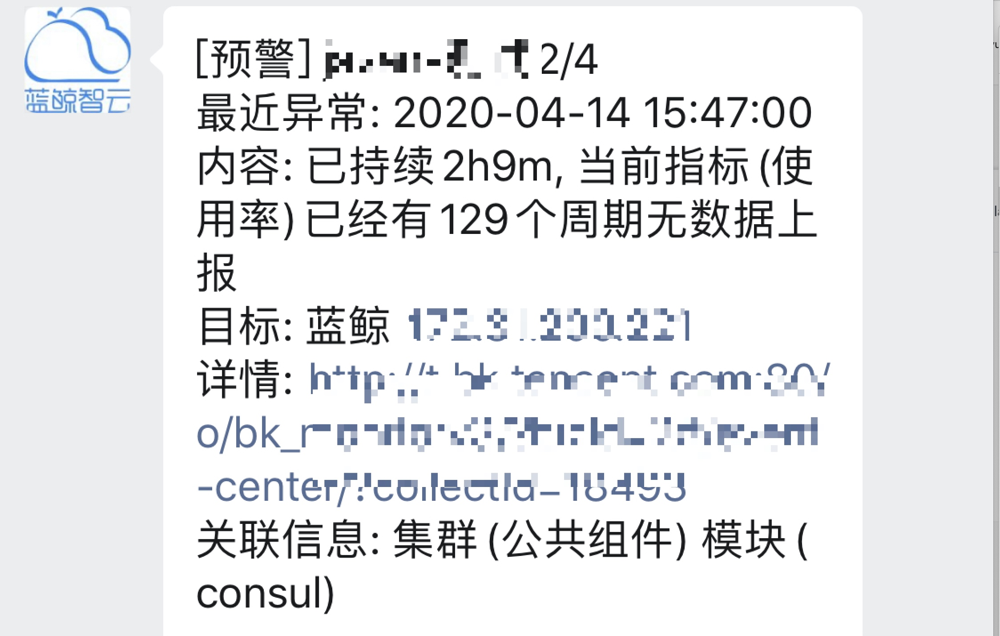
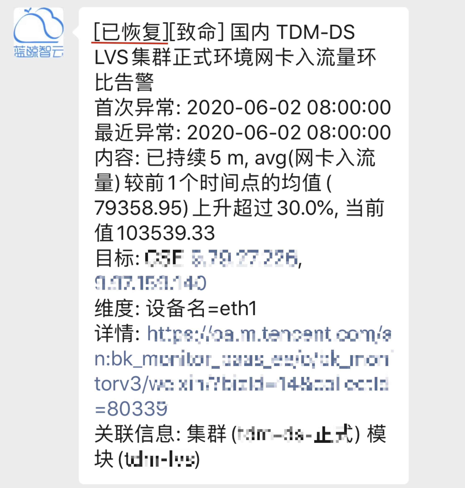

# Notification content description

There are four types of notification channel styles for monitoring, each of which has three summarized information formats.

## Function overview

* Notification channels: SMS, phone call, email, IM text (WeChat, Enterprise WeChat)
* Message format: single-event alarm, multiple-event alarm with the same strategy, multiple-event alarm with different strategies
* Notification type: exception notification, recovery notification, no data notification

## Function Description

### Email & multi-event alarm with the same policy

* The most email information, with comparison chart and event details link
* Multiple events with the same policy: only the target is different, and the IP/service instance list will be provided in the alarm target.


### SMS & Single Event Alarm

Text messages are the simplest, without links or pictures.


### WeChat/Enterprise WeChat&Summary Alarm

When the summary convergence threshold is reached at the same time, cross-policy alarms will be merged, the number of summary items will be prompted, and a representative message will be given. Click to enter for details to see more specific details. The email will contain a list of events. And WeChat has an entrance to the mobile terminal H5, please check [mobile terminal](../../QuickStart/h5_app.md) for details



### No data alarm

No data alarms are all warning levels


### Notification restored



### Telephone

Because the phone itself has current limitations and convergence, the phone serves as a reminder.

```bash
A {{level}} alarm occurred in the current {{business}} {{policy name}}
```