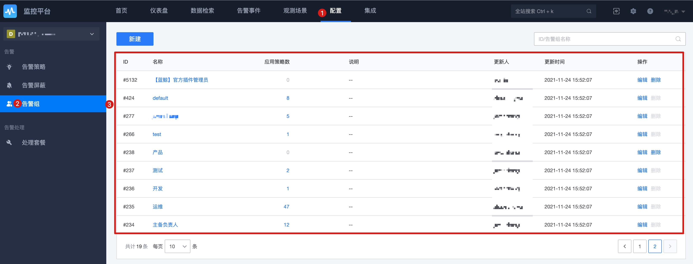
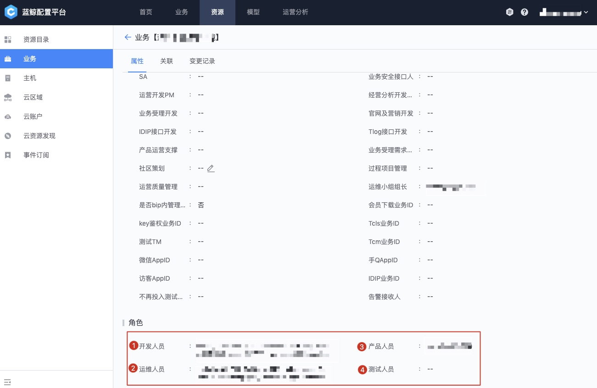
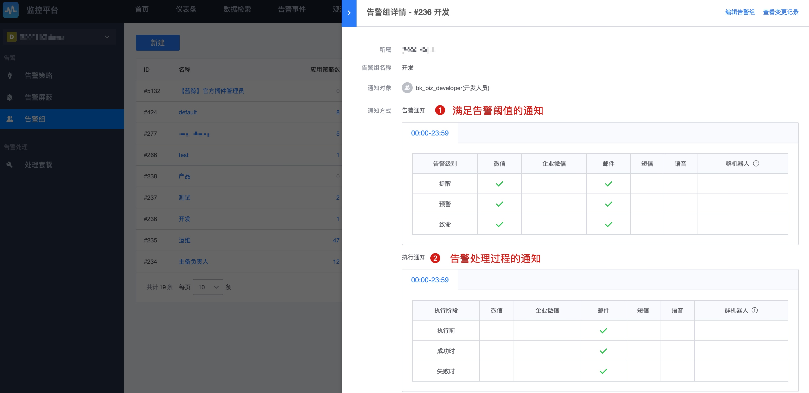
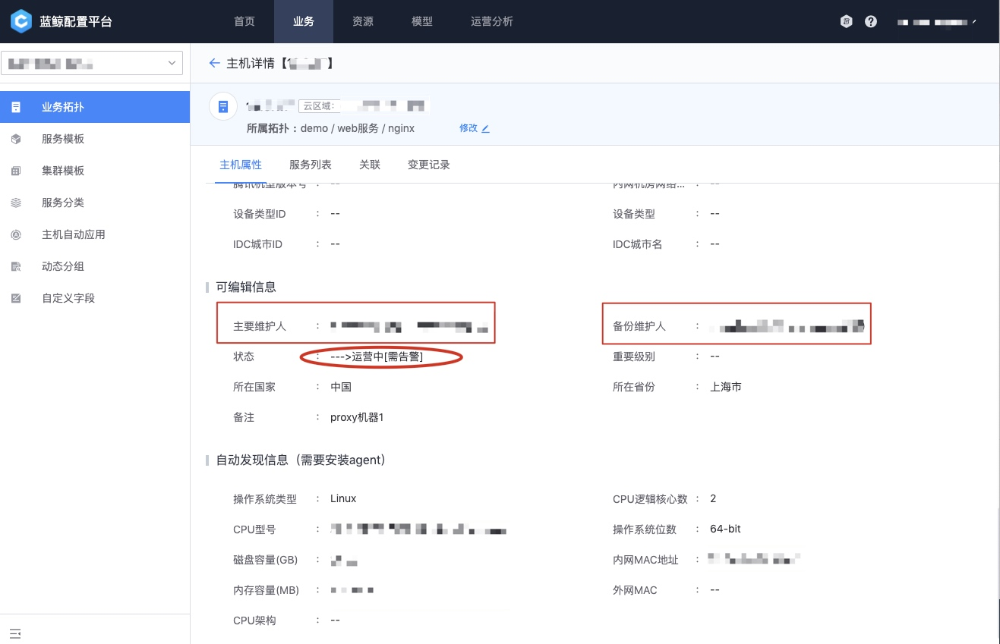
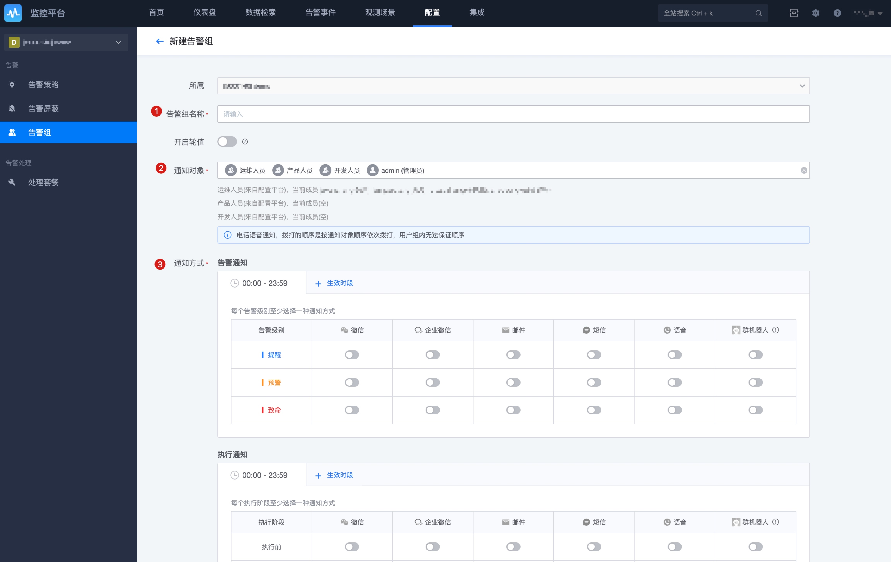
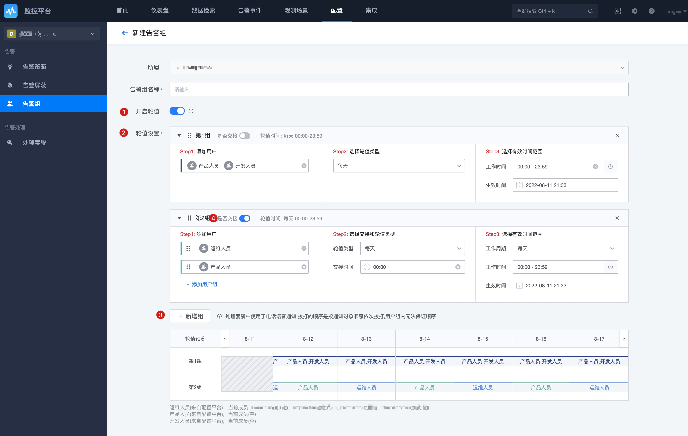

# Alarm group

The alarm group is the same as daily management. There will be a group of people responsible for a piece of content at the same time, receiving alarms and processing them together. Then this group of people belongs to an alarm group.

Functions are divided into operations, development, product, and testing. But in fact, operation and maintenance also involves group A operation and maintenance, and group B operation and maintenance, so the granularity of the alarm group is controlled by the management granularity.

## Preliminary steps

**Navigation path**: Navigation → Monitoring Configuration → Alarm Group

## Features

### Configure alarm group

The default alarm groups are: primary and secondary responsible person, operation and maintenance, development and testing product

Members of these groups come from business roles in the CMDB.

### Configure notification method

The notification method can be selected according to the alarm level. The currently supported methods are as shown in the figure below.

### Primary and backup person in charge

The maintainer of the host comes from the main maintainer and backup person in charge of the configuration platform.

Note: The host status requires an alarm before the alarm is sent to the notification group.

### Add alarm group

Notification objects: 1. The group can select existing alarm groups such as "operation and maintenance personnel" and "developers". 2. It also supports inputting personnel account names such as "admin".

### Enable polling for alarm group

Turn on the rotation function:

1. Can support multiple groups of personnel to distinguish time periods and receive alarms in turn
2. It can support people in the same group to distinguish time periods, take over shifts regularly, and receive alarms.

