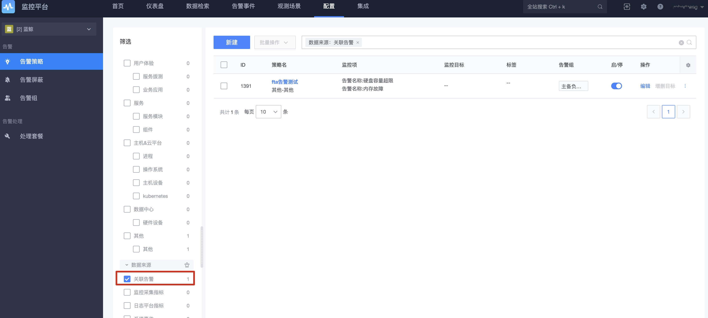
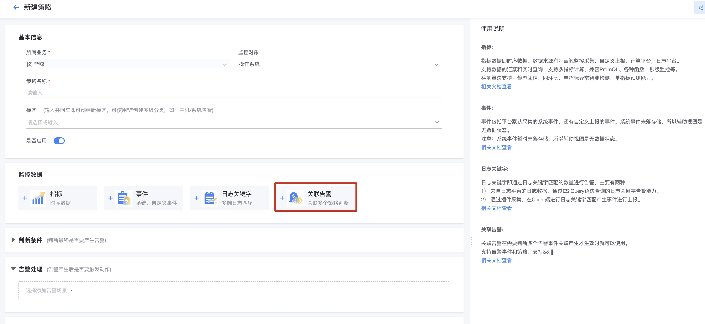
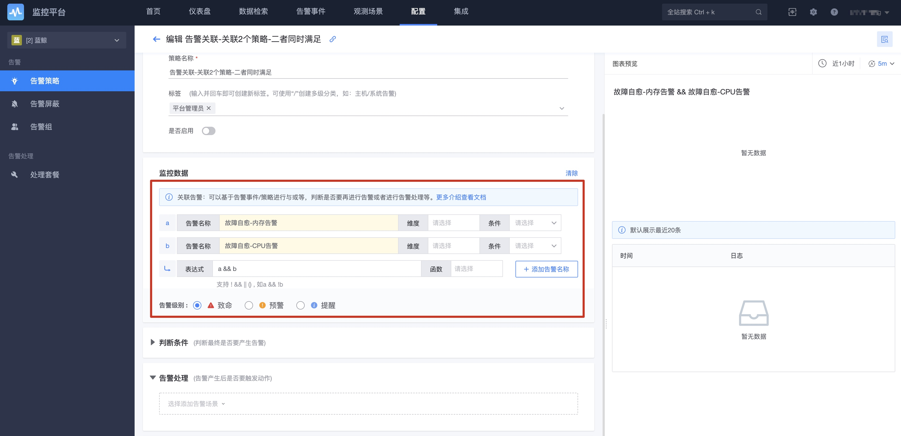
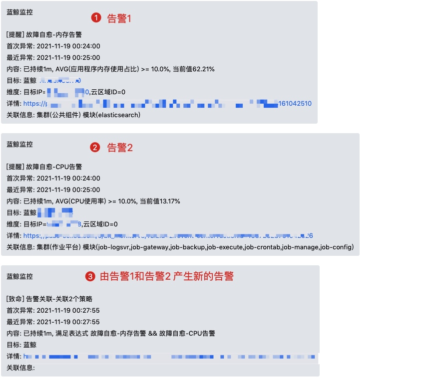

# Associate alarm strategy

Correlate the generated alarms to determine whether to generate and process new alarms. For example, make a call only when two alarms occur at the same time.

## Strategy list

View policy list

## Create new strategy

Select the associated alarm policy to associate multiple alarms at one time

Add an association strategy, as shown in the figure below

## Supported data sources for associated alarms

There are two data sources that can be used to configure associated alarms:

1. Alarm policies created by the monitoring platform

     * All non-correlated alarm policies currently configured in the business

2. Accessed third-party alarms

     * The built-in alarm name configured by the event plug-in
     * The alarms generated by the event plug-in in the last 7 days. This type can only be used to configure the associated alarm policy after it is actually generated (there is a 5-minute synchronization delay)

## Dimensions

Each alarm can select different dimensions, but the dimensions of each alarm must be a subset or superset of the dimensions of all other alarms.

When performing alarm matching, calculations will be performed based on the value combinations of the common dimensions.

For example, alarm a is configured with dimensions [ip, device_name], then alarm b is configured with dimensions [ip]. When calculating expressions, a && b will be calculated separately based on different ip values, that is, `a[ip=10.0.0.1] && b[ip=10.0.0.1]` and `a[ip=10.0.0.2 ] && b[ip=10.0.0.2]`

## Target dimension standardization

Different alarm strategies or third-party alarms may have different target field names. In order to allow more effective correlation between alarms, monitoring will perform standardized conversion on the target dimensions when matching alarms. The conversion rules are as follows

Target type | Original field name | Standardized field name
---|---|---
Host IP | bk_target_ip, ip |ip
Cloud area | bk_target_cloud_id, bk_cloud_id | bk_cloud_id
Service instance | bk_service_instance_id, bk_target_service_instance_id | bk_service_instance_id
Topology node | bk_obj_id, bk_inst_id | bk_topo_node

## Expression

Expression is used to describe the correlation between alarms, and it consists of two parts

Alarm alias: After each alarm is added, it will be assigned a lowercase English letter, such as a, b c, to facilitate the reference of specific alarms in expressions (expressions are not case-sensitive, that is, a && b and A && B are Equivalent)

Boolean operators: support &&, or ||, not!

## Alarm alias value

In the expression, the value of the alarm alias depends on the current status of the alarm. The corresponding relationship between alarm status and value is as follows:

Alarm status | value
---|---
Not restored (ABNORMAL) | true
RECOVERED | false
CLOSED | false
Unknown (UNKNOWN) | false

Examples and explanations

expression | trigger condition
---|---
a && b | a and b are both in the unrestored state at the current moment
a || b | Either a or b is in the unrecovered state at the current moment
a && !b | a is in the unrecovered state, and b is not in the unrecovered state
a && (b || c) | a is in the unrecovered state, and either b or c is in the unrecovered state

## Detection trigger mechanism

There are currently two trigger mechanisms

1. The alarm name/policy associated with the policy has a change in alarm status, including the following situations:

A new alarm is generated
The alarm status changes from Not Recovered to Recovered
Alarm status changes from Not Restored to Closed

2. Periodic inspection

Every minute, all unrecovered alarms in the current system will be checked, their corresponding associated policies will be found, and full calculations will be performed.

Note: If the associated alarm policy is configured with a no-data alarm, the no-data alarm will not participate in the correlation detection.

## Alarm life cycle

There are only two statuses for associated alarms: unrecovered and closed

When the associated alarm policy satisfies the expression for the first time, an associated alarm record will be generated with the status Unrecovered. And will trigger the corresponding processing action, which can be viewed in the event center

When the associated alarm policy does not satisfy the expression, the current unrecovered alarm status is set to closed