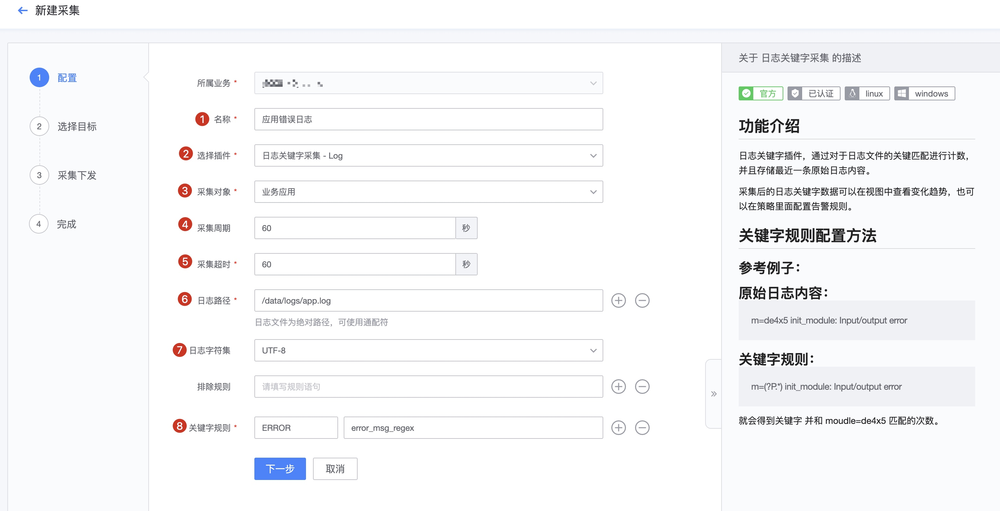
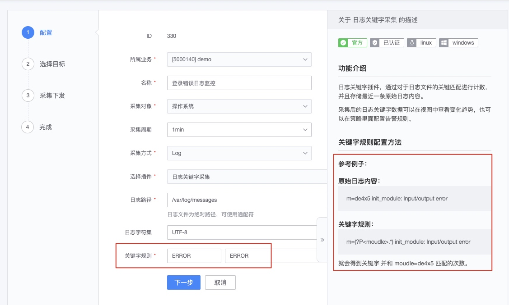
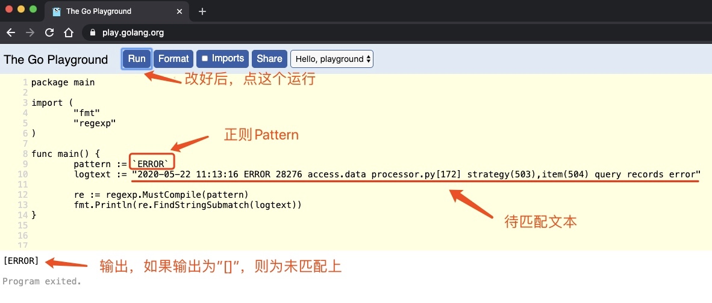
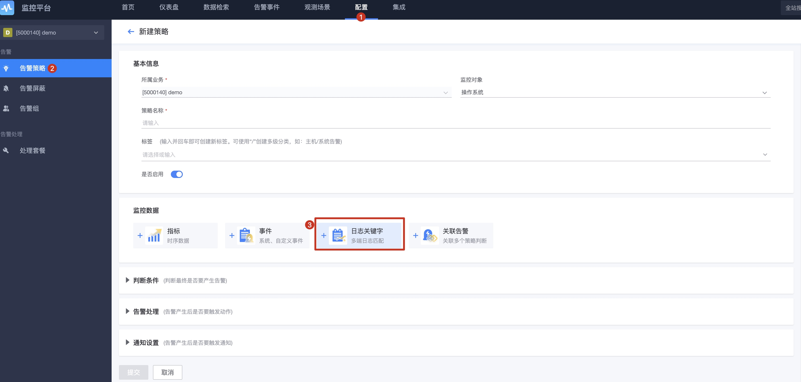

# Log keyword monitoring

Log keyword monitoring refers to using the number of keyword matches in the log to generate alarms and determine whether there is a problem. It is a relatively common monitoring requirement. There are two log keyword configuration methods on the monitoring platform.

## Preliminary steps

First understand the working principles of the two log keywords:

### The first type: Log keywords based on log platform data

The data of the log platform cannot be collected by itself. The data of the third-party ES or the data platform will ultimately be stored in the ES storage. Therefore, the log keys for this type of data are based on the ES query syntax log key.

* **Advantages**: Logs are stored in a centralized manner. When receiving log keyword alerts, you can directly query and locate them on the log platform.

* **Disadvantages**: If the log volume is large, it will occupy a lot of bandwidth and storage resources. In addition, the query method is based on the word segmentation principle. Like I/O, I and O will be split by default for matching

Specific configuration method: [Log keyword alarm-data based on ES storage](./log_monitor.md)

### The second type: Log matching on the Agent side to generate events

Match the log keywords on the server where the log is located, and report the statistical values and sample data within the period. Then generate alarm events through the alarm policy to achieve the purpose of alarm.

* **Advantages**: It can also meet the needs of log keywords when the amount of logs is large and storage resources are insufficient. The matching method is regular, which is easier to configure and understand. Meet timely alarm requirements without being affected by delays in log transmission
* **Disadvantages**: There is only one latest sampling data. If you need more information, you need to check it through other methods.

Next, we will mainly introduce the configuration method of the second log keyword event.

## Dependencies

  Make sure the collection process has started

- Linux

     ```bash
     ps -ef | grep bkmonitorbeat
     ```

- Windows

     ```bat
     tasklist | findstr bkmonitorbeat
     ```
    
- If not, you need to install it through the **Node Management** application and host it to start. And make sure it's the latest version.

## Step 1: Configure collection

Navigation: Integration -> Data Collection -> New Collection





### Log path

Just fill in the absolute path of the rotated log. like:

```bash
/var/log/nginx/nginx.log
```

```bash
/var/log/xxxx/error.%Y%m%d.log
```

## How keywords are matched

During the process of configuring keywords, there are two input boxes in the keyword rules. The first input box is the name of the rule. Be careful not to enter spaces. The format is [a-z][A-Z][0-9]. The second input box is the name of the rule. The input box is this expression







Expressed in python code as follows:

```
from __future__ import print_function
import re
pattern = 'ERROR'
logtext = "2020-05-22 11:13:16 ERROR 28276 access.data processor.py[172] strategy(503),item(504) query records error"
r = re.compile(pattern)
print(r.search(logtext))
```


### Keyword regular rules

Regular expressions use Golang's regular syntax. If you have complex requirements, it is recommended to debug first to get the correct regular expression, [Online regular expression debugging address](https://www.debuggex.com/).

Regular reference syntax example:

```bash
([^\s]*) # Match $http_host
(\d+\.\d+\.\d+\.\d+) # Match $server_addr,$remote_addr
(\"\d+\.\d+\.\d+\.\d+\,\s\d+\.\d+\.\d+\.\d+\"|\"\d+\.\d+\.\d+ \.\d+\") #match "$http_x_forwarded_for"
(\[[^\[\]]+\]) #match[$time_local]
(\"(?:[^"]|\")+|-\") # Match "$request", "$http_referer", "$http_user_agent"
(\d{3}) # Match $status
(\d+|-) # Match $body_bytes_sent
(\d*\.\d*|\-) # Match $request_time,$upstream_response_time'
^ # Match the beginning of each line of data
$ # Match the ending of each row of data
```

### Dimension extraction

Keywords can not only match regular expressions, but also extract dimension information from row logs to refine the content of keywords. Regular expression extraction can be used, for example:

```bash
     # If my log text is like this
     "2020-05-22 11:13:16 ERROR 28276 access.data processor.py[172] strategy(503),item(504) query records error, System Request 'metadata_v3' error"
        
     # Then you can fill in the following regular rules, and while matching ERROR, extract my code module and file name information.
     "ERROR[ 0-9]+(?P<module>[a-z\.]+) +(?P<filename>[^\[]+).*"
```


## How to configure keyword alarm




## Recommendations

- Single line log size: If a single line is too long, it will lead to poor regular matching performance. It is recommended to < 1k bytes
- Log generation rate per second: Recommended < 5w per second
- Log file size rate: Recommended < 50M per second
- Regular number limit: that is, the number of rules configured on the page: recommended < (50M / actual generated size rate) per second
     - If the current machine has all the log files that need to be monitored, the log generation rate is 1M/s. It is recommended that the number of rules < 50
     - If the current machine has all the log files that need to be monitored, the log generation rate is 2M/s. It is recommended that the number of rules < 25
- Regular expressions should be as precise as possible, reducing the usage of ".*" and improving efficiency.

Exceeding the above limit will result in processing failure and queue backlog. The statistical values reported in each cycle will be inaccurate.

## Troubleshooting

6. Problem Troubleshooting
If the above configurations are correct but the log keyword function is still abnormal, you can enable the debug level log of bkmonitorbeat and then restart bkmonitorbeat. After running for two minutes, package the log and send it to our developers for troubleshooting.

linux

```
vim /usr/local/gse/plugins/etc/bkmonitorbeat.conf
# Modify logging.level to debug
# Restart bkmonitorbeat manually, or through node management
cd /usr/local/gse/plugins/bin/ && ./restart.sh bkmonitorbeat
# After two minutes, package /var/log/gse/bkmonitorbeat* related log files
```

Windows

```
Open c:\gse\plugins\etc\bkmonitorbeat.conf
rem changes logging.level to debug
rem manually restart bkmonitorbeat, or through node management
cd c:\gse\plugins\bin && restart.bat bkmonitorbeat
rem After two minutes, package c:\gse\logs\bkmonitorbeat* related log files
```