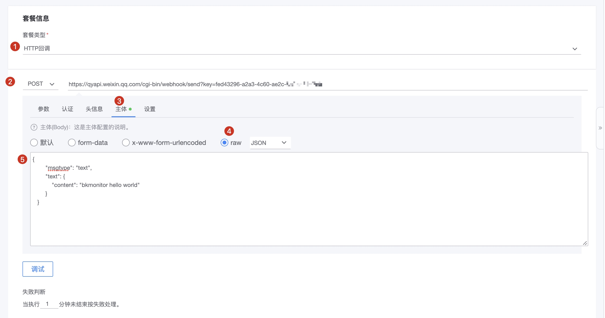
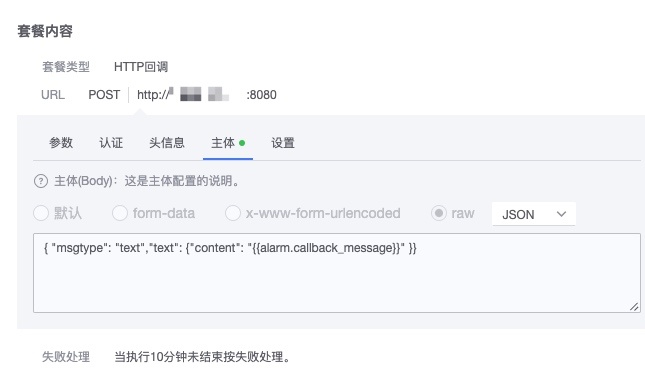
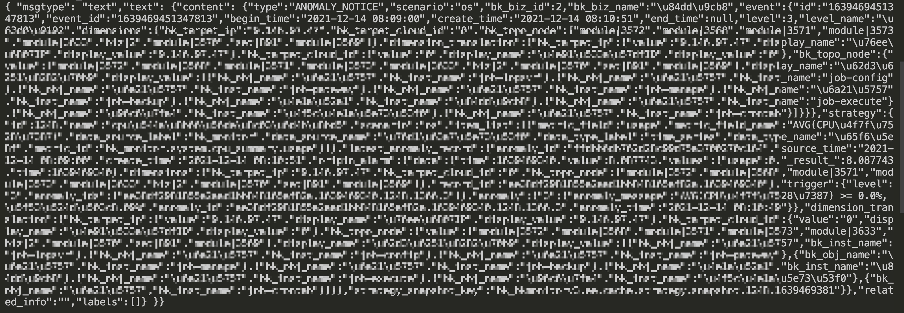

# Case: WeChat group custom robot

This article mainly explains the functions of WeChat robots through callbacks. The specific function description of HTTP callback can be viewed in [Processing Package-HTTP Callback](./solutions_http_callback.md)

## Configuration process

The alarm callback uses WeChat's custom robot to send messages. Please refer to the document https://work.weixin.qq.com/api/doc/90000/90136/91770


The callback parameters are configured as follows



Use case-customized receiving callback data

The receiving server demo is as follows

```
package main

import (
"fmt"
"io/ioutil"
"log"
"net/http"
)

func hello(w http.ResponseWriter, r *http.Request) {
if r.URL.Path != "/" {
http.Error(w, "404 not found.", http.StatusNotFound)
return
}

switch r.Method {
case "POST":
         //If you need to do more formatting on the alarm, you can handle it yourself
reqBody, err := ioutil.ReadAll(r.Body)
if err != nil {
log.Fatal(err)
}

fmt.Printf("%s\n", reqBody)
w.Write([]byte("Received a POST request\n"))
default:
fmt.Fprintf(w, "Sorry, only POST method is supported.")
}
}

func main() {
http.HandleFunc("/", hello)

fmt.Printf("Starting server for testing HTTP POST...\n")
if err := http.ListenAndServe(":8080", nil); err != nil {
log.Fatal(err)
}
}


#Compile into binary
#CGO_ENABLED=0 GOOS=linux GOARCH=amd64 go build -o http_svr

```

Start service


Test receiving data


Configuration package



Configure alarms and select this package


The received data is as follows




Alarm callback receives data successfully