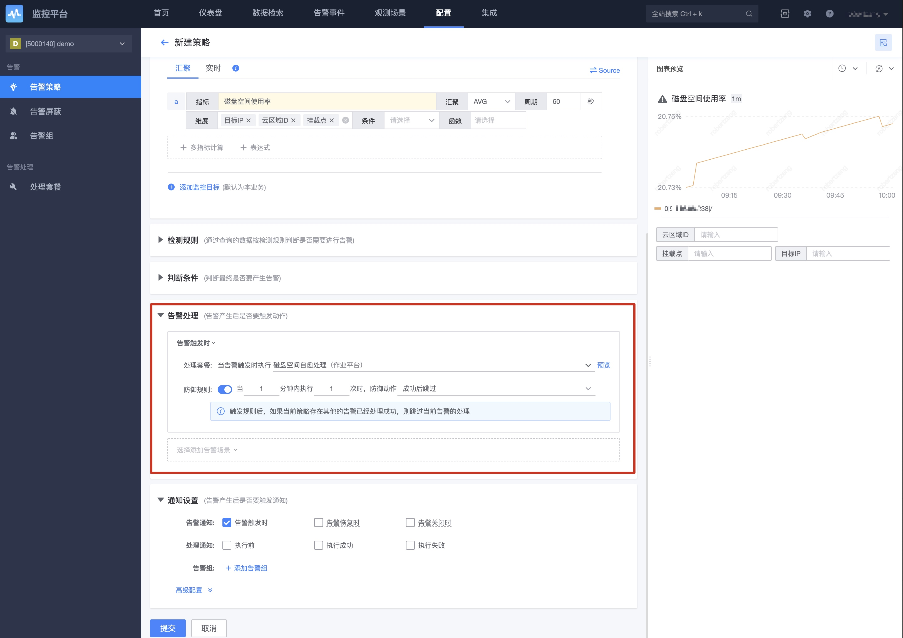
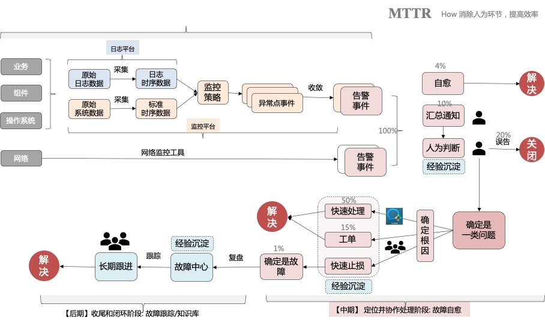
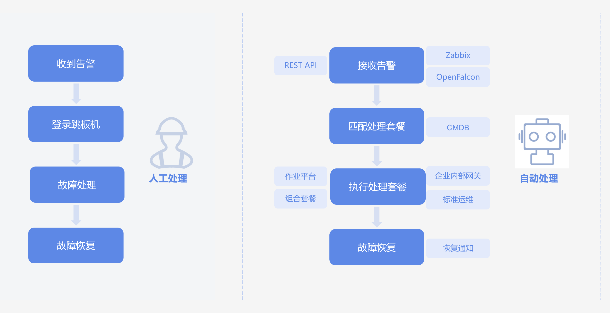
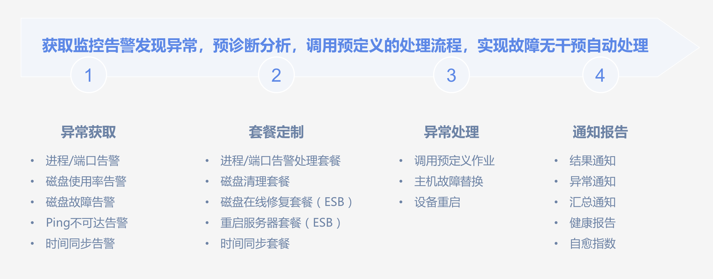
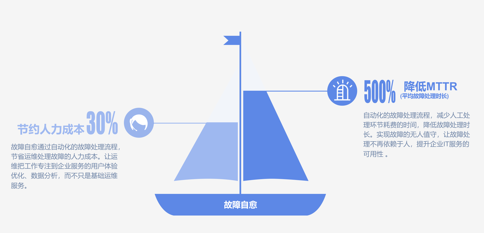

# Alarm processing package

In the alarm policy, there is the function of sending alarm notifications, and it also has the function of processing alarms. Alarm processing is performed by specific processing packages. Through systems such as HTTP callbacks, job platforms, standard operation and maintenance, and process services, the ability to automatically process alarms after they are generated is realized.

There are two steps to use the alarm processing function:

1. Define the processing package to represent the specific task execution logic.
2. Use packages in alert policies.

The functions for handling packages are shown below.

Use processing packages in alert policies.

# Introduction to fault self-healing product functions

Fault self-healing is a solution for fault generation and automatic fault processing. It improves the service availability of enterprises and reduces the human investment in fault processing, and realizes the purpose of service self-healing from "manual processing" to "unattended" faults.

Save manpower investment through automated processing, make the recovery process more reliable through scheduled recovery processes, and achieve faster fault location and recovery through parallel analysis.

Fault self-healing is a process in the mid-term of operation and maintenance. The purpose is to eliminate human links and reduce MTTA and MTTR.

## Features and advantages

1. **Integrated mainstream monitoring products**: The alarm source integrates BlueKing monitoring, 4 mainstream open source monitoring products Zabbix, Open-Falcon, Nagios, Icinga, and alarm access to AWS and email, and can be pulled through REST API , Push alerts.
2. **Rich processing packages**: In addition to supporting the operating platform, standard operation and maintenance, and ITSM; it also supports shortcut packages (disk cleaning, summary, detection of TOP10 CPU usage, etc.); and also supports customized systems.
3. **Alarm generation**: Alarm events can be enriched, alarm events can be identified and duplicated to generate final alarms, reducing the interference of repeated events.
5. **Flexible Event Center**: The event center has alarms, alarm-related events, and processing records, which can help users quickly trace back problems and assist in discovering and locating problems.
7. **Processing records**: Record each execution action, and the processing records can be analyzed.

## Leading the new trend of industry troubleshooting

**Fault self-healing redefines the fault handling process**. In the field of operation and maintenance, the fault automation concept was first proposed and implemented as a product.

## Event processing process engine to achieve unattended self-healing

Obtain monitoring alarms and detect abnormalities, conduct pre-diagnosis and analysis, and call predefined processing procedures to achieve **automatic fault handling without intervention**.

## Save manpower and reduce MTTR for enterprises

Fault self-healing saves labor costs in operation and maintenance through automated fault handling processes**. Let operation and maintenance focus on user experience optimization and data analysis of enterprise services, not just basic operation and maintenance services.

The automated troubleshooting process reduces the time spent on manual processing and reduces the length of troubleshooting. Realize unattended faults, so that fault handling no longer relies on people, **improving the availability of enterprise IT services**.

#Fault self-healing product architecture diagram

Faulty working process:

1. Event access: Able to receive different types of alarm events, provide PUSH PULL and other methods, support mainstream alarm systems, and also support user-defined access to extended event plug-ins.
2. Event processing engine: The received events will be standardized, enriched, and deduplicated to form alarms. The final fault will be formed through correlation analysis of the alarm, and the root cause analysis of the fault will be performed to further intelligently provide information to help operation and maintenance decisions. .
3. Workflow management engine: Alarms and faults can be managed through workflow, linked to surrounding systems, and can be triggered by notifications, JOB execution, standard operation and maintenance processes, service work orders, alarm callbacks, etc. (services can also be customized) More system collaboration will ultimately achieve the goal of reducing human intervention and even enabling self-healing of services.

## The relationship between BlueKing monitoring and fault self-healing

The ability to self-heal faults is part of BlueKing monitoring. The data from BlueKing monitoring is more beneficial for analysis and processing. However, when the processing of indicator data and log data is not required, it only needs to be connected to a third-party alarm system, and faults will be self-healing. Yu can completely exist independently.

1. Some functional modules are shared, such as event center, processing package, alarm group, shielding, and alarm strategy (event alarm, associated alarm)
2. The monitoring platform includes all capabilities of fault self-healing, which is a subsystem of the monitoring platform.
3. Permissions are shared, and the permissions use the permissions of the monitoring platform.