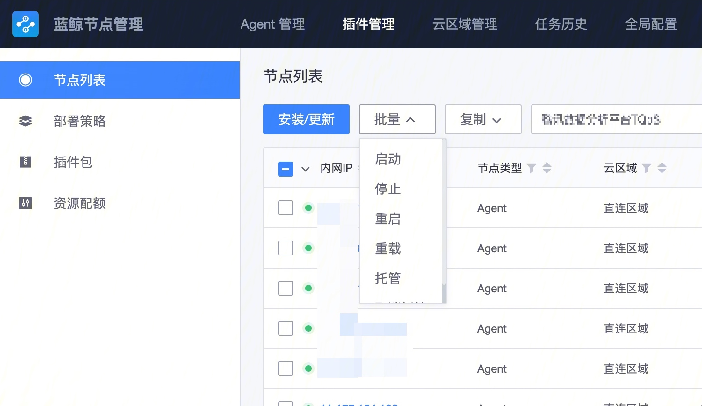

#Collector FAQ

## **Collector installation location, configuration files, logs**
### **The collector is installed in the same path of gse agent**

```
/usr/local/gse/agent #gse agent deployment directory
/usr/local/gse/plugins #Collector deployment directory
```

### **Collector configuration file**
The configuration file of the collector is in the etc directory under the plugins directory. The collector configuration file is named "collector name.conf".

```
[root@VM-42-61-centos /usr/local/gse/plugins/etc]# ll
total 36
d--xr--r-- 2 root root 4096 Jul 6 19:34 bkmonitorbeat
-rwxr-xr-x 1 root root 8231 Jul 6 19:34 bkmonitorbeat.conf
-rw-r--r-- 1 root root 638 Mar 11 10:17 bkunifylogbeat.conf
-rw-r--r-- 1 root root 72 Mar 11 10:17 gsecmdline.conf
```

### **Collector log view**

It can be seen from the configuration file of the collector that the log of the collector is written to the /var/log/gse directory.

### **View collector start and stop logs**

In the startup and shutdown script of the collector, a log will be written to /tmp/bkc.log to record the startup and shutdown information.

```
# tail /tmp/bkc.log
20220623-141557 INFO|83|log-main stop bkmonitorbeat ...
20220623-141559 INFO|75|log-main start bkmonitorbeat ...
20220706-193451 INFO|96|log-main stop bkmonitorbeat ...
20220706-193453 INFO|185|log-main start bkmonitorbeat ...
20220706-203857 INFO|185|log-main start bkmonitorbeat ...
20220706-203908 INFO|185|log-main start bkmonitorbeat ...
20220706-205212 INFO|96|log-main stop bkunifylogbeat ...
20220706-205214 INFO|185|log-main start bkunifylogbeat ...
```


## **How to start, stop, restart or reload the collector**

### A. Start, stop or restart the collector (plug-in) through node management SaaS (**recommended**)




### B. Modify on the server (not recommended)

  In the bin directory of plugins, there are reload.sh, restart.sh, start.sh, and stop.sh for corresponding operations.
 
```
./restart.sh bkmonitorbeat # Restart the BlueKing monitoring indicator collector
./reload.sh bkmonitorbeat # Reload the BlueKing monitoring indicator collector

# Because the gse agent hosts the collector, even if the process is started or stopped on the machine, the agent will perform corresponding operations according to the hosting configuration.
# For example: if the collector is stopped, the agent will pull up the collector again, that is, stop cannot achieve the expected purpose.
# Therefore, it is recommended to start and stop the collector in "A. Node Management".
 
./start.sh bkmonitorbeat # Start the BlueKing monitoring indicator collector
./stop.sh bkmonitorbeat # Stop the BlueKing monitoring indicator collector
```

## **How to limit the resource usage of the monitoring collector**

### **1. Adjust the configuration file of the monitoring collector to limit resources**
In the configuration file of the BlueKing monitoring collector (/usr/local/gse/plugins/etc/bkmonitorbeat.conf), the resource_limit field is used to limit the host resource usage.

```
resource_limit:
   enabled: true
   cpu: 1 # CPU resource limit unit core(float64)
   mem: -1 # Memory resource limit unit MB (int), -1 means no limit
```

* cpu: 1 # Indicates limit to 1 core usage. (This usage rate is the usage rate of dynamic drift on multi-core, not the physical single-core CPU usage rate)
* mem: -1 # Please do not modify the memory limit by yourself. On some Linux kernel versions, it may cause bugs and cause the collector to crash.

### **2. Manage the configuration file through gse agent to limit resource usage**

#### The relationship between collector and gse agent

The collector is hosted and controlled by the gse agent.
We can host the collector through node management or manually modify the configuration file of the gse agent. After hosting, the collector will be automatically managed by the gse agent.
In the proinfo.json configuration file hosted by the gse agent plug-in, you can perform comprehensive management of the resource usage of the corresponding collector (that is, kill the collector process).

### How to check the resource usage of the collector

In the etc directory of gse agent (/usr/local/gse/agent/etc), you can see the proinfo.json configuration file.

```
{
"procName" : "bkmonitorbeat",
          "cpulmt" : 10,
          "memlmt" : 10,
...
  }
```
cpulmt: The highest CPU resource usage of the plug-in. The default is 10, which means that when the plug-in runs and consumes up to 10% of the host's CPU resources, the gse agent will kill the collector.
memlmt: The highest memory resource usage of this plug-in. The default is 10, which means that the plug-in will occupy up to 10% of the host's memory resources, and the gse agent will kill the collector.

#### How to modify the resource usage of the collector

Because of the protection mechanism of gse agent for the hosted file proinfo.json, when the collector is restarted, the corresponding collector hosting configuration will be reset to the default value.
Therefore, modifying cpulmt and memlmt in the configuration file is not a long-term solution.
Please go to the node management, plug-in management - resource coordination page, and modify cpulmt and memlmt according to the module dimension of the business topology.

