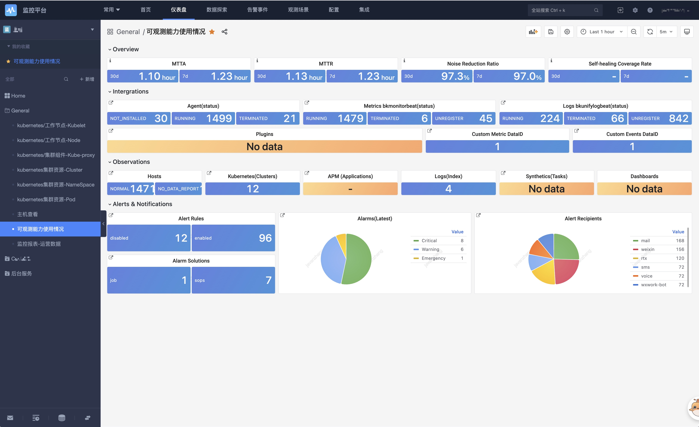
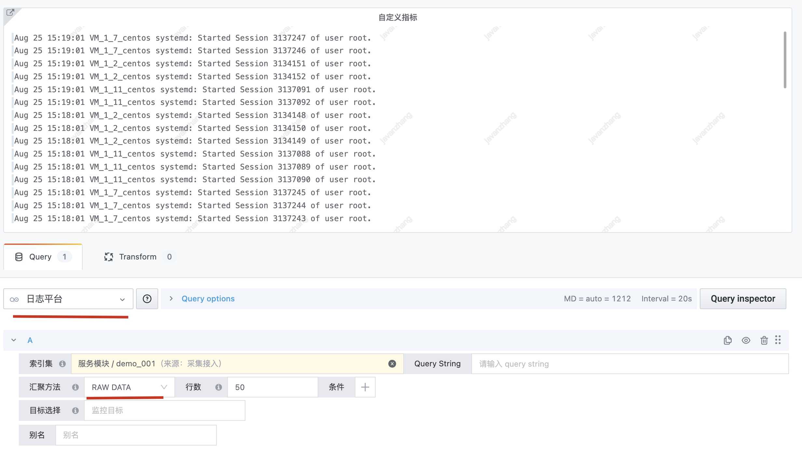
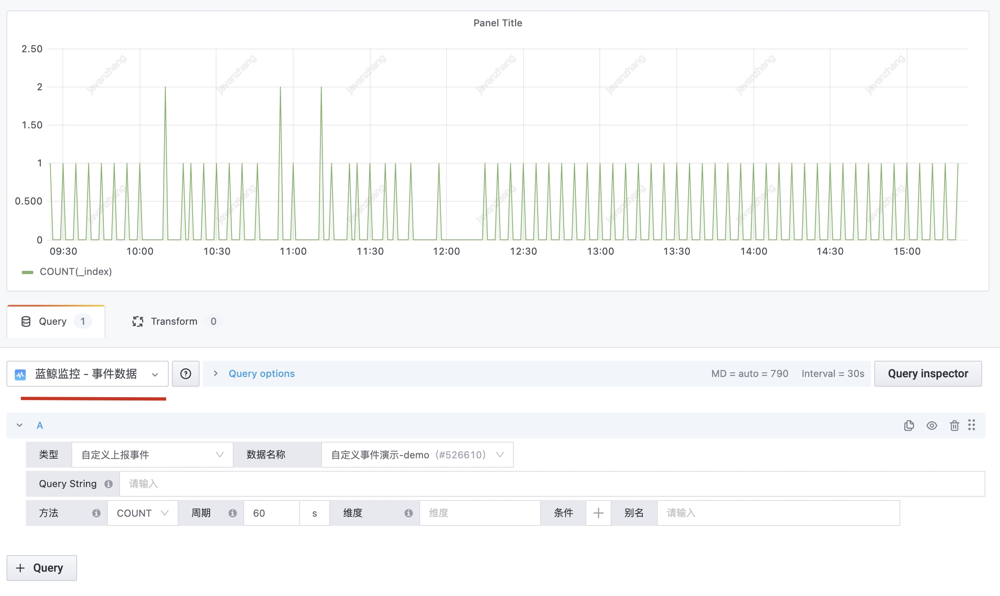
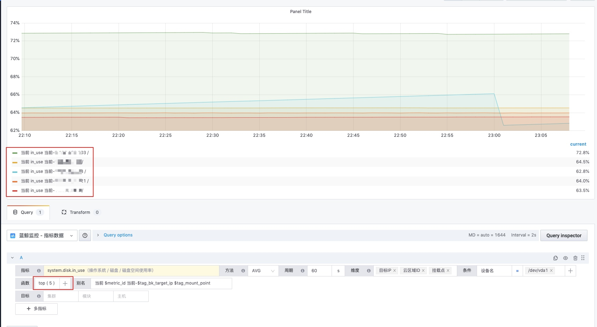
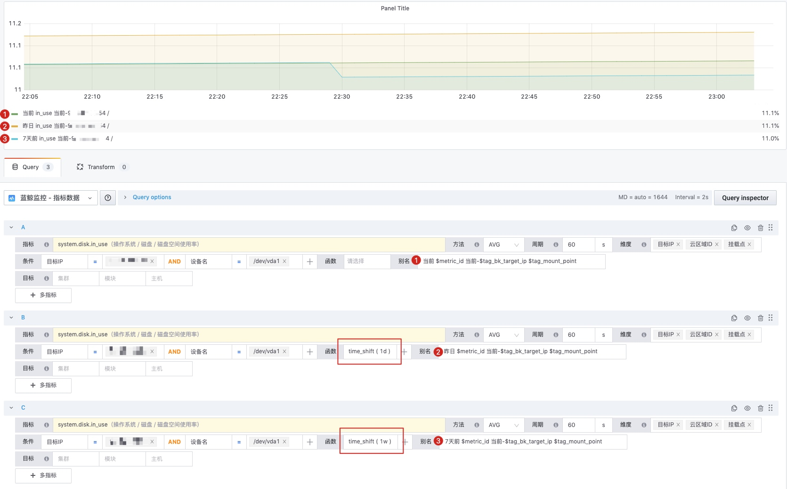
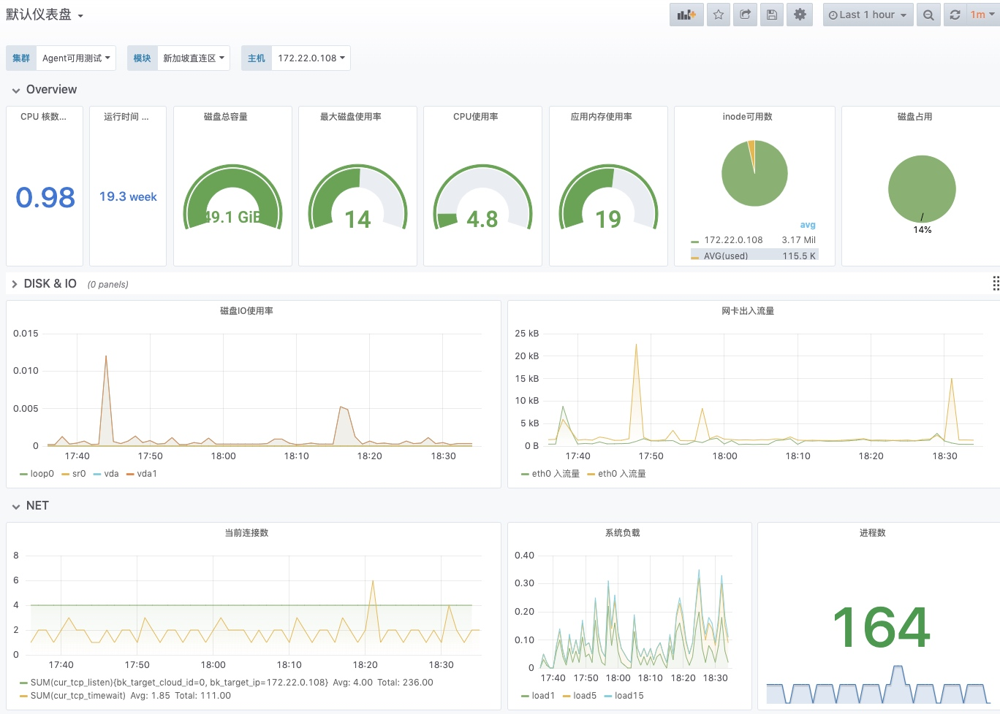
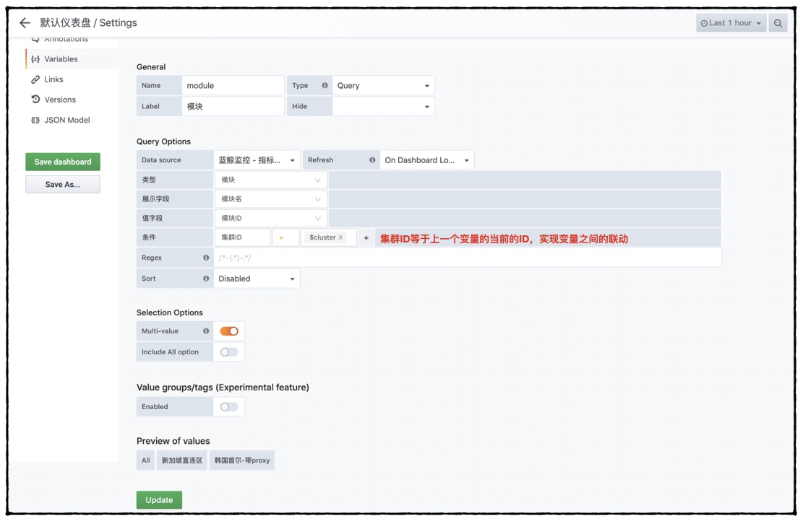
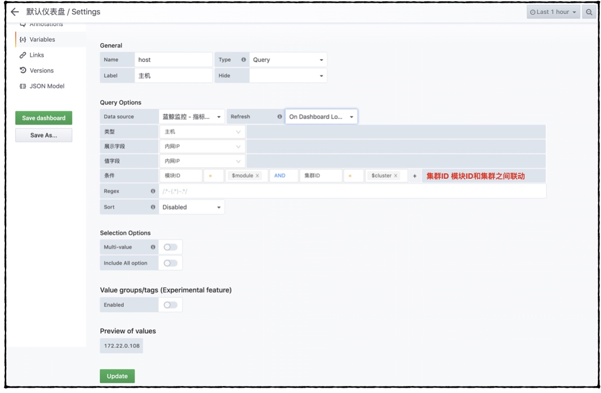
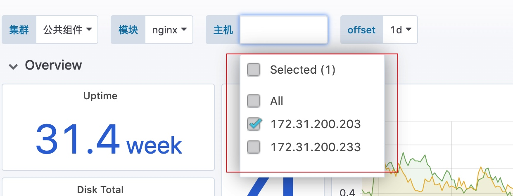
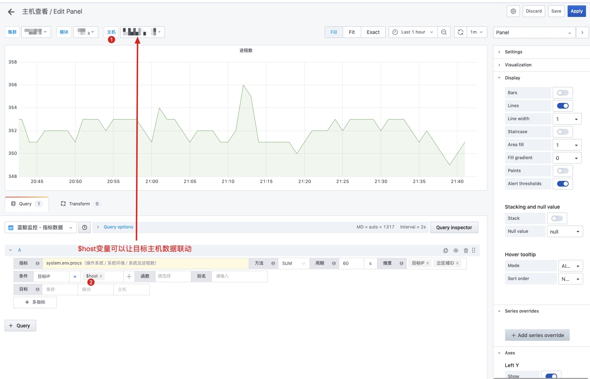

# dash board

The dashboard uses Grafana. Based on Grafana's design concept, it basically incorporates BlueKing's own monitoring functions without changing Grafana.

For basic usage of Grafana, you can check the official website or online usage articles. Next, we mainly introduce some additional functions of BlueKing monitoring and some commonly used functions.

## Basic usage

### Create new views and groups

1. Create a new view. You can select data or graph first.
2. If you want to implement grouping, you can use Convert to row to achieve similar grouping functions.

### View plugin

Administrators can add corresponding charts based on the version of Grafana.

### Data source plug-in

The monitoring platform provides three data source plug-ins

1. Indicator data
2. Event data
3. Log data

### Indicator data panel

* Indicator selection: choose the right indicator
* Aggregation method: When there are multiple data points in one aggregation period, attention should be paid to selecting the aggregation method at this time. When the data collected is 1 minute, the aggregation period is also 1 minute, and there is only one data point, then the aggregation method is actually the same whether it is SUM MAX MIN.
    
     Aggregation operation methods: support SUM, AVG, MAX, MIN, COUNT, SUM(PromQL), AVG(PromQL), MAX(PromQL), MIN(PromQL), COUNT(PromQL)
* Aggregation period: The units of the aggregation period are seconds (s) and minutes (m). It also supports auto and will automatically select an adapted aggregation period based on the time range, and the query efficiency will be optimized.
* Dimension: similar to Group by
* Condition: similar to Where used to filter data
* Function: supports various function calculations
*Multiple indicators/expressions: Multiple indicators can be calculated
* Goal: is a quick IP/instance selection method
* Alias: Generally, the default example names are very long, so you can make good use of the alias function to make the chart look better.

### Log data source query

* Index set: Select the index set of the log
* Query String: Supports native ES query syntax
* Aggregation method: In addition to the common MAX COUNT, there is also RAW DATA, which is useful under text chart plug-ins, as shown in the original log presentation above.

### Event data source query

* Type: Custom reporting events, log keyword events
* Data name: It is the name of the data item of the corresponding type
* Query String: Supports ES’s native query syntax
* Method: Only count is provided

## Common Functions

### Alias function

Alias syntax: starting with `$`, `$header_field name`

For example: indicator id. The header is `metric` and the field name is `id`. So the whole variable is: `$metric_id` If you want to display the indicator name, it is. `$metric_name`

For example: dimension name. The header is `tag` and the field name is `device_name`, so the entire variable is: `$tag_device_name`.

* Header: You can click on the help information of each box to display the name of the header.
* Field name: The name will be displayed when the mouse floats up

Chinese name | header name | alias combination method
---|---|---
Metric | metric | `$metric_id` represents the metric name
Method | formula | `$formula` represents the aggregation method
Period | interval | `$interval` represents the convergence period
Dimension | tag | `$tag_field name` such as $tag_bk_target_ip

### Common chart configurations

### Save query time range

## Advanced Features

### Extreme value

Function - TOP or Bottom function

The logic of TOP and Bottom is to count the data within the query time range. According to whether the original query aggregation method is MAX or SUM, the overall data is sorted, and then TOP and Bottom are sorted.

The difference from topk and bottomk is that topk and bottomk take the data at each time point and sort it.

### Sort

#### Descending order

#### Ascending order

### Time comparison

To compare data with a certain day in the past, you can use the time offset function.

Time format:

| key | shorthand |
|---|---|
| years | y |
| quarters | Q|
| months | M |
| weeks | w |
| days | d |
| hours | h |
| minutes | m |
| seconds | s |

For example: `1d 1day 1days`

To compare the data from yesterday and a week ago, you can use the time_shift function, as shown in the figure below

[View more functions](../data-visualization/mutil_metric.md)

### Variable function

There is a variable function in the settings of the dashboard. After setting the variables and matching the query conditions, the linkage effect of the variables can be instantiated. Next, configure the host query corresponding to a cluster module as an example.

#### Configure the linkage variables of the cluster and module

First configure the cluster `cluster`.

The default clusert variables are as follows. Please see the explanation in the picture for the explanation you gave first. Mutil-value means that you can select multiple values at one time, and Include All option means that you can select all.

Then configure the module `module`, and the query conditions in the module use the cluster ID as the condition.

#### Configure host

The host variable associates the cluster and the module to implement the cluster. After the module changes, the host IP changes accordingly.

Set the variable `host`.

Multiple host selection and all conditions can be enabled

You can see the following effect.

#### Configure query condition association

Using the host variable in the condition can achieve the effect of linked query

#### Repeat function-automatically draw multiple pictures

Select the Repeat function to automatically draw multiple graphs based on variable values

### Data drill-down

As shown in the figure, data drill-down is configured. Click on the IP to jump to the page corresponding to host monitoring through "Host Details".

Configuration method: In the view configuration, use the `Add link` function and use relevant variables in the URL

