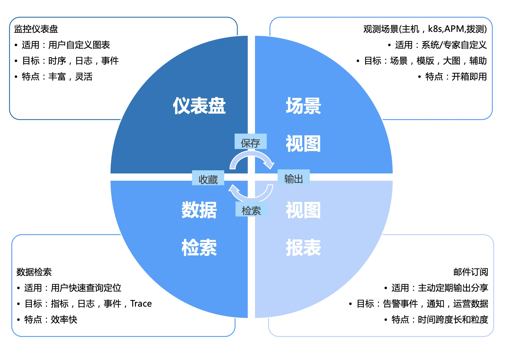
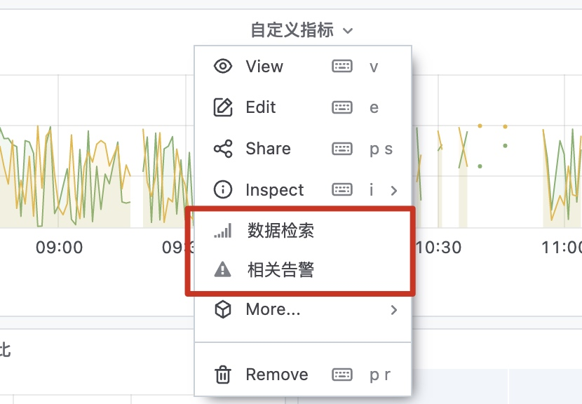
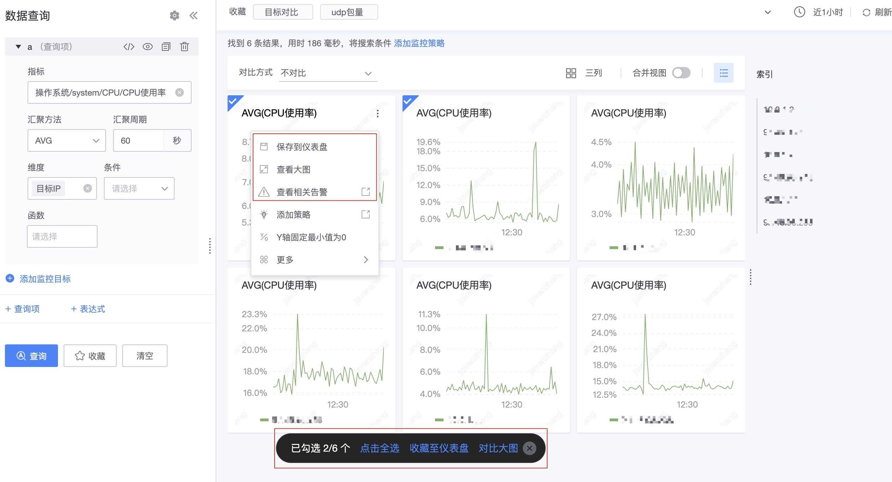

# Introduction to data visualization

Data visualization is one of the important uses based on monitoring data consumption. Data visualization can basically be divided into four categories:

1. Data retrieval
2. Dashboard
3. Scene view
4. View reports

The types of data are:

1. Metrics
2. Events
3. Logs
4. Call chain Traces
5. Alerts

## Conversion relationship between visualizations

Each visualization capability must be able to meet the use of five types of data, and the various visualization capabilities can achieve mutual conversion.

### dash board 

1. Jump directly to data retrieval. Different data types have different retrievals.
2. Relevant alarms can be directly viewed in alarm events
3. The dashboard can send reports regularly through email subscription

[View more](./dashboard.md)

### Data retrieval

1. Can be quickly saved to the dashboard
2. You can view relevant alarms
3. You can view the big picture

[View more](./explore_metrics.md)

### Scene View

1. Can be quickly saved to the dashboard
2. You can view relevant alarms
3. You can view the big picture
4. Can jump to search
5. Can drill down

[More views](./data_quick_view.md)

### View report

1. You can subscribe to individual views in the dashboard
2. You can subscribe to the entire dashboard of the dashboard

[View more](./report_email.md)