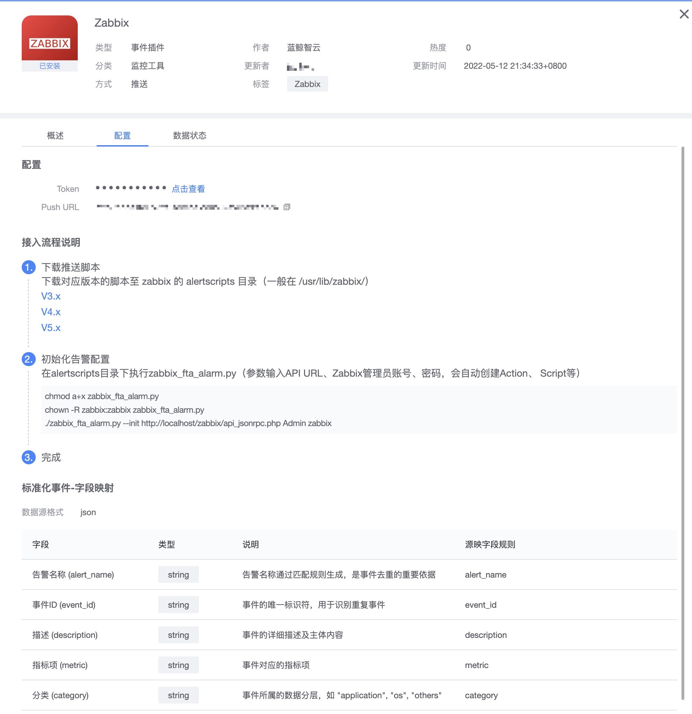

# Alarm source access instructions

Integration refers to data access and peripheral service access, including:

* Production of various plug-ins
* data collection
* Collection status management
* Dependent service docking
* Template production

## General abilities

There are various classifications and queries based on plug-ins to quickly find the corresponding plug-ins.

The card mode of the plug-in displays the following content:

* Plug-in’s LOGO
* The name of the plugin
* Source: BlueKing/department/person
* Popularity: Counted based on business applications
* Installed: It is a business/global that belongs to this business/visible scope
*Available: Resources that belong to the public market

## Integration-Event Plugin

The event plug-in in the integration is mainly used for fault self-healing to obtain third-party alarm events. There are many ways to obtain alarm events.

The event plug-in is mainly divided into these parts:

Basic information about the plug-in

* Overview: Mainly briefly describes the functions of the plug-in
* Configuration: specific configuration and usage methods
     * Configured address information
     * Instructions for access process
     * Rules for standardized event-field mapping
     * Alarm name list is additional content added by the user through the workbench
     * Data status: Displays the latest raw data obtained

## Integrate mainstream monitoring products

The alarm source integrates BlueKing monitoring and 4 mainstream open source monitoring products

* Zabbix
*Open-Falcon
*Prometheus
* Tencent Cloud Monitoring

## Customizable alarm source