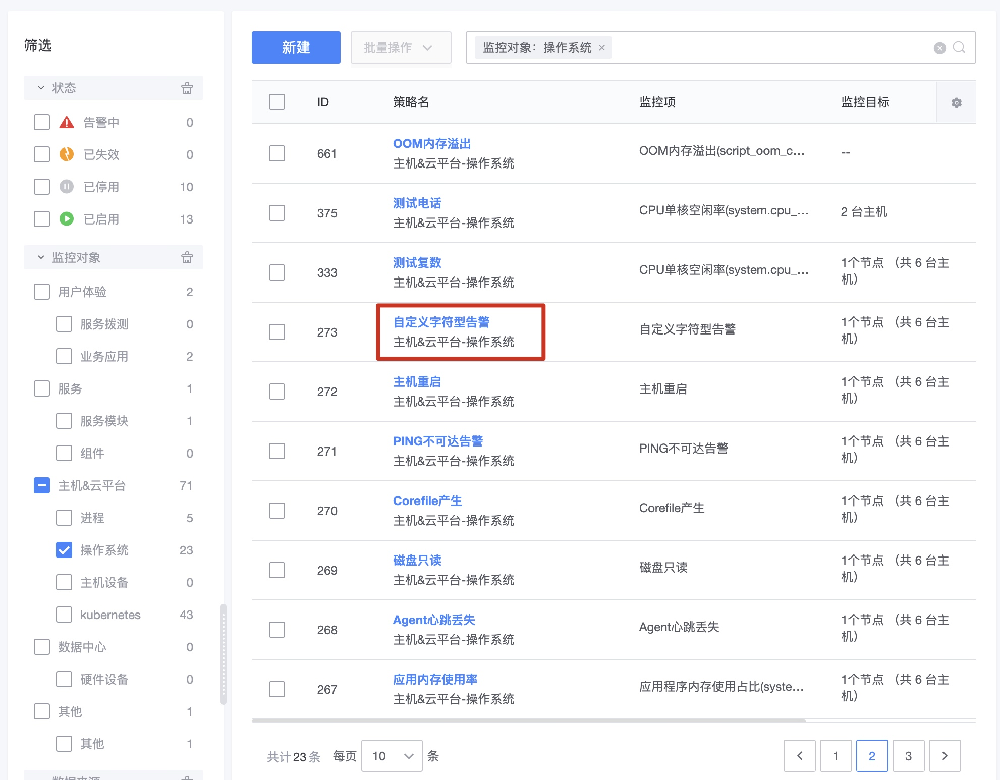
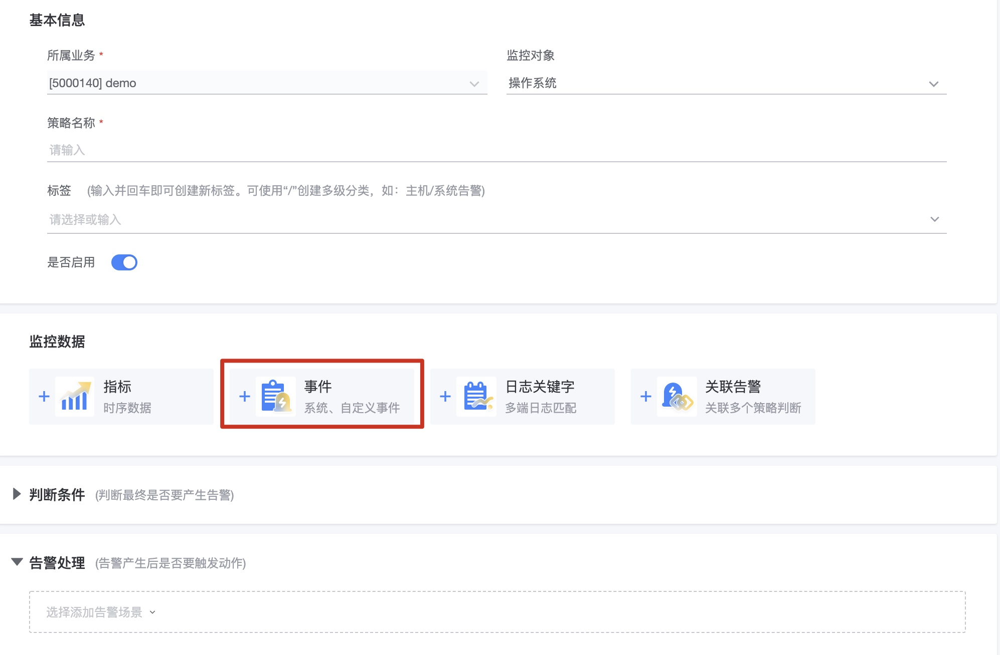
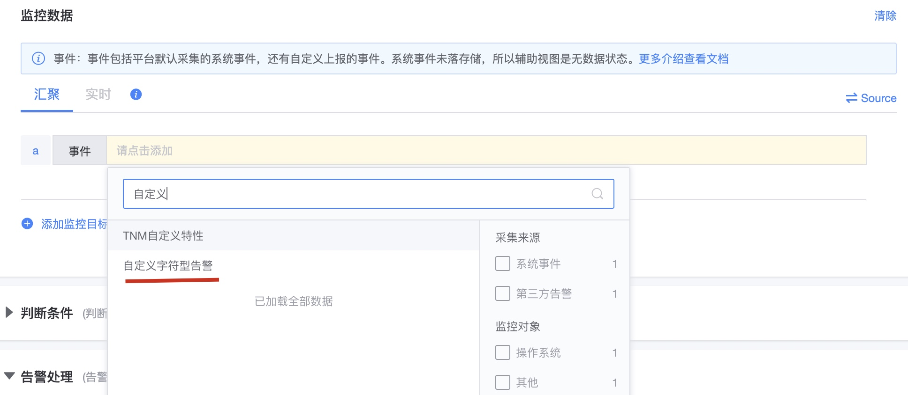

# Character alarm-gsecmdline

## Not recommended

Customizing character-based alarms is a relatively early use. In order to be compatible with early uses, it is indeed very simple and easy to use. However, it cannot be expanded due to the following problems:

1. All reported data can only have the same alarm policy, and can be differentiated according to the monitoring target range at most, and the events themselves cannot be distinguished.
2. There is no way to converge, cannot be grouped, and cannot be classified based on data conditions.

Therefore, it is more recommended to use [custom events-HTTP reporting](custom_events_http.md)

## How to configure alarm policy

### Default policy

In the default policy, there is a "custom character alarm" policy, which will send the alarm to the person in charge of the active and backup machines. That is, which machine sends the data for processing will be sent to the person in charge of the primary and secondary IPs.


### Add new strategy

To create a matching strategy with more scopes, as shown below






## Report data

How to send an alert using a command

Linux usage:
```
/usr/local/gse_bkte/plugins/bin/gsecmdline -d 1100000 -l "This service is offline."
```
Note: This command only needs to modify the characters within the quotation marks of "This service is offline.". 1100000 is the built-in data_id and cannot be modified.

Version requirements: /usr/local/gse_bkte/plugins/bin/gsecmdline -v The output version needs to be >= 2.0.2. If the version does not meet the requirements, please go to the node management to update the binary

windows usage:

```
c:/gse_bkte/plugins/bin/gsecmdline.exe -d 1100000 -l "This service is offline."
```