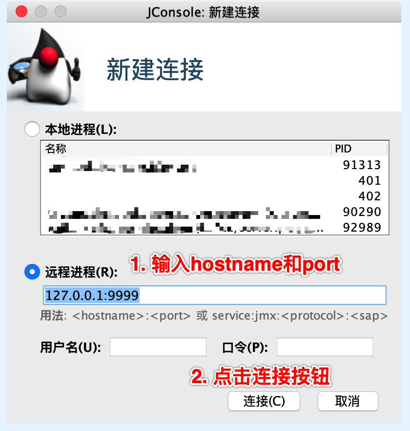
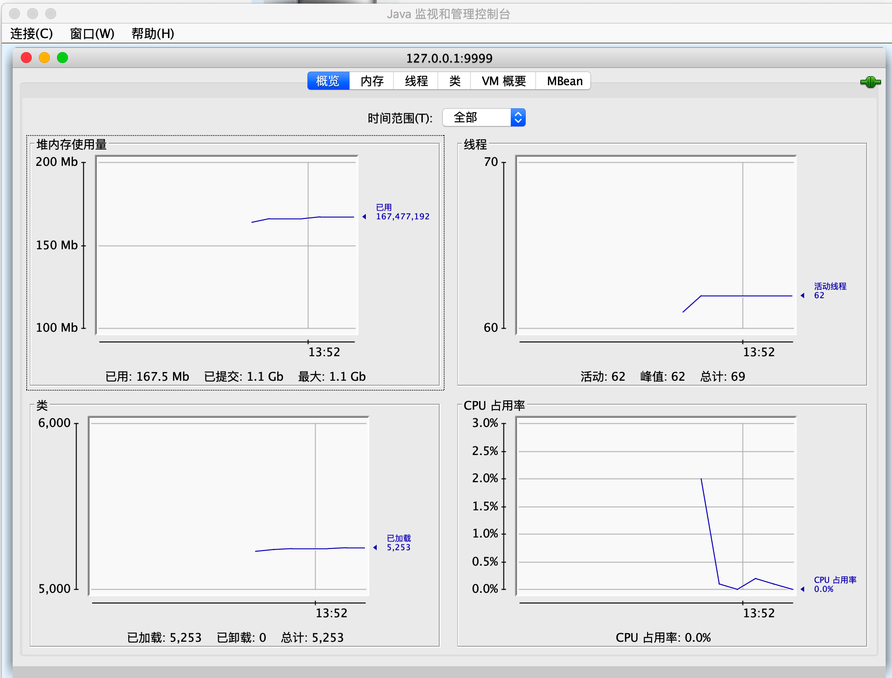
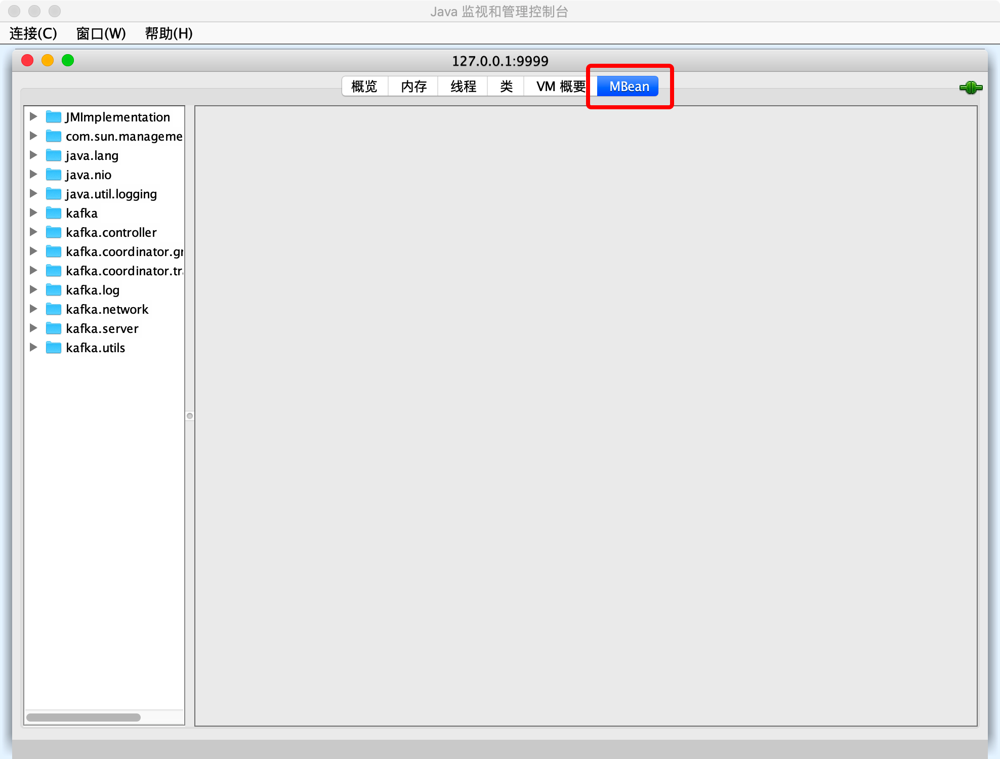
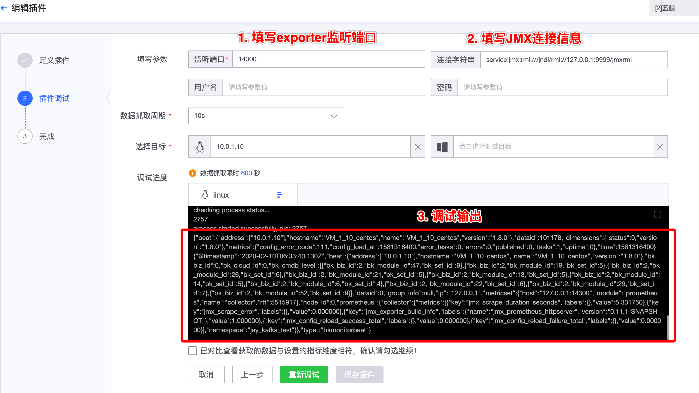

# How to make JMX plug-in online

How the JMX plug-in works:


# Customize a JMX plug-in

## Enable JMX remote access function

Java comes with a JMX RMI connector by default. Therefore, you only need to bring the running parameters when starting the java program to open the Agent's RMI protocol connector.

### Self-developed java program

For example, the java program is `app.jar`, and its startup command is:

```bash
java -jar app.jar
```

To enable the JMX remote access function, you need to add the following startup parameters:

```bash
java -jar app.jar \
-Dcom.sun.management.jmxremote\
-Dcom.sun.management.jmxremote.port=9999 \
-Dcom.sun.management.jmxremote.authenticate=false \
-Dcom.sun.management.jmxremote.ssl=false
```

Parameter Description:

| Parameter name | Type | Description |
| ----- | ------ | ---- |
| `-Dcom.sun.management.jmxremote` | Boolean | Whether to support remote JMX access, default true. **This item must be turned on for normal monitoring and collection** |
| `-Dcom.sun.management.jmxremote.port` | Value | Listening port number, used for remote access |
| `-Dcom.sun.management.jmxremote.authenticate` | Boolean | Whether user authentication needs to be enabled, the default is `true`. After opening, you need to provide a username and password to collect |
| `-Dcom.sun.management.jmxremote.ssl` | Boolean | Whether to enable SSL encryption for the connection, default `true`. **The current version does not support SSL encryption, please set this to false** |
| `-Dcom.sun.management.jmxremote.access.file` | String | The path to the user rights configuration file, the default is `JRE_HOME/lib/management/ jmxremote.access`. This configuration will only take effect when `-Dcom.sun.management.jmxremote.authenticate` is configured as `true` |
| `-Dcom.sun.management.jmxremote.password.file` | String | The path to the user password configuration file, the default is `JRE_HOME/lib/management/ jmxremote.password`. This configuration will only take effect when `-Dcom.sun.management.jmxremote.authenticate` is configured as `true` |

`jmxremote.password` file example:

```bash
# specify actual password instead of the text password
monitorRole password
controlRole password
```

`jmxremote.access` file example:

```bash
# The "monitorRole" role has readonly access.
# The "controlRole" role has readwrite access.
monitorRole readonly
controlRole readwrite
```

For more details about JMX configuration parameters, please refer to [Official Document](https://docs.oracle.com/javase/7/docs/technotes/guides/management/agent.html#gdeum)

### Third-party components

For the remote JMX opening method of each component, please refer to the documentation of each component.

### Check whether startup is successful

The client can remotely access the JMX service through the following URL. Among them, `hostName` is the host name/IP of the target service, and `portNum` is the `jmxremote.port` configured above.

```bash
service:jmx:rmi:///jndi/rmi://${hostName}:${portNum}/jmxrmi
```

You can check whether the configuration has been successful in the following two ways:

1. Simply check whether the JMX remote access has been started successfully by checking whether the port exists and whether the PID matches.

```bash
netstat -anpt | grep ${portNum}
```

2. If JConsole is installed, you can also directly connect to test



After the connection is successful, you can enter the management page.



## Collection configuration

JMX collection in the monitoring platform is implemented based on [Prometheus JMX Exporter](https://github.com/prometheus/jmx_exporter). The "Collection Configuration" on the plug-in definition page corresponds to the `config.yaml` configuration file of JMX Exporter. It determines which metrics the plugin will collect and in what format they will be output. There are two ways to define configuration files:

### Use configuration template

JMX Exporter officially provides [configuration templates](https://github.com/prometheus/jmx_exporter/tree/master/example_configs) for commonly used components, which can be used directly

### Manual configuration

If the configuration template cannot meet the needs, you can also configure it manually. The following is a configuration example:

```yaml
startDelaySeconds: 0
lowercaseOutputName: false
lowercaseOutputLabelNames: false
whitelistObjectNames: ["Catalina:*", "java.lang:*"]
blacklistObjectNames: ["Catalina:j2eeType=Servlet,*"]

rules:
   - pattern: 'Catalina<type=ThreadPool, name="(\w+-\w+)-(\d+)"><>(currentThreadCount|currentThreadsBusy|keepAliveCount|pollerThreadCount|connectionCount):(.*)'
     name: tomcat_threadpool_$3
     value: $4
     valueFactor: 1
     labels:
       port: "$2"
       protocol: "$1"
```

- Field description

| Field name | Meaning |
| ----------------------- | ----------------------- ---------------------------------------- |
| startDelaySeconds | Start delays. Any request within the delay period will return an empty metric |
| lowercaseOutputName | Lowercase output indicator name. Applies to name. Defaults to false |
| lowercaseOutputLabelNames | Lowercase output indicator label names. Applies to labels. Defaults to false |
| whitelistObjectNames | The list of ObjectNames to query. Defaults to all mBeans |
| blacklistObjectNames | The list of ObjectNames to query. Has higher priority than whitelistObjectNames. Default is none |
| rules | A list of rules to apply sequentially, stopping processing at the first matched rule. Unmatched properties are not collected. If not specified, defaults to collecting everything in the default format |
| pattern | Matches each bean property with a regular expression pattern. Match values (using parentheses to identify a match value) can be referenced by other options as $n (representing the nth match value). Defaults to match everything |
| name | Indicator name. Match values from pattern can be referenced. If not specified, the default format will be used: `domain_beanPropertyValue1_key1_key2_…keyN_attrName` |
| value | The value of the indicator. You can use static values or reference matching values from pattern. If not specified, the mBean value will be used |
| valueFactor | Used to multiply the value of the indicator by this setting value, mainly used to convert mBean values from milliseconds to seconds. Default is 1 |
| labels | Mapping of label names to label values. Match values from pattern can be referenced. Name must be set before using this parameter. If name is used but the value is not specified, no labels will be output |- pattern format description

```bash
domain<beanpropertyName1=beanPropertyValue1, beanpropertyName2=beanPropertyValue2, ...><key1, key2, ...>attrName: value
```

| Part | Description |
| -------------------------- | -------------------------- ---------------------------------- |
| domain | Bean name, the part before the colon in the JMX object name |
| beanProperyName/Value | Bean property, the key/value after the colon in the JMX object name; separate multiple ones with **comma+space** |
| keyN | When encountering an attribute of compound or tabular data, add the name of the attribute to this list; separate multiple levels with commas + spaces; generally rarely used, just leave it blank |
| attrName | The name of the attribute, that is, the monitoring indicator |
| value | refers to the attribute, that is, the value of the monitoring indicator, which is generally rarely used |

Note: For each of the above parts, regular expressions are supported. The indicator field (attrName) and the dimension field (beanProperyName) are commonly used for regular matching.

- pattern variable reference description:

   The regular matching result in the pattern parameter can be referenced through `$`, which is used for customizing parameters such as `name`, `value`, `labels`, etc. The referenced regular expression needs to be marked with brackets `()`, according to the sequence number Make a reference.

   In the above pattern: `Catalina<type=ThreadPool, name="(\w+-\w+)-(\d+)"><>(currentThreadCount|currentThreadsBusy|keepAliveCount|pollerThreadCount|connectionCount):(.*)`, The meaning of variable reference is as follows:

| Variable name | Represents the matching string |
| ------ | ------------- |
| $1 | `(\w+-\w+)` |
| $2 | `(\d+)` |
| $3 | `(currentThreadCount|currentThreadsBusy|keepAliveCount|pollerThreadCount|connectionCount)` |
| $4 | `(.*)` |


> **Please note that regardless of the configuration method, the configuration file must strictly contain the following attributes**. Otherwise, the monitoring platform will not be able to collect indicators correctly.

```yaml
username: {{ username }}
password: {{ password }}
jmxUrl: {{ jmx_url }}
ssl: false
```

Combined with the above example, a complete JMX collection configuration is as follows. Just enter the following configuration into the plug-in configuration page.

```yaml
# ==== Fixed configuration starts ====
username: {{ username }}
password: {{ password }}
jmxUrl: {{ jmx_url }}
ssl: false
# ==== End of fixed configuration ====

# ==== Custom configuration starts ====
startDelaySeconds: 0
lowercaseOutputName: false
lowercaseOutputLabelNames: false
whitelistObjectNames: ["Catalina:*", "java.lang:*"]
blacklistObjectNames: ["Catalina:j2eeType=Servlet,*"]

rules:
   - pattern: 'Catalina<type=ThreadPool, name="(\w+-\w+)-(\d+)"><>(currentThreadCount|currentThreadsBusy|keepAliveCount|pollerThreadCount|connectionCount):(.*)'
     name: tomcat_threadpool_$3
     value: $4
     valueFactor: 1
     labels:
       port: "$2"
       protocol: "$1"
# ==== End of custom configuration ====
```

## Define parameters

The JMX plug-in does not support custom parameters, they are all fixed parameters. These fixed parameters will be used to render placeholders in the shape of `{{ username }}` in the collection configuration. The meaning of each fixed parameter is as follows:

- Listening port: The HTTP port that JMX Exporter listens to when it starts. Note that it is not a JMX port.

- Connection string: URL of JMX RMI in the format `service:jmx:rmi:///jndi/rmi://${hostName}:${portNum}/jmxrmi`. `hostName` is the host IP of the target service, and `portNum` is the port number for JMX listening. Will replace `{{ jmx_url }}` in the collection configuration
- Username: If user authentication is turned on, you need to enter it, otherwise leave it blank. Will replace `{{ username }}` in the collection configuration
- Password: If user authentication is turned on, you need to enter it, otherwise leave it blank. Will replace `{{ passowrd }}` in the collection configuration

## Indicator dimensions

After obtaining the results from plug-in debugging, define indicators and dimensions according to actual needs.

# Kafka plugin definition example

## Enable JMX remote access function

1. Import the following environment variables

```bash
export JMX_PORT=9999
```

2. Start kafka

3. Using JConsole to connect, you can observe that a series of MBeans have been obtained



## Define configuration file

For example, you need to collect the MBean of `kafka.server` and `type=BrokerTopicMetrics`. As shown below. For specific MBean meaning information, you can view the kafka component documentation: [JMX indicator information](http://kafka.apache.org/documentation/#remote_jmx).


### View MBean details

Let’s start with `ByteInPerSec` and click to view MBeanInfo. Among them, `objectName` and `attrName` need attention.


### Define the simplest rules

Suppose you want to get the attribute `MeanRate`. According to the above pattern rules, it can be written in the following form:

```bash
kafka.server<type=BrokerTopicMetrics, name=BytesInPerSec><>MeanRate
```

`objectName` is separated by a colon and can be split into two parts, domain and beanPropery. In the above example, `kafka.server` is domain, and `type=BrokerTopicMetrics, name=BytesInPerSec` is beanPropery. The last `MeanRate` is the attribute name. Please note that **two beanProperys must be separated by comma + space, and spaces are indispensable**.

The final rules configuration is as follows, with the `name` field used as the indicator name for data reporting.

```yaml
rules:
- pattern: kafka.server<type=BrokerTopicMetrics, name=BytesInPerSec><>MeanRate
    name: kafka_server_bytesinpersec
```

### Fill in the complete configuration on the page

```yaml
username: {{ username }}
password: {{ password }}
jmxUrl: {{ jmx_url }}
ssl: false
# The above content does not need to be modified, the following is a custom configuration
# For configuration instructions, please refer to https://github.com/prometheus/jmx_exporter#configuration
startDelaySeconds: 0
lowercaseOutputName: true
lowercaseOutputLabelNames: true

rules:
- pattern: kafka.server<type=BrokerTopicMetrics, name=BytesInPerSec><>MeanRate
    name: kafka_server_bytesinpersec
```

### Enter the debugging page



Fill in the relevant parameters, then click "Start Debugging" and wait a moment to view the debugging output.

You can see json data similar to the following, indicating that the configuration is successful.

```json
{
"key":"kafka_server_bytesinpersec",
"labels":{

},
"value":691816711161
}
```

### Configure labels

In addition to `MeanRate`, if you want to display `OneMinuteRate`, `FiveMinuteRate`, `FifteenMinuteRate` at the same time in one chart, you need to configure labels.According to the pattern rules, the configuration is as follows:

```yaml
rules:
- pattern: kafka.server<type=BrokerTopicMetrics, name=BytesInPerSec><>(MeanRate|OneMinuteRate|FiveMinuteRate|FifteenMinuteRate)
    name: kafka_server_bytesinpersec
    labels:
      type: $1
```

`MeanRate|OneMinuteRate|FiveMinuteRate|FifteenMinuteRate` means matching the above attributes. If `()` is used in the outer layer, it can be referenced by the following fields. Since there is only one set of brackets in this pattern, `$1` can match.

`labels` corresponds to the monitored dimensions. Key-value represents the dimension name and dimension value respectively. Here `type` is the dimension name and `$1` is the dimension value.

Debugging results:

```json
[
     {
         "key":"kafka_server_bytesinpersec",
         "labels":{
             "type":"MeanRate"
         },
         "value":297575.117976
     },
     {
         "key":"kafka_server_bytesinpersec",
         "labels":{
             "type":"OneMinuteRate"
         },
         "value":361639.591095
     },
     {
         "key":"kafka_server_bytesinpersec",
         "labels":{
             "type":"FiveMinuteRate"
         },
         "value":312505.738508
     },
     {
         "key":"kafka_server_bytesinpersec",
         "labels":{
             "type":"FifteenMinuteRate"
         },
         "value":304602.237208
     }
]
```

### Configure more indicators

Continue to configure indicators such as `ByteOutPerSec`. According to the above example, just add a rule directly.

```yaml
rules:
- pattern: kafka.server<type=BrokerTopicMetrics, name=BytesInPerSec><>(MeanRate|OneMinuteRate|FiveMinuteRate|FifteenMinuteRate)
    name: kafka_server_bytesinpersec
    labels:
      type: $1
- pattern: kafka.server<type=BrokerTopicMetrics, name=BytesOutPerSec><>(MeanRate|OneMinuteRate|FiveMinuteRate|FifteenMinuteRate)
    name: kafka_server_bytesoutpersec
    labels:
      type: $1
```

### Use the pattern variable to define indicators

After configuring more indicators, you will find that many rules are consistent except for a certain field. Therefore, the differences can be abstracted into variables to reduce configuration costs.

```yaml
rules:
- pattern: kafka.server<type=BrokerTopicMetrics, name=(\w+)><>(MeanRate|OneMinuteRate|FiveMinuteRate|FifteenMinuteRate)
    name: kafka_server_$1
    labels:
      type: $2
```

## Define indicators

Based on the above configuration, the following indicators and dimensions can be derived:

- `kafka_server_bytesoutpersec`: Contains dimension `type`
- `kafka_server_bytesinpersec`: Contains dimension `type`

Indicators with the same dimension combination can be classified into the same category, as shown below.


## Debug and save the plugin

After debugging and confirming that data reporting is normal, you can proceed to the next step to save the plug-in. Since then, a JMX plug-in has been created.

# tomcat plug-in usage

## Add manager role and set username and password

Edit the `tomcat-user.xml` file in the `conf` directory, add the manager role and set the username and password:

Configuration example:

``` java
<?xml version="1.0" encoding="utf-8"?>
<tomcat-users>
<role rolename="manager-jmx"/>
<user username="tomcat" password="tomcat" roles="manager-jmx"/>
</tomcat-users>
```

## Add JMX startup parameters

Edit `bin/catalina.sh` and add it after JAVA_OPTS.

```java
CATALINA_OPTS="$CATALINA_OPTS -Dcom.sun.management.jmxremote"
CATALINA_OPTS="$CATALINA_OPTS -Djava.rmi.server.hostname=10.0.0.1"
CATALINA_OPTS="$CATALINA_OPTS -Dcom.sun.management.jmxremote.port=9011"
CATALINA_OPTS="$CATALINA_OPTS -Dcom.sun.management.jmxremote.ssl=false"
CATALINA_OPTS="$CATALINA_OPTS -Dcom.sun.management.jmxremote.authenticate=false"
```

* `-Dcom.sun.management.jmxremote`: Enable jmxremote function;
* `-Dcom.sun.management.jmxremote.port=9011`: jmxremote listening port, used for client connections, the example is set to 9011;
* `-Dcom.sun.management.jmxremote.ssl=false`: Whether to enable SSL connection, the example is set to false;
* `-Dcom.sun.management.jmxremote.authenticate=true`: Enable user authentication connection;
* `-Dcom.sun.management.jmxremote.password.file=/usr/share/tomcat/conf/jmxremote.password`: authentication user password file, the example is set to `/usr/share/tomcat/conf/jmxremote. password`;
* `-Dcom.sun.management.jmxremote.access.file=/usr/share/tomcat/conf/jmxremote.access`: authentication user permission configuration file, the example is set to `/usr/share/tomcat/conf/jmxremote .access`.
* If user authentication is not enabled, set the value of option `Dcom.sun.management.jmxremote.authenticate` to false, and there is no need to set the options `Dcom.sun.management.jmxremote.password.file` and `Dcom.sun. management.jmxremote.access.file`.

## Parameter Description

| Parameter name | Meaning | Usage examples |
| --- | --- | ---- |
| port | The port monitored by the Exporter, provided for use by the collector | 9110 |
| username | Collection target authentication user name, empty if not available | test |
| password | Collect the target authentication password, if not, it will be empty | test123 |
| jmx_url | jmx connection string of collection target | service:jmx:rmi:///jndi/rmi://localhost:9011/jmxrmi |

As shown in the above configuration, the collector will periodically access the tomcat jvm of localhost:9011 locally to obtain Tomcat indicator data based on your configuration.