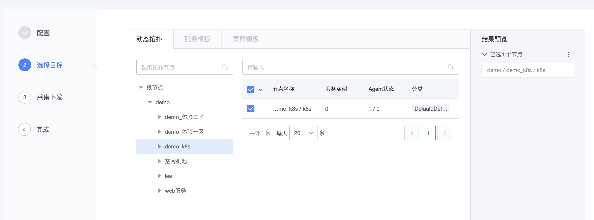
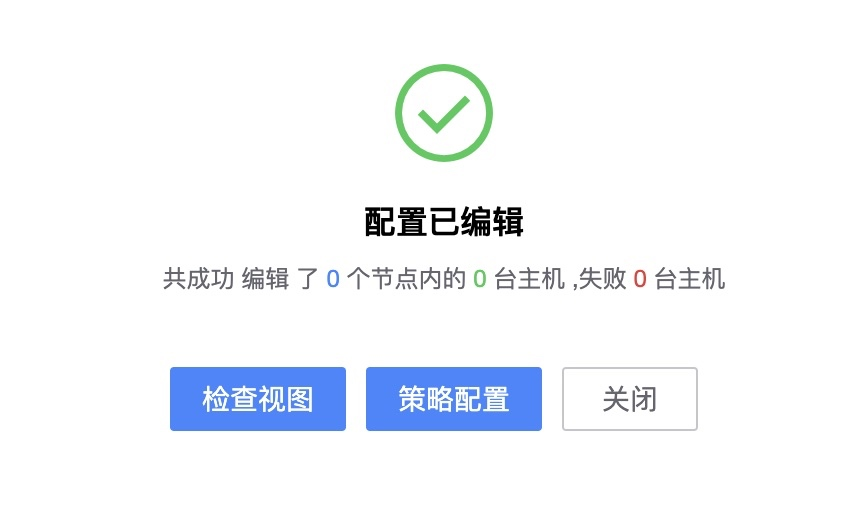
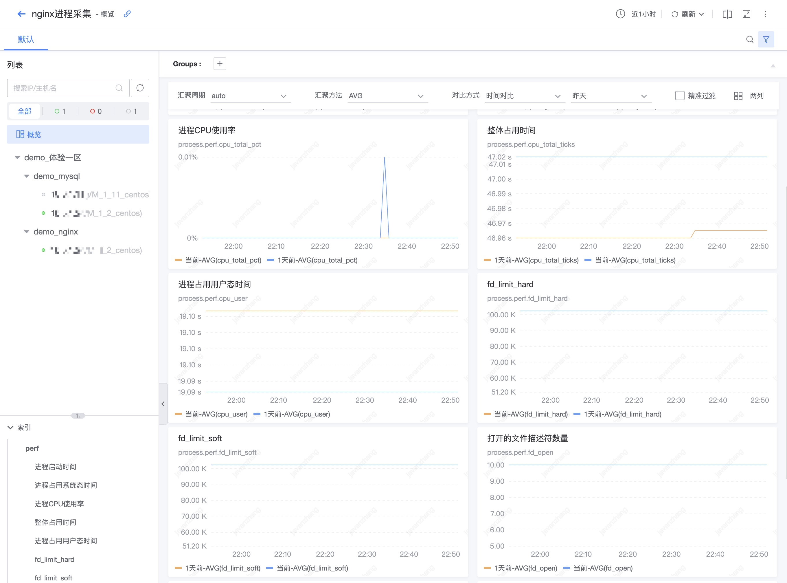
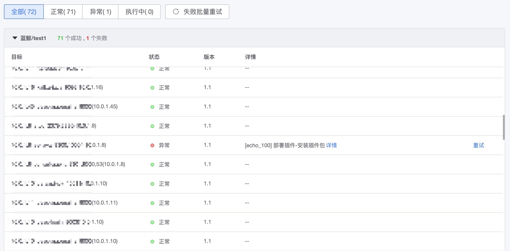

# Basic usage of collection tasks

The purpose of collection configuration and collection tasks is to collect data from the source of monitored objects. The collection uses either built-in collection capabilities or user-created plug-ins.

## Preliminary steps

**working principle**:

**Navigation path**: Navigation → Integration → Data Collection → New

## List of main functions

* Collection parameters support variables
* Dynamic collection based on business topology
* Check view
* Plug-in upgrade
* Collection status

## Function Description

### Collection configuration list

**Statistics Description**:

1. Enabled configuration: Displays collection tasks that are still in effect
2. Deactivated configuration: The collection configuration can be deactivated. The number of configurations after deactivation
3. Abnormal collection targets: Collection exceptions are collection problems. There will be an exception prompt in the inspection view. The number of targets here is the number of IPs/instances.
4. Target to be upgraded: After the plug-in is changed, major version changes will prompt that an upgrade is required, otherwise editing and other operations cannot be performed. The target data here is IP/number of instances.

> Note:
> 1. Statistical data can be clicked to filter, and then clicked again to cancel filtering.
> 2. Log collection is a capability of the log platform used, and interface interaction is temporarily not available in "New"

### Create new collection

**Step 1: Basic configuration**

* Collection cycle: The default is 1 minute. Data can be collected for 2 minutes and 5 minutes, or data can be collected for 10 seconds and 30 seconds. The chart class will be compatible with the collection cycle display. Note that the monitoring period set by the policy should be consistent with the collection period.
* Exporter needs to set the port where Exporter starts
* You can use CMDB variables to fill in parameters. The applicable scenario is that the parameter content is different and the processing logic is different. For example, the monitored process ports are different, the roles are different (master slave), etc. See [How to implement multi-instance collection](./multi_instance_monitor.md) for details

**Step 2: Select target**

There are static and dynamic collection methods. It is recommended to use dynamic collection to dynamically expand and shrink the capacity based on the CMDB topology.

> Note: The minimum granularity corresponding to the host is IP, and the minimum granularity corresponding to the service is service instance instance.

**Step Three: Collection and Distribution**

The collection target delivery process is visualized because the collection target environment has many uncertain factors that affect the collection process. Process visualization can help relevant people quickly locate problems.

If it fails, you can view the specific details and retry in batches. You can also quickly roll back while editing.

**Step 4: Complete**

The completion phase provides quick guidance to "Inspection View" and "Policy Configuration".

### View collected data

In order to determine whether the collection task successfully collected data. There are following methods:

* 1) Check view
* 2) Check running status

**1) Check View**

There is a "Check View" operation on the list page to directly see the indicator data content of the collection task.

**2) Running status check**

When you have encountered some collection problems, or the statistics on the list page have some abnormal data, you need to be concerned and deal with them.

