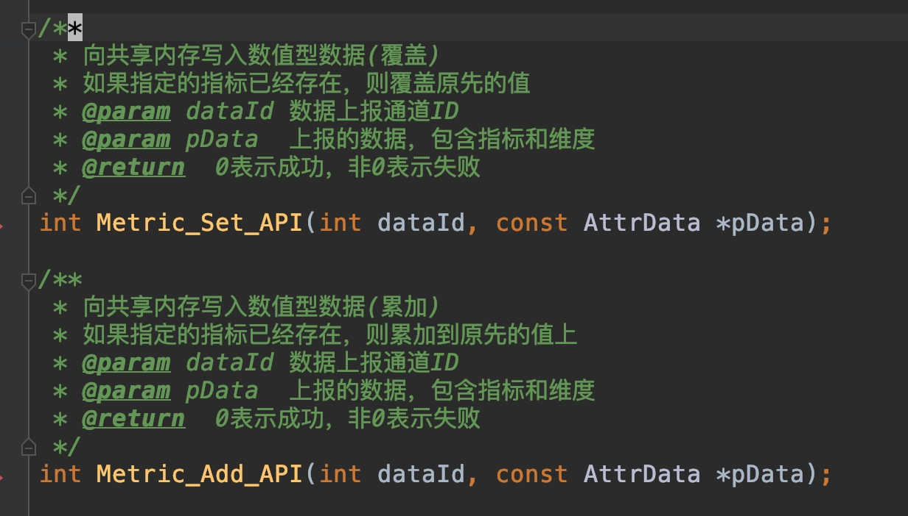

# Custom indicator reporting-FAQ

### The difference between custom events and custom indicators

Custom events are similar to string alerts and support multiple dimensions. Custom indicators are equivalent to the time series data collected by prometheus.

### How to apply for permission before experiencing the function

It mainly applies for data reporting and data viewing, as well as policy addition and other functions.

### The report was just successful, why don’t I see the data?

Dimensions and metrics need to be discovered automatically. There will be a maximum synchronization discovery period of about 5 minutes for newly added indicators and dimension fields, so you need to wait for the first time. After waiting for the indicator to be discovered, you can view the data of this indicator.

### Where can I view custom reported indicator data?

Default: View under Customized Reporting→Inspection View, all indicators will be visible in tiles.

It can be obtained through metric selection in both data retrieval and dashboard.

### What are the differences between different customized reporting methods?

There is a frequency limit for HTTP reporting, mainly to solve the problem of not wanting to install an agent.

Both the command line tool and the SDK rely on the agent and bkmonitorbeat plug-ins, so the performance will be good.

### Does the sdk have a cumulative function? If you receive a request and call the SDK once, the SDK will automatically accumulate

Yes, there are two methods

### What is the resource usage of custom reports?

There will be certain restrictions on the number of indicators and dimensions reported.

for example:

- Up to 1,000 reports within 1 minute
- The number of indicators & dimensions reported at a time is limited to less than 10, and the name and value are limited to 128 characters, so a single piece of data is about 5k, (128+128+128+128)*10
- It is expected to apply for about 5M shared memory space

### Do I need to apply for a feature ID when adding new indicators?

You only need to apply for a data ID for the first time. You can no longer apply for a feature ID when the indicators increase later. It is recommended that indicators under the same type of management apply for a data ID. It is not good to have a data ID for all indicator data because it is similar. If they are all crammed into one table, too much data and different dimensions will have an impact on data query and management.