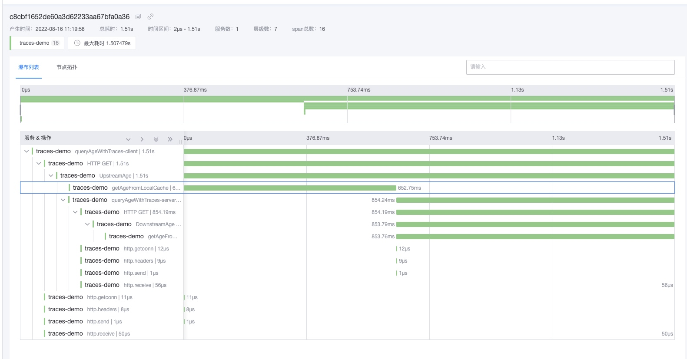

# Opentelemetry SDK access no data troubleshooting ideas

During the SDK access process, there will always be situations where the user has configured the configuration, but no data is seen on the platform. Because there are many intermediate links and two parties are involved, communication will be more laborious. This document provides a troubleshooting idea to quickly locate the problem.


SDK access process judgment:

1. Get the business/space and application name
2. Confirm whether the created application token and the reported address match
3. Directly provide a test demo program, application token and reporting address

     1. Confirm the network connectivity of the user’s machine to the reported address and obtain the sending address IP
     2. Confirm the environment for user testing, whether it is IDC, dev, or office environment, etc.
     3. Connect and load the SDK correctly according to the configuration, and confirm whether the debug log output is correct.

4. Check Collector to see if data has been received


## DEMO program

Run DEMO directly. If there is data reported, it means there is no problem with the link. You can pay attention to the program output.

[Original code repository]()


Startup parameters

```
Usage of ./ottraces:
   -downstream string
         downstream server address for testing (default "localhost:56099")
   -env string
         env used to switch report environment, optional: local/bkop/bkte (default "local")
   -exporter string
         exporter represents the standard exporter type, optional: stdout/http/grpc (default "stdout")
   -exporter-addr string
         specify the custom exporter address
   -token string
         authentication token (default "Ymtia2JrYmtia2JrYmtiaxUtdLzrldhHtlcjc1Cwfo1u99rVk5HGe8EjT761brGtKm3H4Ran78rWl85HwzfRgw==")
   -upstream string
         upstream server address for testing (default "localhost:56089")

```

If you want to report to the bkop environment, execute: `./ottraces_linux -exporter http -env bkop -token ${token}`.


## Example traces effect

